 
# The 120 Albums and EPs I Listened to in 2025
 
 
## Introduction
First of all, thanks for reading. I’m going to allow myself to be pretentious for a second because this has been a not insignificant part of my year. I made an effort this year to listen to as many albums in full as comfortably possible - it paid off in terms of exposing me to a lot of new artists, but most of all I also learned a lot about my relationship to music and art as well as the role of a critic. More than anything this is mostly an exercise in learning to better write about art (it didn’t work). 
 

This Summer I spent countless days biking out to quieter beaches along Lake Champlain and simply wading in the water with my headphones on, having the time of my life. At the same time, I found myself dissatisfied with my understanding of the album format, noticing more and more the cracks in the work of criticizing a collective of 10-20 songs. I realized a 10/10 album is borderline impossible with music. Even my favorite album of all time, Kendrick Lamar’s To Pimp a Butterfly has songs I would skip. That begs the question, should an album be treated like a collective of songs, or more like a movie? In my opinion, you must choose the latter. “Mortal Man”, the 12 minute closer of TPAB, is a song I’ve only listened to a handful of times. Would I want it removed from the album? Of course not, that’s a mandatory epilogue. 
 
My point is this, albums are not the ideal format for experiencing music for fun, but they are a necessary format for creating further meaning behind the collection of songs being released. A single song within an album can be perfect pretty easily in comparison to making a perfect album which requires a level of cohesivity that is difficult in the medium of audio. In my opinion, It requires a tight direction of lyricism and instrumentation that many artists fail to even take notice of. I found myself talking a relatively ton of shit about the albums in this list for that reason even though the top 70 of this list are at the very least “good” or offer a hint or promise of future greatness.
 

Speaking of scores, there’s a lot of numbers here so let me break it down. Richard Williamson is an art advisor (whatever that means) with a decent following on social media. I ran into one of his videos where he described how he judged art based on Novelty, Nuance (how much work went into it), and Narrative (how much of a story or message is conveyed through the piece). I gave each album a score out of 5 for each category. I thought this was a pretty concise and effective way of judging art, but I threw in 3 bonus points to give at my discretion to boost albums I enjoyed despite not scoring high from an objective perspective. Later in the year, I also added 3 points for listenability, as I really think making enjoyable music that can be listened to casually is something to be celebrated. The total numerical score is x/21. I also assigned letter grades to the final score, though I was much more liberal than traditional American letter grading (80% is an A-).
 

I also recorded a lot of stats and variables about the albums and tried to find correlations both to check for any bias, and out of pure curiosity. Here are some random useless pieces of info:
- **Gender**: 50.8% of projects I reviewed were primarily by people identifying as men, 44.2% were by those identifying as women, 3.3% were by nonbinary artists, and 1.7% are credited 50/50 men and women. 
- **Popularity**: By my own perception, 19% of albums were by A listers, 22% were by “very popular” artists, 26% were by artists known in their genre, 21% were by unpopular artists, and 13% were by complete unknowns. 
- **Format**: I reviewed 106 albums, 13 EPs, and 1 Mixtape.
- **Country of Origin**: 50% of albums (60/120) were from American artists, followed by Britain (20%), South Korea (6%), Japan (4%), Australia (3%) and the remaining 17% from other countries from every continent excluding Africa (oops). 
- **Genre**: 27% of album and EPs were Pop, followed by Rock (15%), Indie (15%), Rap (15%), Electronic (12.5%), and 4% or less in R&B, FOlk, Ambient, Metal, Country, Comedy, Jazz, Musical, and Collage. 
- **Found Through…**: I found 37% of albums through being an existing fan, 13% through AOTY.org (my preferred music forum over RYM), and 10% through tiktok. lol. The method that gave me the most interesting reccs was through randomly looking up the nominees for the Mercury Prize this year, which I am only aware of because my old flame Alt-J won in 2012. Two of my top three albums of the year were nominees. Anthony Fantano gave me recommendations for 4% of albums I listened to this year, which is lower than expected. 
- **Language**: 80% of albums I reviewed were primarily in English, followed by Spanish, Korean, Japanese, or other. 
- **Repeat Artists**: Jane Remover released two albums and one EP this year. Cameron Winter released a solo album and served as the frontman of the band Geese, who also released a record. Danny Brown, solo/featured on Jane Remover. Quadeca solo/featured on Kevin Abstract. Doja Cat solo/featured on Lisa. Sabrina Carpenter solo/featured on Taylor Swift. Clipse solo/featured on JID. Ichiko Aoba solo/credited on place #22. Underscores was featured on Danny Brown and Oklou's album. And I think that's about it. 
- **Other stuff**: I wrote a total of 15,469 words about these albums and EPs. The entire document is over 17,000 words including the introduction, and the website is 8078 lines of HTML. No AI was used except for one instance of bug fixing. 
 
 

## Artists I am not listening to
- **Ethel Cain**
I am a big big fan of Preacher’s Daughter and “American Teenager”, but I sadly cannot look past the controversy Hayden encountered this past Summer regarding her social media posts she made at age 19. On one hand, I trust that she pivoted hard after coming out as trans at age 20 in 2018, but being the same age as her, I cannot fathom saying the things she said in that year. Yes, people can change and she obviously has (I really appreciate her political views today), but those are tough words to overlook in 2018. 

- **Japanese Breakfast**
“Road Head” is one of my favorite songs of all time, and bonus points after I saw her live, front row, but I’m sadly off Michelle Zauner after she did an ad promoting gen AI for google. Girl, fuck you. 

- **Justin Bieber**
I heard mixed things about them, but two Bieber albums called “Swag” is an immediate no from me. Also, zionist for some reason. 

- **Lady Gaga**
I’m glad she exists but I’ve never understood the appeal of her music. Sorry. 

- **Lily Allen**
I have a few songs by Lily Allen liked on Spotify but I was pretty blown away by the lead single “Pussy Palace” off her album that dropped in November. Unfortunately, I learned not long after its release that she’s kind of a dumbass. Google Lily Allen Dr. Luke if you’re interested. 

- **The Weeknd**
I’ve listened to the past few Weeknd albums in full, and every one of them was not worth the album format. Apparently “Heartless” was in my top 5 most played tracks of last year according to Spotify (I don’t believe it), but that’s not tipping the scales in my overall view of the artist.
 
 

## Other Artists I listened to this year
- Jess Williamson is probably my most listened to artist this year, despite her last album coming out in 2023, and it being in the Country genre. 
- Crosby Stills & Nash's song "Almost Cut my Hair" came on the radio one day and I was pretty blown away. My song of the Summer. 
- Foster and Emily got me onto Vampire Weekend's 2024 album this year. Kicking myself for not listening to it before year end, because it would've totally disrupted last year's AOTY list. 
- Some evil Turks showed me Kenan Dogulu & Melis Fiz while I was waiting for a train in Konya this October. Those guys belong in prison but their music reccs go hard. 
- MJ Lenderman is pretty great. The fact that he was formerly the guitarist of the band Wednesday makes almost too much sense in retrospect, but his solo work is great. 
- Mk. Gee - the GOAT right now. Cannot believe I missed listening to his album in the year it was released. 
- Hakushi Hasegawa is also an artist who would've disrupted last year's AOTY list. Truly innovative stuff. 
 
 
One final note: I wrote almost all of this in a text editor which didn't have spellcheck, so if you see any mistakes, assume they're typos and that I know how to spell, though admittedly reccomendation/recommendation is one I always mess up on for some reason. Restaurant. Restaraunt. Absolutely. Absolutley. Hm maybe I am stupid without a computer checking me. 
 Also, apologies for the low res images. I didn't want to risk anything with embedding them so I stored them locally. Still could've afforded to add a few more pixels but I'm not about to fetch them all over again. 
 

<article class="album-card">
  

    120
    <h2 class="album-title">Lonely at the Top - Joey Bada$$</h2>
  

  
  <blockquote class="favorite-lyrics">
    
Laidback in the Maybach, I know they can’t stand it

    
Got me thinkin’ &#x27;bout way back, ’bout times we couldn&#x27;t manage

  </blockquote>
  
  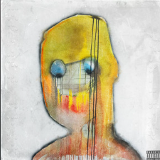
  
  

    <strong>Genre:</strong> Rap
    <strong>Subgenre:</strong> Rap
    <strong>Country:</strong> USA
    <strong>Language:</strong> English
    <strong>Format:</strong> Album
    <strong>Favorite Song:</strong> Supaflee
  

  
  

    <h3>Scores</h3>
    

      

        Nuance
        1
      

      

        Narrative/Lyrics
        2
      

      

        Novelty
        1
      

      

        Listenability
        2
      

      

        Bonus Points
        +0
      

    

    

      Total:
      6/21
      F
    

  

  
  

    <h3>Review</h3>
    
My relationship with Joey&#x27;s music goes back over a decade, but this album is sadly completely devoid of passion, purpose, and anything remotely interesting or personal, which contradicts heavily with much of his early work. That&#x27;s it. That&#x27;s the tweet. This is the hip-hop equivalent of plain oatmeal. I&#x27;ll say it again and again: the worst thing you can do is bore me. 

  

  
  <a href="https://www.youtube.com/watch?v=52ToK1R1kzI&amp;list=RD52ToK1R1kzI&amp;start_radio=1" class="listen-link" target="_blank">Listen</a>
  
  

    
  

</article>

<article class="album-card">
  

    119
    <h2 class="album-title">Ruby - Jennie</h2>
  

  
  <blockquote class="favorite-lyrics">
    
JENNIE, JENNIE, JENNIE, JENNIE, JENNIE, JENNIE, JENNIE

  </blockquote>
  
  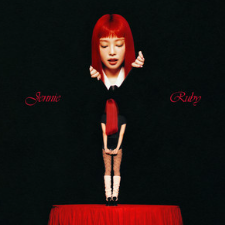
  
  

    <strong>Genre:</strong> Pop
    <strong>Subgenre:</strong> Pop
    <strong>Country:</strong> South Korea
    <strong>Language:</strong> English
    <strong>Format:</strong> Album
    <strong>Favorite Song:</strong> Love Hangover
  

  
  

    <h3>Scores</h3>
    

      

        Nuance
        2
      

      

        Narrative/Lyrics
        2
      

      

        Novelty
        1
      

      

        Listenability
        3
      

      

        Bonus Points
        +0
      

    

    

      Total:
      8/21
      D
    

  

  
  

    <h3>Review</h3>
    
I am a big Blackpink (music) hater, but Lisa’s success in 2024, and Jennie’s lead single “Love Hangover” made me give this a chance. I ranked this album super low when I first listened to it, but gave it another shot this week just to make sure I was correct - I was. This album is beyond soulless. You could say that about a lot of kpop (not that Jennie is considered kpop anymore), but what differentiates Jennie from others is that she doesn’t even seem like she’s having any fun doing it. Even singles such as “Like Jennie” are supposed to be bombastic, intimidating reintroductions to her as a solo artist, but comes across as a song she was told to do versus a representation of who she actually is.  
This is a pretty terrible album across the board, but I should give praise again to that damn single “Love Hangover”. She can’t act, her attempts at rapping are embarrassing, but damn can she sing. Shoutout Matt Champion for pulling that out of her btw. 

  

  
  <a href="https://www.youtube.com/watch?v=23urWKmHS6o&amp;list=RD23urWKmHS6o&amp;start_radio=1" class="listen-link" target="_blank">Listen</a>
  
  

    
  

</article>

<article class="album-card">
  

    118
    <h2 class="album-title">Dumb - Flume &amp; Emma Louise</h2>
  

  
  <blockquote class="favorite-lyrics">
    
Every time I start anew, you bleed through

    
I never even saw you cry, am I an easy goodbye?

  </blockquote>
  
  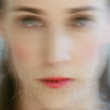
  
  

    <strong>Genre:</strong> Electronic
    <strong>Subgenre:</strong> Electronic
    <strong>Country:</strong> United Kingdom
    <strong>Language:</strong> English
    <strong>Format:</strong> Album
    <strong>Favorite Song:</strong> Easy Goodbye
  

  
  

    <h3>Scores</h3>
    

      

        Nuance
        2
      

      

        Narrative/Lyrics
        1
      

      

        Novelty
        1
      

      

        Listenability
        2
      

      

        Bonus Points
        +0
      

    

    

      Total:
      6/21
      F
    

  

  
  

    <h3>Review</h3>
    
And I&#x27;ll say it again now: the worst thing you can do is bore me. *Dumb* is very sadly lacking anything interesting. I forgot I listened to this within minutes of finishing it. If the best song came on in shuffle, I&#x27;d probably end up skipping halfway through out of boredom. There&#x27;s glimpses of classic Flume in here, but it&#x27;s consistently just terribly bland for the remaining 99%. Nothing else to say for this one. 

  

  
  <a href="https://www.youtube.com/watch?v=JlQoMeRRbkM" class="listen-link" target="_blank">Listen</a>
  
  

    
  

</article>

<article class="album-card">
  

    117
    <h2 class="album-title">The Life of a Showgirl - Taylor Swift</h2>
  

  
  <blockquote class="favorite-lyrics">
    

  </blockquote>
  
  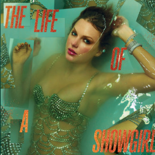
  
  

    <strong>Genre:</strong> Pop
    <strong>Subgenre:</strong> Pop
    <strong>Country:</strong> USA
    <strong>Language:</strong> English
    <strong>Format:</strong> Album
    <strong>Favorite Song:</strong> Honey
  

  
  

    <h3>Scores</h3>
    

      

        Nuance
        1
      

      

        Narrative/Lyrics
        2
      

      

        Novelty
        1
      

      

        Listenability
        2
      

      

        Bonus Points
        +0
      

    

    

      Total:
      6/21
      F
    

  

  
  

    <h3>Review</h3>
    
Someone please stop this woman. Taylor Swift has a tough job. She&#x27;s correct in feeling that she is the most criticized person in the world, probably moreso than even the president on the grounds that she is a woman, and for that I feel an ounce of sympathy. That level of fame comes with a lot of pressure, but with her resources, it neither seems that she ever attempts to live up to her expectations and potential, nor create anything of meaning for herself.  
Let&#x27;s start with the lyrics because everybody knows that&#x27;s what her fans call her strong suit. I genuinely gagged (not was gagged - gagged) at every attempt at sexuality she made in here. &quot;Redwood tree, it ain&#x27;t hard to see. His love was thе key that opened my thighs&quot;. Disgusting. &quot;I mind my business, God&#x27;s my witness that I don&#x27;t provoke it. It&#x27;s kind of making me wet&quot;. No. It doesn&#x27;t end with the sex bars either. &quot;Was the first lamb to the slaughter. So we all dressed up as wolves and we looked fire&quot;. Give me a break. &quot;Good thing I like my friends cancelled. I like &#x27;em cloaked in Gucci and in scandal&quot;. Grow up. &quot;Her name was Kitty. Made her money being pretty and witty. They gave her the keys to this city. Then they said she didn&#x27;t do it legitly, uh&quot;. Ugh is right. This is not nitckpicking either - this album is soaked, SOAKED, in cringe. It&#x27;s beyond clear that Taylor surrounds herself with yes men who refuse to give her any negative feedback. I cannot imagine watching her record this in the studio with a straight face. Also, &quot;Cancelled&quot; is a dogwhistle to get off her back about hanging out with fascists. Fuck you.  
Then there&#x27;s the overall sound. In short, the showgirl aesthetic is a waste does not align with the album whatsover apart from the objectification of women angle which is not dwelled on enough anyways. That&#x27;s fine, but when you call the album &quot;life of a showgirl&quot; and do all those photoshoots, you expect the music to sound a bit more like showgirl music and not just b-sides from Midnights. This album gives me a lot more respect for her last album, because at least the overall theme of TTPD aligned with real things in her life versus an aesthetic seemingly chosen at random. Apart from the showgirl theme, every song is also lacking. It&#x27;s hard to pinpoint, but it feels like there is an instrument missing, leaving a lot of songs feeling empty. I found myself turning the volume up just to make sure I wasn&#x27;t crazy. I blame this mostly on the overreliance on electronic production versus live instrumentation. At least it&#x27;s mixed well enought to hear the wack ass bars.  
In summary, this project was even more dissapointing than I expected. Contrary to everything I&#x27;ve indicated in this review and in my review for TTPD, I actually want Taylor to be great. I didn&#x27;t dislike her as a person until she became a billionaire and started hanging around with RACISTS. She has had her moments throughout the years, I like her voice, and can say with my chest that Folklore and Evermore are smash hits that prove she&#x27;s deserving of her fame. However, she&#x27;s far too comfortable in her artistry, and we all suffer for it. If we have to have Taylor Swift in our lives, at least give us something worth celebrating. Bad album, bad person. 

  

  
  <a href="https://www.youtube.com/watch?v=ko70cExuzZM&amp;list=RDko70cExuzZM&amp;start_radio=1&amp;pp=ygUNdGF5bG9yIHN3aWZ0IKAHAQ%3D%3D" class="listen-link" target="_blank">Listen</a>
  
  

    
  

</article>

<article class="album-card">
  

    116
    <h2 class="album-title">Even in Arcadia - Sleep Token</h2>
  

  
  <blockquote class="favorite-lyrics">
    
You pray for sound and I pray for silence

  </blockquote>
  
  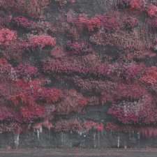
  
  

    <strong>Genre:</strong> Rock
    <strong>Subgenre:</strong> Rock
    <strong>Country:</strong> United Kingdom
    <strong>Language:</strong> English
    <strong>Format:</strong> Album
    <strong>Favorite Song:</strong> Of Windward
  

  
  

    <h3>Scores</h3>
    

      

        Nuance
        2
      

      

        Narrative/Lyrics
        2
      

      

        Novelty
        1
      

      

        Listenability
        1
      

      

        Bonus Points
        +0
      

    

    

      Total:
      6/21
      F
    

  

  
  

    <h3>Review</h3>
    
Before reading any further, I highly recommend listening to the linked song.   
I didn&#x27;t hate this on first listen. In fact, I kinda liked it given that the massive needle drop into metal on the few few songs overshadowed the quieter, weaker segments. I saw it on the front page of Spotify, for some reason said &quot;why not&quot;, and was greeted a VERY heavy hitter opener. That opening track is still pretty great IMO, hell even the poppier &quot;Past Self&quot; is catchy as hell. After another couple listens though, the grandiosity of the soundscape Sleep Token made washed away, and what was left was little but cringe. The instrumentation here is mostly fine excluding some overuse of synths on certain songs which really pull it away from being a rock album - what really drags it down though is the singer. Holy shit you can just tell this guy is insufferable IRL. He sings like he is a damn prophet coming to save us from pop slop. Did he ever say anything related to the sort? Absolutley not, but the music oozes the same vibe as wallet chains and $40 katanas you&#x27;d get from a dying mall.  
In contrast to some of the albums I&#x27;ve ranked lower on the list, I have to say this album was neither boring or uninteresting - I just wouldn&#x27;t want to be seen with these guys. 

  

  
  <a href="https://www.youtube.com/watch?v=JJpFTUP6fIo&amp;list=RDJJpFTUP6fIo&amp;start_radio=1&amp;pp=ygUVZW1lcmdlbmNlIHNsZWVwIHRva2VuoAcB" class="listen-link" target="_blank">Listen</a>
  
  

    
  

</article>

<article class="album-card">
  

    115
    <h2 class="album-title">God Does Like Ugly - JID</h2>
  

  
  <blockquote class="favorite-lyrics">
    
I don&#x27;t give a fuck about no industry beef

    
Ain&#x27;t nobody give a fuck when Tay was dead in the street

  </blockquote>
  
  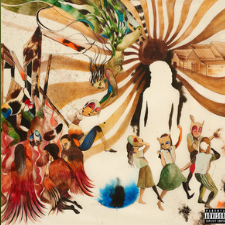
  
  

    <strong>Genre:</strong> Rap
    <strong>Subgenre:</strong> Rap
    <strong>Country:</strong> USA
    <strong>Language:</strong> English
    <strong>Format:</strong> Album
    <strong>Favorite Song:</strong> Community
  

  
  

    <h3>Scores</h3>
    

      

        Nuance
        2
      

      

        Narrative/Lyrics
        1
      

      

        Novelty
        1
      

      

        Listenability
        2
      

      

        Bonus Points
        +0
      

    

    

      Total:
      6/21
      F
    

  

  
  

    <h3>Review</h3>
    
Kind of like Joey&#x27;s album, I&#x27;ve been listening to JID for years, so this was a big let down for me. Like the other hip-hop ranked low on this list, there simply wasn&#x27;t a ton of interesting or experimental sounds on this LP, but God Does Like Ugly especially suffers from JID&#x27;s lack of injection of himself in it, even taking every opportunity to take a backseat to whatever features he includes. Moreover, his sound simply has not evolved in close to a decade. JID has one of the most unique and identifiable voices in music, yet any song on this album could have been off his first or second album and I wouldn&#x27;t be able to tell. It&#x27;s just so sad to see so many years wasted when you compare it to the artistic progression of those like Kendrick, Tyler, Pusha T, and the likes. Apart from some highlights like &quot;Community&quot;, this album was simply boring. 

  

  
  <a href="https://www.youtube.com/watch?v=-V4jiPcNUjg&amp;list=RD-V4jiPcNUjg&amp;start_radio=1" class="listen-link" target="_blank">Listen</a>
  
  

    
  

</article>

<article class="album-card">
  

    114
    <h2 class="album-title">Weirdo - Emma Jean Thackray</h2>
  

  
  <blockquote class="favorite-lyrics">
    
Tofu tofu tofu tofu tofu tofu tofu tofu

  </blockquote>
  
  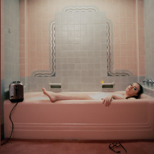
  
  

    <strong>Genre:</strong> Indie
    <strong>Subgenre:</strong> Alternative
    <strong>Country:</strong> United Kingdom
    <strong>Language:</strong> English
    <strong>Format:</strong> Album
    <strong>Favorite Song:</strong> Tofu
  

  
  

    <h3>Scores</h3>
    

      

        Nuance
        3
      

      

        Narrative/Lyrics
        3
      

      

        Novelty
        2
      

      

        Listenability
        1
      

      

        Bonus Points
        +0
      

    

    

      Total:
      9/21
      D+
    

  

  
  

    <h3>Review</h3>
    
A lengthy and overall somewhat miserable experience. The instrumentation, vision, and narrative are there, albeit a bit bland, but that narrative centers on Emma&#x27;s mental health journey, and unfortunatley, it comes across as the thoughts of someone who should have grown out of those feelings years earlier. That is in no way meant to discredit her experience, instead I argue that the story clashes with the more mature sound the other aspects of the music has, leaving the listener ultimatley neutral about her journey. In my opinion, there a huge disconnect and lack of cohesion between the subject matter and instrumentation. 3/4 of the way in, and I just got annoyed by most of the songs. None are particularly worthy of being in a daily rotation, yet it almost sounds like they expect to be taken as such while also being worthy of critical analysis and acclaim. Good album art tho. 

  

  
  <a href="https://www.youtube.com/watch?v=9cXpou1r6sI" class="listen-link" target="_blank">Listen</a>
  
  

    
  

</article>

<article class="album-card">
  

    113
    <h2 class="album-title">Don&#x27;t Tap the Glass - Tyler the Creator</h2>
  

  
  <blockquote class="favorite-lyrics">
    
Ring-ring-ring-ring-ring-ring-ring-ring-ring-ring, pick up the phone

    
Hello?

  </blockquote>
  
  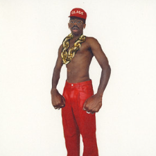
  
  

    <strong>Genre:</strong> Rap
    <strong>Subgenre:</strong> Rap
    <strong>Country:</strong> USA
    <strong>Language:</strong> English
    <strong>Format:</strong> Album
    <strong>Favorite Song:</strong> Ring Ring Ring
  

  
  

    <h3>Scores</h3>
    

      

        Nuance
        1
      

      

        Narrative/Lyrics
        1
      

      

        Novelty
        1
      

      

        Listenability
        3
      

      

        Bonus Points
        +0
      

    

    

      Total:
      6/21
      F
    

  

  
  

    <h3>Review</h3>
    
This is not an edgy &quot;look at me&quot; choice, so bare with me. Second year in a row where I’m putting Tyler close to the bottom of the list, but with heavy disclaimers just like I did last year. This is not the worst album to come out this year, nor that I listened to. It is, however, the most disappointing. Flower Boy and Igor are two undisputed classics, and Tyler is a top 20 producer of all time in my book. Call Me When You Get Lost was a big step down in direction for Tyler, but still had a couple 10/10 songs and features from Wayne and NBA Youngboy of all people. Last year, Tyler dropped Chromakopia after a solid rollout and hype train, but he completely lost the plot in my view. The rollout had a solid unique visual style, but the music itself, save two songs, was mostly repetitive at best, and utter unlistenable trash at worst.  
Don’t Tap the Glass was a surprise drop with not much rollout, but needless to say, I wasn’t optimistic going into my first listen given the short turnaround between Chromakopia and this. As you can imagine, Tyler’s sound evolved minimally, and my complaints from Chromakopia carry over to DTtG.  
That said, this album made me think about why I bother to write about music for fun in the first place, let alone what right I have to criticize it. I forget if he actually said it or not, but it was clear that this album is a “just for fun album” and not personal, important, or profound. I love just for fun albums, but it makes the role of the critic difficult. You can criticize the Fast and Furious movies all you want, they’re still going to be entertaining and worthy of good reviews in that regard. Is Music different in that just because an auteur made something special in the past, they can’t make something fun in the future? Probably not, because George Miller made Happy Feet in between Mad Max movies with enough success. Am I involuntarily living through Tyler’s career, seeing him as someone I could’ve been, upset by the fact that neither he nor I are not making meaningful contributions to art and constantly living up to our potential? 
Anyways, most of the songs on this album sound the same, and like last year, Tyler is too comfortable in the sound he developed 8 years ago. “Ring Ring Ring” is an undeniable banger but that’s the one exception in my book. 

  

  
  <a href="https://www.youtube.com/watch?v=GJDmvDSWK64&amp;list=RDGJDmvDSWK64&amp;start_radio=1" class="listen-link" target="_blank">Listen</a>
  
  

    
  

</article>

<article class="album-card">
  

    112
    <h2 class="album-title">Man&#x27;s Best Friend - Sabrina Carpenter</h2>
  

  
  <blockquote class="favorite-lyrics">
    
&quot;Hi, I hope you&#x27;re great, I think it&#x27;s time we took a break, So I can grow emotionally&quot;

    
That&#x27;s what he said to me

    
Here we go again, crying in bed, what a familiar feeling. All my friends in love, and I&#x27;m the one they call for a third wheeling

  </blockquote>
  
  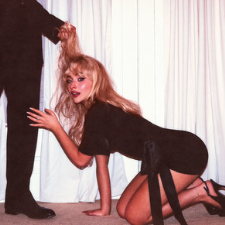
  
  

    <strong>Genre:</strong> Pop
    <strong>Subgenre:</strong> Pop
    <strong>Country:</strong> USA
    <strong>Language:</strong> English
    <strong>Format:</strong> Album
    <strong>Favorite Song:</strong> Nobody&#x27;s Son
  

  
  

    <h3>Scores</h3>
    

      

        Nuance
        2
      

      

        Narrative/Lyrics
        2
      

      

        Novelty
        2
      

      

        Listenability
        3
      

      

        Bonus Points
        +0
      

    

    

      Total:
      9/21
      D+
    

  

  
  

    <h3>Review</h3>
    
What are we even doing here? I genuinely looked forward to Sabrina’s second album as an A-lister, but I expected better than this. Sonically, it’s fine. She leans more into her faux country twang and the instrumentation works for those songs. I called the pop production on her last album perfect, but never got any of that ear euphoria on the poppier tracks. What really brings this album down, though, is the lyrics. Sabrina has gotten a lot of love in the past for how clever and funny she can be amidst all the horniness, but she overdoes it to a truly detrimental level here. Most songs are at least fractionally cringe and belong on /r/Ihavesex. I&#x27;m so over it. 

  

  
  <a href="https://www.youtube.com/watch?v=hE2DLtuxcUU&amp;list=RDhE2DLtuxcUU&amp;start_radio=1" class="listen-link" target="_blank">Listen</a>
  
  

    
  

</article>

<article class="album-card">
  

    111
    <h2 class="album-title">Earthwave - AU5</h2>
  

  
  <blockquote class="favorite-lyrics">
    
No better moment will arrive, there is a world of inner light

    
A place where frequencies align, shifting my paradigm

  </blockquote>
  
  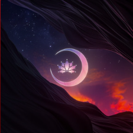
  
  

    <strong>Genre:</strong> Electronic
    <strong>Subgenre:</strong> Colorbass
    <strong>Country:</strong> USA
    <strong>Language:</strong> English
    <strong>Format:</strong> EP
    <strong>Favorite Song:</strong> Heat
  

  
  

    <h3>Scores</h3>
    

      

        Nuance
        4
      

      

        Narrative/Lyrics
        1
      

      

        Novelty
        3
      

      

        Listenability
        2
      

      

        Bonus Points
        +1
      

    

    

      Total:
      11/21
      C
    

  

  
  

    <h3>Review</h3>
    
I should probably not have taken recommendations from friends - not because I hated this or wasn&#x27;t curious, but because I hate to put down a homie&#x27;s favorite artist. For what it&#x27;s worth, I really really enjoyed his December EP *Beyond Light*.  
My problems with this type of electronic music and AU5 are 100% reflective of my problems with the genre as a whole; at this point in my life it all just feels very impersonable. Perhaps some of that comes from just knowing the process behind how its made, both from a production standpoint and a business standpoint. More likely it&#x27;s a lyrical problem. A lot of electronic artists, in my eyes, do not care about the word singers are saying on their songs, and it results in the music equivalent of a early 2010s B sci fi movie where all the budget went towards the CG. 

  

  
  <a href="https://www.youtube.com/watch?v=83gLGjj1gZg&amp;list=RD83gLGjj1gZg&amp;start_radio=1" class="listen-link" target="_blank">Listen</a>
  
  

    
  

</article>

<article class="album-card">
  

    110
    <h2 class="album-title">I Barely Know Her - Sombr</h2>
  

  
  <blockquote class="favorite-lyrics">
    
In a room full of people I look for you

    
Would you avoid me or would you look for me too?

  </blockquote>
  
  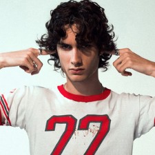
  
  

    <strong>Genre:</strong> Pop
    <strong>Subgenre:</strong> Pop
    <strong>Country:</strong> USA
    <strong>Language:</strong> English
    <strong>Format:</strong> Album
    <strong>Favorite Song:</strong> 12 to 12
  

  
  

    <h3>Scores</h3>
    

      

        Nuance
        2
      

      

        Narrative/Lyrics
        4
      

      

        Novelty
        2
      

      

        Listenability
        3
      

      

        Bonus Points
        +1
      

    

    

      Total:
      12/21
      C+
    

  

  
  

    <h3>Review</h3>
    
Sombr has had a crazy year, even for a nepo baby. Undeniably, he released 3-4 generational hits, which also happen to be the first 4 tracks, so of course they had to rush out an album to capitalize on his popularity. And rush they did. This album has the hardest falloff after track 4 of any album on this list. It honestly feels like most of the tracks on here are written by plugging in the lyrics of the singles to chatgpt and asking for it to reword them. The subject matter also gets extremely tired after a while. We get it, you&#x27;re sad over a breakup, but you&#x27;re 20, which is old enough to know when you sound like you&#x27;re whining. If this was an EP, it would shoot way up in my rankings, but the fact that they felt the need to force the kid to vomit out 5-6 more cries for help makes the whole situation uncomfortable to say the least. But hey, those first 4 tracks are an insane run.  
As a side, check out his VMAs performance. I have never seen a dance LICK an artist before. There is some very confused marketting going on surrounding Sombr. 

  

  
  <a href="https://www.youtube.com/watch?v=cZgUiR31m-Y&amp;list=RDcZgUiR31m-Y&amp;start_radio=1" class="listen-link" target="_blank">Listen</a>
  
  

    
  

</article>

<article class="album-card">
  

    109
    <h2 class="album-title">13 Months of Sunshine - Amine</h2>
  

  
  <blockquote class="favorite-lyrics">
    
I wanna go on vacay

  </blockquote>
  
  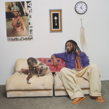
  
  

    <strong>Genre:</strong> Rap
    <strong>Subgenre:</strong> Rap
    <strong>Country:</strong> USA
    <strong>Language:</strong> English
    <strong>Format:</strong> Album
    <strong>Favorite Song:</strong> Familiar
  

  
  

    <h3>Scores</h3>
    

      

        Nuance
        3
      

      

        Narrative/Lyrics
        3
      

      

        Novelty
        2
      

      

        Listenability
        3
      

      

        Bonus Points
        +1
      

    

    

      Total:
      12/21
      C+
    

  

  
  

    <h3>Review</h3>
    
I like Amine and have always wanted him to see success since the release of Caroline back in 2016. He&#x27;s gotten his hits, but for some reason, lacks the ability to pull out any more slam dunks and be truly great. I think *13 Months of Sunshine* exemplifies why pretty well. Amine is not in it for the game, he makes music for fun and will continue doing so for fun. In comparison to his previous work, however, Amine makes it a point to include themes of... going on vacation. Yeah. In content, this is the album equivalent of an Adam Sandler tax writeoff. The good thing is that he successfully make some fun club songs, but he&#x27;s not getting any critical acclaim with this kind of music anytime soon. 

  

  
  <a href="https://www.youtube.com/watch?v=fgWM__UuQFc" class="listen-link" target="_blank">Listen</a>
  
  

    
  

</article>

<article class="album-card">
  

    108
    <h2 class="album-title">Sincerely - Kali Uchis</h2>
  

  
  <blockquote class="favorite-lyrics">
    
When time is a thief, I won&#x27;t let him rob me &#x27;cause

    
Heaven on earth may fade away but you and I are forever to stay in love

  </blockquote>
  
  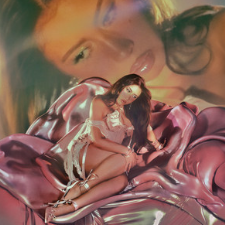
  
  

    <strong>Genre:</strong> Pop
    <strong>Subgenre:</strong> Pop
    <strong>Country:</strong> Colombia
    <strong>Language:</strong> Spanish
    <strong>Format:</strong> Album
    <strong>Favorite Song:</strong> It&#x27;s Just Us
  

  
  

    <h3>Scores</h3>
    

      

        Nuance
        3
      

      

        Narrative/Lyrics
        2
      

      

        Novelty
        1
      

      

        Listenability
        3
      

      

        Bonus Points
        +1
      

    

    

      Total:
      10/21
      C-
    

  

  
  

    <h3>Review</h3>
    
*Isolation* (2018) is a top 30 album of all time for me, so don’t dismiss my negativity on this album on the grounds that I don’t speak enough Spanish, because I do know Marina’s work (and plenty of songs are in English anyhow). I found Sincerely frankly pretty sad. It really just sounds like Kali/Marina is going down the Tyler route where she’s just too comfortable with the sound she’s had for almost a decade. Nothing about this album surprised or excited me. Was the music good, yeah, but it’s baseline work for her. Surprise me, please! Hell, maybe she would have surprised me if I could hear her voice better over the poor mixing between them and the background track. 

  

  
  <a href="https://www.youtube.com/watch?v=w6acdzD1Tr0&amp;list=RDw6acdzD1Tr0&amp;start_radio=1" class="listen-link" target="_blank">Listen</a>
  
  

    
  

</article>

<article class="album-card">
  

    107
    <h2 class="album-title">Princess of Power - Marina</h2>
  

  
  <blockquote class="favorite-lyrics">
    
Yeah I&#x27;m sweet and I&#x27;m icy and strange

    
Indecisive, obsessive, I crave

  </blockquote>
  
  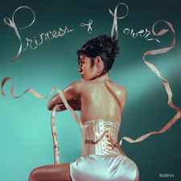
  
  

    <strong>Genre:</strong> Pop
    <strong>Subgenre:</strong> Pop
    <strong>Country:</strong> United Kingdom
    <strong>Language:</strong> English
    <strong>Format:</strong> Album
    <strong>Favorite Song:</strong> Cuntissimo
  

  
  

    <h3>Scores</h3>
    

      

        Nuance
        3
      

      

        Narrative/Lyrics
        2
      

      

        Novelty
        3
      

      

        Listenability
        2
      

      

        Bonus Points
        +1
      

    

    

      Total:
      11/21
      C
    

  

  
  

    <h3>Review</h3>
    
I really enjoyed this album&#x27;s lead single &quot;Cuntissimo&quot;, and have some love for &quot;I am not a Robot&quot; (one of Marina&#x27;s older tracks), but this album felt a bit hollow to me. A few good songs here and there but no reason to return to it. *Princess of Power&#x27;s* aesthetic relies moreso on a rennaisance motif versus building a consistent theme through more clever means. Not uninteresting, but  not very praiseworthy either as a complete package. 

  

  
  <a href="https://www.youtube.com/watch?v=Id_0DsBctYg&amp;list=RDId_0DsBctYg&amp;start_radio=1" class="listen-link" target="_blank">Listen</a>
  
  

    
  

</article>

<article class="album-card">
  

    106
    <h2 class="album-title">Sable Fable - Bon Iver</h2>
  

  
  <blockquote class="favorite-lyrics">
    
Said, “I’ll Be There”, I Won’t Move.

    
Tell me more, or tell me nothing

  </blockquote>
  
  
  
  

    <strong>Genre:</strong> Indie
    <strong>Subgenre:</strong> Indie Folk
    <strong>Country:</strong> USA
    <strong>Language:</strong> English
    <strong>Format:</strong> Album
    <strong>Favorite Song:</strong> I&#x27;ll Be There
  

  
  

    <h3>Scores</h3>
    

      

        Nuance
        2
      

      

        Narrative/Lyrics
        1
      

      

        Novelty
        1
      

      

        Listenability
        1
      

      

        Bonus Points
        +0
      

    

    

      Total:
      5/21
      F
    

  

  
  

    <h3>Review</h3>
    
I know Bon Iver gets a lot of love for their collaborations with Taylor Swift and that circle, but IMO at least 50% of this album is pretentious miserable bullshit. Ok, maybe &quot;bullshit&quot; is too harsh, but it the organization of this album does not immediatley inspire confidence in otherwise. It starts out with an unnecessary disc 1 which has plenty of blank space and a quiet, sad, boring, monotonous tone through most of it. Disc 2, which for some reason has 8 songs, picks up the pace a bit and barely sticks the landing emotionally - but only barely so that I didn&#x27;t walk away angry. Danielle Haim&#x27;s feature was also a welcome but all too short break from singer Justin Vernon&#x27;s depressing voice. Speaking of which it&#x27;s a miracle that they were able to pull out one non-suicide inducing song out of this album with &quot;I&#x27;ll Be There&quot; - that&#x27;s a decent bop I must admit.  
This was my first and will most likely be my last time listening to Bon Iver. I really just don&#x27;t see the appeal. 

  

  
  <a href="https://www.youtube.com/watch?v=ZSkXZ6zz5PQ&amp;list=RDZSkXZ6zz5PQ&amp;start_radio=1" class="listen-link" target="_blank">Listen</a>
  
  

    
  

</article>

<article class="album-card">
  

    105
    <h2 class="album-title">Everybody Scream - Florence and the Machine</h2>
  

  
  <blockquote class="favorite-lyrics">
    
And love was not what I thought it was

    
More like an animal crawling deep into a cave than a romance novel heroine being swept away

  </blockquote>
  
  
  
  

    <strong>Genre:</strong> Indie
    <strong>Subgenre:</strong> Stomp Clap Revival
    <strong>Country:</strong> United Kingdom
    <strong>Language:</strong> English
    <strong>Format:</strong> Album
    <strong>Favorite Song:</strong> And Love
  

  
  

    <h3>Scores</h3>
    

      

        Nuance
        3
      

      

        Narrative/Lyrics
        3
      

      

        Novelty
        1
      

      

        Listenability
        2
      

      

        Bonus Points
        +0
      

    

    

      Total:
      9/21
      D+
    

  

  
  

    <h3>Review</h3>
    
I reviewed this in November when my list was nearing it&#x27;s end point, and my general dislike of this album made me want to look into the relationship between how well I know the artist and my standards of them. I found that after 85 reviews, there was a correlation of -0.187 when comparing my perceived popularity of the artist and my take on the album. While that somewhat aligns with my worries, the fact that the correlation is so weak is glad to see. It says only 3.5% of my review is impacted by their perceived popularity in my eyes, in theory.  
With that said, I did not like this album. For starters, it sounds way too much like pretty much everything this band has released before, but lacking in emotional depth in comparison. Florence&#x27;s singing especially suffers in comparison to her work from the early 2010s, to the point where it honestly felt like she was bored of her very existence. Maybe she&#x27;s depressed. Then there&#x27;s the lyrics. I won&#x27;t go into too much detail here, but there&#x27;s one song on here, &quot;One of the Greats&quot; which is brutally whiny. Florence and the Machine has the privelege of being a household name in 2025. I don&#x27;t doubt in the slightest that it took a ton of behind the scenes work to get them to the heights they reached in around 2013, but they won. Yet Florence decides to say &quot;It must be nice to be a man and make boring music just because you can&quot;, claiming the line is referring to men being lazier performers than women. That&#x27;s 100% true on average, but the blanket statement and lack of self reflection is a terrible look.  
That&#x27;s just one example of a few misandrist lines scattered around the album. If you know me, you know I&#x27;m not a men&#x27;s rights guy and that I&#x27;m not defending men in any way shape or form. I bring this up because on top of being simply boring, *Everybody Scream* also has a lot of anger within it that comes out in some pretty unflattering ways. At the very least, they could be communicated much more effectively. 

  

  
  <a href="https://www.youtube.com/watch?v=QRqCK7jv9tc&amp;list=RDQRqCK7jv9tc&amp;start_radio=1" class="listen-link" target="_blank">Listen</a>
  
  

    
  

</article>

<article class="album-card">
  

    104
    <h2 class="album-title">Crash Bogus - Torr</h2>
  

  
  <blockquote class="favorite-lyrics">
    
I took a picture of myself, the best I had ever seen

    
The caption said &quot;Greatest rapper 2017&quot;

  </blockquote>
  
  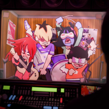
  
  

    <strong>Genre:</strong> Pop
    <strong>Subgenre:</strong> Indietronica
    <strong>Country:</strong> USA
    <strong>Language:</strong> English
    <strong>Format:</strong> Album
    <strong>Favorite Song:</strong> Grace and Owen Die
  

  
  

    <h3>Scores</h3>
    

      

        Nuance
        3
      

      

        Narrative/Lyrics
        2
      

      

        Novelty
        2
      

      

        Listenability
        1
      

      

        Bonus Points
        +2
      

    

    

      Total:
      10/21
      C-
    

  

  
  

    <h3>Review</h3>
    
I hate to say it, but *Crash Bogus* sounds a bit amateurish and lacking confidence. It&#x27;s a bit of a love letter sent too late to late 2018 bedroom and electro pop. I commend it for how diverse the tracklist is, but the song that drew me to this artist isn&#x27;t on the album, and nothing takes the place of the lead single to me. 

  

  
  <a href="https://www.youtube.com/watch?v=vsd9LFuxVFY&amp;list=RDvsd9LFuxVFY&amp;start_radio=1" class="listen-link" target="_blank">Listen</a>
  
  

    
  

</article>

<article class="album-card">
  

    103
    <h2 class="album-title">No Rap on Sunday - Kota the Friend</h2>
  

  
  <blockquote class="favorite-lyrics">
    
Spend my bread on a private chef just to make more bread &#x27;cause I&#x27;m cheap like that

  </blockquote>
  
  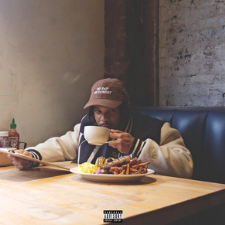
  
  

    <strong>Genre:</strong> Rap
    <strong>Subgenre:</strong> Rap
    <strong>Country:</strong> USA
    <strong>Language:</strong> English
    <strong>Format:</strong> Album
    <strong>Favorite Song:</strong> 5 Percenters
  

  
  

    <h3>Scores</h3>
    

      

        Nuance
        2
      

      

        Narrative/Lyrics
        3
      

      

        Novelty
        1
      

      

        Listenability
        3
      

      

        Bonus Points
        +1
      

    

    

      Total:
      10/21
      C-
    

  

  
  

    <h3>Review</h3>
    
I went into this album with pretty low expectations given what I knew about Kota&#x27;s music, but was pleasantly surprised with how much I enjoyed it. That&#x27;s in no way to say that I though Kota was a bad artist - he has some genuine classics under his belt despite being a C lister - I refer to his rap style which tends to be relatively monotone and vocally safe. What I respect about him though is that at this point in his career, he knows how to take advantage of that style and produce some solid chill raps. That said, apart from a few good political moments, it didn&#x27;t surprise me much and I don&#x27;t see myself thinking about the album much going forwards. Still, if a song came on in shuffle, it probably won&#x27;t be skipped.  

  

  
  <a href="https://www.youtube.com/watch?v=HcZN--J_87k&amp;list=RDHcZN--J_87k&amp;start_radio=1" class="listen-link" target="_blank">Listen</a>
  
  

    
  

</article>

<article class="album-card">
  

    102
    <h2 class="album-title">Guitar - Mac Demarco</h2>
  

  
  <blockquote class="favorite-lyrics">
    
If the sun&#x27;s still shining down on her

  </blockquote>
  
  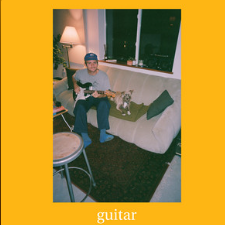
  
  

    <strong>Genre:</strong> Indie
    <strong>Subgenre:</strong> Slacker Rock
    <strong>Country:</strong> Canada
    <strong>Language:</strong> English
    <strong>Format:</strong> Album
    <strong>Favorite Song:</strong> Shining
  

  
  

    <h3>Scores</h3>
    

      

        Nuance
        2
      

      

        Narrative/Lyrics
        3
      

      

        Novelty
        1
      

      

        Listenability
        2
      

      

        Bonus Points
        +1
      

    

    

      Total:
      9/21
      D+
    

  

  
  

    <h3>Review</h3>
    
It&#x27;s a Mac Demarco album, and sadly a pretty boring one at that. I can appreciate that Mac clearly puts a lot of love and care into his music and lyrics, but this album can be described in one word: sleepy. 

  

  
  <a href="https://www.youtube.com/watch?v=jr_ArQThFlo&amp;list=RDjr_ArQThFlo&amp;start_radio=1" class="listen-link" target="_blank">Listen</a>
  
  

    
  

</article>

<article class="album-card">
  

    101
    <h2 class="album-title">Baby - Dijon</h2>
  

  
  <blockquote class="favorite-lyrics">
    
Is it all just passing time?

    
Is it brave, begging, &quot;Rewind!&quot;

  </blockquote>
  
  
  
  

    <strong>Genre:</strong> R&amp;B
    <strong>Subgenre:</strong> Alt R&amp;B
    <strong>Country:</strong> USA
    <strong>Language:</strong> English
    <strong>Format:</strong> Album
    <strong>Favorite Song:</strong> Rewind
  

  
  

    <h3>Scores</h3>
    

      

        Nuance
        3
      

      

        Narrative/Lyrics
        3
      

      

        Novelty
        4
      

      

        Listenability
        1
      

      

        Bonus Points
        +0
      

    

    

      Total:
      11/21
      C
    

  

  
  

    <h3>Review</h3>
    
Oh god did I go into this album with some high expectations. Every other critic online this year was grouping Dijon in with the likes of Mk. Gee and crediting him with producing some of the biggest albums of the year, so I went into this expecting his own work to be at the very least, special. Unique it was, but likeable it was not. Solid instrumentation and overall talent was present across the board, but my god Dijon sings like he is trying to walk off a gunshot wound. I can appreciate having such passion for your craft, but it makes the listening experience seriously difficult - for me at least. &quot;Rewind&quot; is one song that cross the threshhold into more emotional than painful, but that&#x27;s the one exception in my book. Overall, just a pretty painful and pretentious album. Not for me. He seems like a great artist to see live though. That SNL performance of &quot;Baby!&quot; was really great. Recorded version, not so much. 

  

  
  <a href="https://www.youtube.com/watch?v=vPI0mdAmLHU&amp;list=RDvPI0mdAmLHU&amp;start_radio=1&amp;pp=ygUMZGlqb24gcmV3aW5koAcB" class="listen-link" target="_blank">Listen</a>
  
  

    
  

</article>

<article class="album-card">
  

    100
    <h2 class="album-title">Baloonerism - Mac Miller</h2>
  

  
  <blockquote class="favorite-lyrics">
    
Abracadabra!

  </blockquote>
  
  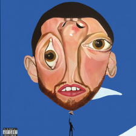
  
  

    <strong>Genre:</strong> Rap
    <strong>Subgenre:</strong> Rap
    <strong>Country:</strong> USA
    <strong>Language:</strong> English
    <strong>Format:</strong> Album
    <strong>Favorite Song:</strong> Excelsior
  

  
  

    <h3>Scores</h3>
    

      

        Nuance
        2
      

      

        Narrative/Lyrics
        2
      

      

        Novelty
        2
      

      

        Listenability
        3
      

      

        Bonus Points
        +1
      

    

    

      Total:
      10/21
      C-
    

  

  
  

    <h3>Review</h3>
    
This is a hard one to score, because I cannot bring myself to review it accurately knowing the artist behind it never gave consent for its publishing. I may be waaaay off the mark with that claim, but as far as I have read, Mac recorded this in 2014 and never released for an unknown reason. Multiple sources say it was due to Mac prioritizing other albums, namely the masterpiece which is *the Divine Feminine*, but that doesn&#x27;t sound like the full story to me. My point is that I think the album should be framed differently than how it was released. The average listener won&#x27;t know how young he was when it was recorded or any context at all for that matter. As for the songs, they&#x27;re good enough - they don&#x27;t invoke too many strong feelings in me excluding the exceptional &quot;Excesior&quot;, which would have made a legendary final track of his discography. In sum, I give this album a *shrug* out of ten because we&#x27;ll simply never know what it was meant to be. 

  

  
  <a href="https://www.youtube.com/watch?v=f4e3aVU7cjI&amp;list=RDf4e3aVU7cjI&amp;start_radio=1" class="listen-link" target="_blank">Listen</a>
  
  

    
  

</article>

<article class="album-card">
  

    99
    <h2 class="album-title">Vie - Doja Cat</h2>
  

  
  <blockquote class="favorite-lyrics">
    
It&#x27;s never easy, we&#x27;re willingly uncomfortable

    
I want you to teach me, we&#x27;re both feeling unlovable

  </blockquote>
  
  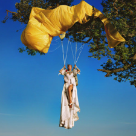
  
  

    <strong>Genre:</strong> Pop
    <strong>Subgenre:</strong> Pop
    <strong>Country:</strong> USA
    <strong>Language:</strong> English
    <strong>Format:</strong> Album
    <strong>Favorite Song:</strong> One More Time
  

  
  

    <h3>Scores</h3>
    

      

        Nuance
        2
      

      

        Narrative/Lyrics
        1
      

      

        Novelty
        1
      

      

        Listenability
        3
      

      

        Bonus Points
        +1
      

    

    

      Total:
      8/21
      D
    

  

  
  

    <h3>Review</h3>
    
I&#x27;ve somehow been following Doja&#x27;s career since the very beginning, and her 2019 album Hot Pink is an undeniable favorite pop album of mine. In my opinion, she excels in everything except rapping, which this album relies a bit too much on for my taste. Every album has featured a good amount of rap, but Vie couples it with one too many out of place, forced &quot;fuck you&quot;-esque bars that drags the album down a bit, namely with some of the early tracks &quot;Cards&quot;, and &quot;Aaaahh Men!&quot;. Ignoring that, it&#x27;s a typical and unsurprising Doja record. There&#x27;s some fun 80s pop pastiches, some serviceable R&amp;B, radio hits, et cetera. Unsurprising is the keyword here if you are even slightly familiar with her music, which is all the more dissapointing because she&#x27;s shown herself capable of changing up her sound on features such as with Teezo Touchdown, and on the high points of her last album Scarlet. This album attempts some new things, such as the saxaphone solo at the end of &quot;Stranger&quot;, but doesn&#x27;t dwell on or commit to them enough to warrant praise. &quot;One More Time&quot; is an exciting departure from the rest of the album, but it&#x27;s only one song in a 50 minute album. Still, far from the worst thing I heard this year, just less innovative than I had hoped, and lacking any sense of a throughline to justify it&#x27;s length. 

  

  
  <a href="https://www.youtube.com/watch?v=oGvBg_UwkJ0&amp;list=RDoGvBg_UwkJ0&amp;start_radio=1" class="listen-link" target="_blank">Listen</a>
  
  

    
  

</article>

<article class="album-card">
  

    98
    <h2 class="album-title">A Matter of Time - Laufey</h2>
  

  
  <blockquote class="favorite-lyrics">
    
You said “I can&#x27;t read your mind”, But I&#x27;m reading it just fine

    
You think you&#x27;re so misunderstood, The black cat of your neighborhood

  </blockquote>
  
  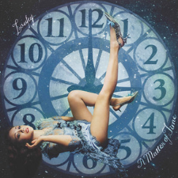
  
  

    <strong>Genre:</strong> Pop
    <strong>Subgenre:</strong> Jazz
    <strong>Country:</strong> Iceland
    <strong>Language:</strong> English
    <strong>Format:</strong> Album
    <strong>Favorite Song:</strong> Tough Luck
  

  
  

    <h3>Scores</h3>
    

      

        Nuance
        5
      

      

        Narrative/Lyrics
        2
      

      

        Novelty
        2
      

      

        Listenability
        2
      

      

        Bonus Points
        +1
      

    

    

      Total:
      12/21
      C+
    

  

  
  

    <h3>Review</h3>
    
I like Laufey a lot, but this album did not do it for me. I think her voice is much more interesting in a jazz or bossa-pop context, but on *A Matter of Time*, she leans much more heavily into classical sound. It still works for her, but the keyword for me is interesting. She as an artist is at her peak both artistically and as a unique brand when she owns the bossa nova sound. I don’t know why she abandoned it. Yes, I&#x27;ve given other artists shit for not evolving their sound album-to-album, but you don&#x27;t have to abandon a genre to evolve within it. 

  

  
  <a href="https://www.youtube.com/watch?v=9q71ywEqJjA&amp;list=RD9q71ywEqJjA&amp;start_radio=1" class="listen-link" target="_blank">Listen</a>
  
  

    Would love to hear the thoughts of: Lena Emily Sally
  

</article>

<article class="album-card">
  

    97
    <h2 class="album-title">Datamosh - High Society</h2>
  

  
  <blockquote class="favorite-lyrics">
    
N/A

  </blockquote>
  
  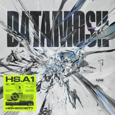
  
  

    <strong>Genre:</strong> Electronic
    <strong>Subgenre:</strong> EDMetal
    <strong>Country:</strong> USA
    <strong>Language:</strong> English
    <strong>Format:</strong> Album
    <strong>Favorite Song:</strong> Break
  

  
  

    <h3>Scores</h3>
    

      

        Nuance
        4
      

      

        Narrative/Lyrics
        1
      

      

        Novelty
        3
      

      

        Listenability
        2
      

      

        Bonus Points
        +1
      

    

    

      Total:
      11/21
      C
    

  

  
  

    <h3>Review</h3>
    
EDM is a tough genre to rate and review because of the dichotomy between the artists within a song. Unless the producer is also the singer, or if the vocals are sampled, the division between how the song sounds can be credited and impacted by two different people in a way that heavily contrasts a band. High Society is a producer and is the name on the album, and I&#x27;m sure he directs the vocals to an extent, yet I still felt like the singers were the stars of the show on this one, and I didn&#x27;t love that part of it. What I did love was the production on this album - it&#x27;s downright exhilerating and there&#x27;s not a lot else like it out there. Bro should try out an instrumental project, or singing, in the future. 

  

  
  <a href="https://www.youtube.com/watch?v=dWHA_sZRt88&amp;list=RDdWHA_sZRt88&amp;start_radio=1&amp;pp=ygUSaGlnaCBzb2NpZXR5IGJyZWFroAcB" class="listen-link" target="_blank">Listen</a>
  
  

    
  

</article>

<article class="album-card">
  

    96
    <h2 class="album-title">Synthetic Love - Tokyona</h2>
  

  
  <blockquote class="favorite-lyrics">
    
N/A

  </blockquote>
  
  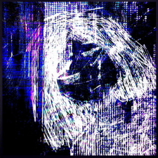
  
  

    <strong>Genre:</strong> Electronic
    <strong>Subgenre:</strong> Breakcore
    <strong>Country:</strong> Unknown
    <strong>Language:</strong> Instrumental
    <strong>Format:</strong> Album
    <strong>Favorite Song:</strong> Lovesynthesis
  

  
  

    <h3>Scores</h3>
    

      

        Nuance
        5
      

      

        Narrative/Lyrics
        2
      

      

        Novelty
        2
      

      

        Listenability
        1
      

      

        Bonus Points
        +2
      

    

    

      Total:
      12/21
      C+
    

  

  
  

    <h3>Review</h3>
    
I found my favorite song by this pretty unknown artist through listening to Nigerian radio stations, but unfortunatley, that song was on an EP she released int he 2nd half of 2025, a few months after this. That&#x27;s not to say that it&#x27;s tooooo far away from the tracklist on Synthetic Love, but it highlights one of the album&#x27;s two downfalls; depth of each track, and a narrative throughline. 

  

  
  <a href="https://www.youtube.com/watch?v=L_UBFnwaOgY" class="listen-link" target="_blank">Listen</a>
  
  

    Would love to hear the thoughts of: Phil
  

</article>

<article class="album-card">
  

    95
    <h2 class="album-title">Endlessly - Chanpan</h2>
  

  
  <blockquote class="favorite-lyrics">
    
But you can&#x27;t take this heat, your nerves keep burning through your stomach, yeah

    
Run like a tumbleweed, the sun keeps beating so hypnotic

  </blockquote>
  
  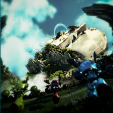
  
  

    <strong>Genre:</strong> Pop
    <strong>Subgenre:</strong> Breakbeat
    <strong>Country:</strong> USA
    <strong>Language:</strong> English
    <strong>Format:</strong> EP
    <strong>Favorite Song:</strong> Striking Vipers
  

  
  

    <h3>Scores</h3>
    

      

        Nuance
        4
      

      

        Narrative/Lyrics
        2
      

      

        Novelty
        4
      

      

        Listenability
        3
      

      

        Bonus Points
        +2
      

    

    

      Total:
      15/21
      B
    

  

  
  

    <h3>Review</h3>
    
I enjoy this group a lot and think they should be a lot bigger than they are, but somehow I forgot I listened to this EP shortly after hearing it despite the inclusion of at least two great songs (&quot;Striking Vipers&quot; and &quot;Gaia&quot;). Overall, while Chanpan has a lot to offer, they are in desperate need of a way to inject more personality in their music. Don&#x27;t get me wrong, it is a really fun time, but I for starters I can&#x27;t make out 75% of the lyrics amongst the consistently dope backing tracks. 

  

  
  <a href="https://www.youtube.com/watch?v=3ZmlRsNysNY&amp;list=RD3ZmlRsNysNY&amp;start_radio=1" class="listen-link" target="_blank">Listen</a>
  
  

    Would love to hear the thoughts of: Lena Emily Sally
  

</article>

<article class="album-card">
  

    94
    <h2 class="album-title">Ur an Angel I&#x27;m Just Particles - Benee</h2>
  

  
  <blockquote class="favorite-lyrics">
    
I&#x27;m off the rails, think I might fall apart

    
And I&#x27;m crazy now, but it got dark

  </blockquote>
  
  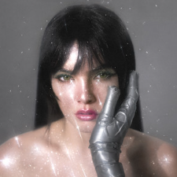
  
  

    <strong>Genre:</strong> Pop
    <strong>Subgenre:</strong> Pop
    <strong>Country:</strong> Australia
    <strong>Language:</strong> English
    <strong>Format:</strong> Album
    <strong>Favorite Song:</strong> Off the Rails
  

  
  

    <h3>Scores</h3>
    

      

        Nuance
        2
      

      

        Narrative/Lyrics
        2
      

      

        Novelty
        2
      

      

        Listenability
        3
      

      

        Bonus Points
        +1
      

    

    

      Total:
      10/21
      C-
    

  

  
  

    <h3>Review</h3>
    
This is far from a bad album, however I left it a bit let down due to how high of a standard the singles set for the full project. &quot;Cinnamon&quot; and &quot;Off the Rails&quot;, especially, are a couple of the catchiest and most exciting songs I&#x27;ve heard all year, but they are two standouts on an album of mostly pop I&#x27;ve been listening to for close to a decade now. Props to &quot;Prey4U&quot; for getting close to matching their energy.  
I also have a bit of an issue with the sequencing of the album. In my opinion, the &quot;Off the Rails&quot; should have opened the album, being a song that I could sprint a mile on, but instead Benee chose to kick things off with &quot;Demons&quot;, a slower, almost lethargic R&amp;B track. It&#x27;s not a bad song, but it&#x27;s lacking intrigue.  
That could be said about most of the album, in fact. I was really missing any form of narrative throughline. Not to bring up &quot;Off the Rails&quot; so much, but that song tells the story of a girl who&#x27;s taking advantage of the destruction and chaos of fame, and it&#x27;s frankly pretty profound when you think about it. That idea does not show up anywhere else on the album, and I think it was a missed opportunity.  
In summary, Ur an Angel I&#x27;m Just Particles is a decently fun but basic pop album which, despite it&#x27;s standouts, holds on too close to the lockdown vibes of 2020 and lacks a hook, despite its many excellent hooks. 

  

  
  <a href="https://www.youtube.com/watch?v=TVnSI84fGqY&amp;list=RDTVnSI84fGqY&amp;start_radio=1" class="listen-link" target="_blank">Listen</a>
  
  

    
  

</article>

<article class="album-card">
  

    93
    <h2 class="album-title">Alles oder Nix - SSIO </h2>
  

  
  <blockquote class="favorite-lyrics">
    
Durch TikTok-Algorithmus hab&#x27; ich in letzter Zeit zu viel Musik von Ayliva gehört

  </blockquote>
  
  
  
  

    <strong>Genre:</strong> Rap
    <strong>Subgenre:</strong> Rap
    <strong>Country:</strong> Germany
    <strong>Language:</strong> German
    <strong>Format:</strong> Album
    <strong>Favorite Song:</strong> Ich Bin Raus
  

  
  

    <h3>Scores</h3>
    

      

        Nuance
        3
      

      

        Narrative/Lyrics
        4
      

      

        Novelty
        2
      

      

        Listenability
        3
      

      

        Bonus Points
        +1
      

    

    

      Total:
      13/21
      B-
    

  

  
  

    <h3>Review</h3>
    
I found this artist through his really stellar performance on Colors and had to check it out. It&#x27;s a mixed bag, but you can tell SSIO is hungry.  
About a quarter of the albums on this list are not primarily in English, but this album above others was especially hard to comprehend for me as it was so lyrically dense that cultural and liguistic differences between my experience as an American and him as a German complicated my understanding of what he was trying to say, even in the translated lyrics. I&#x27;m not going to go into specifics, but there are some comments about women in this album that were a bit over the line in terms of their sexism, yet they also felt extremely out of place compared to the rest of the album. I don&#x27;t think you need to know about the artist&#x27;s personal and political life in order to understand what they&#x27;re trying to say in their songs, in most cases. 

  

  
  <a href="https://www.youtube.com/watch?v=rl0HAGx6X0I&amp;list=RDrl0HAGx6X0I&amp;start_radio=1&amp;pp=ygUTY29sb3JzIGljaCBiaW4gcmF1c6AHAQ%3D%3D" class="listen-link" target="_blank">Listen</a>
  
  

    
  

</article>

<article class="album-card">
  

    92
    <h2 class="album-title">Through the Wall - Rochelle Jordan</h2>
  

  
  <blockquote class="favorite-lyrics">
    
Ooh, and my heart keeps telling me yeah, and my heart keeps telling me fine

    
And my heart keeps telling me now, every time I see the boy

  </blockquote>
  
  
  
  

    <strong>Genre:</strong> Electronic
    <strong>Subgenre:</strong> House R&amp;B
    <strong>Country:</strong> Canada
    <strong>Language:</strong> English
    <strong>Format:</strong> Album
    <strong>Favorite Song:</strong> The Boy
  

  
  

    <h3>Scores</h3>
    

      

        Nuance
        3
      

      

        Narrative/Lyrics
        1
      

      

        Novelty
        1
      

      

        Listenability
        2
      

      

        Bonus Points
        +2
      

    

    

      Total:
      9/21
      D+
    

  

  
  

    <h3>Review</h3>
    
It&#x27;s fine. Better than mediocre, but lacking any sort of novelty or narrative throughline to keep me invested. Saved by Kaytranada doing a lot of the production. 

  

  
  <a href="https://www.youtube.com/watch?v=qJDn6PseE2k&amp;list=RDqJDn6PseE2k&amp;start_radio=1" class="listen-link" target="_blank">Listen</a>
  
  

    Would love to hear the thoughts of: Aidan B
  

</article>

<article class="album-card">
  

    91
    <h2 class="album-title">Wicked: For Good Soundtrack - Ariana Grande, Cynthia Erivio, and cast </h2>
  

  
  <blockquote class="favorite-lyrics">
    
Because I knew you, I&#x27;ve been changed for good

  </blockquote>
  
  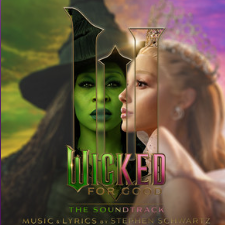
  
  

    <strong>Genre:</strong> Musical Theater
    <strong>Subgenre:</strong> Musical Theater
    <strong>Country:</strong> USA
    <strong>Language:</strong> English
    <strong>Format:</strong> Album
    <strong>Favorite Song:</strong> For Good
  

  
  

    <h3>Scores</h3>
    

      

        Nuance
        4
      

      

        Narrative/Lyrics
        5
      

      

        Novelty
        1
      

      

        Listenability
        2
      

      

        Bonus Points
        +0
      

    

    

      Total:
      12/21
      C+
    

  

  
  

    <h3>Review</h3>
    
If Elphaba wasn&#x27;t such a shitlib she would&#x27;ve painted the walls red with nazi Wizard&#x27;s blood in the first act.  
I was told going into this that the second half of the broadway show was famously the weaker half, and on the music front that is definitley true. It&#x27;s still, dare I say, good both within and outside of the musical theater genre, but when I compare it to the high points of &quot;part 1&quot;, I can&#x27;t help but feeling like something was missing. At the very least the statement stands looking at &quot;Wicked&quot; as a complete product between both parts - if only I was more interested in theater as a kid while my sister was a fan. I neither identified any lighthearted hits like &quot;Popular&quot; or triumphs like &quot;Defying gravity&quot; here, which more than anything speaks to how the range of music on &quot;part 2&quot; is a lot more limited than it once was in part 1.  
Anyways, I&#x27;d reccomend the movie simply because it&#x27;s a conclusion to part 1, although it&#x27;s a terribly drawn out one, but skip the soundtrack unless you&#x27;re a nerd. 

  

  
  <a href="https://www.youtube.com/watch?v=wYTeyNB1k5g&amp;list=RDwYTeyNB1k5g&amp;start_radio=1" class="listen-link" target="_blank">Listen</a>
  
  

    
  

</article>

<article class="album-card">
  

    90
    <h2 class="album-title">Anywhere Here is Perfect - Sam Gelliatry</h2>
  

  
  <blockquote class="favorite-lyrics">
    
Oh, how typical of her to come around now I&#x27;m doing fine

    
Was the best day I had in a while &#x27;til she crossed my mind

  </blockquote>
  
  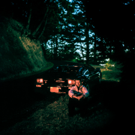
  
  

    <strong>Genre:</strong> Electronic
    <strong>Subgenre:</strong> Synthpop
    <strong>Country:</strong> France
    <strong>Language:</strong> English
    <strong>Format:</strong> Album
    <strong>Favorite Song:</strong> Scar / A New Void
  

  
  

    <h3>Scores</h3>
    

      

        Nuance
        3
      

      

        Narrative/Lyrics
        2
      

      

        Novelty
        2
      

      

        Listenability
        3
      

      

        Bonus Points
        +1
      

    

    

      Total:
      11/21
      C
    

  

  
  

    <h3>Review</h3>
    
Listening to this album, I couldn&#x27;t help but appreciate the fact that when Sam sings on his songs, it&#x27;s a near perfect mashup between Daft Punk and Tame Impala. Unfortunatley, this album is a bit too long for the little he strays from that sound. It&#x27;s still good, but if you were listening to him for the first time, I&#x27;d reccomend his older stuff first. 

  

  
  <a href="https://www.youtube.com/watch?v=XpDnNK8uKNs&amp;list=RDXpDnNK8uKNs&amp;start_radio=1&amp;pp=ygUSc2FtIGdlbGxhaXRyeSBzY2FyoAcB" class="listen-link" target="_blank">Listen</a>
  
  

    
  

</article>

<article class="album-card">
  

    89
    <h2 class="album-title">Fancy That - Pinkpantheress</h2>
  

  
  <blockquote class="favorite-lyrics">
    
My name is Pink and I&#x27;m really glad to meet you

    
You&#x27;re recommended to me by some people

  </blockquote>
  
  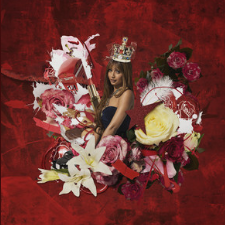
  
  

    <strong>Genre:</strong> Pop
    <strong>Subgenre:</strong> Pop
    <strong>Country:</strong> United Kingdom
    <strong>Language:</strong> English
    <strong>Format:</strong> Album
    <strong>Favorite Song:</strong> Tonight
  

  
  

    <h3>Scores</h3>
    

      

        Nuance
        2
      

      

        Narrative/Lyrics
        4
      

      

        Novelty
        1
      

      

        Listenability
        3
      

      

        Bonus Points
        +2
      

    

    

      Total:
      12/21
      C+
    

  

  
  

    <h3>Review</h3>
    
This is ranked pretty low but I didn&#x27;t dislike this album, I just feel like Pink hasn&#x27;t evolved her vocals enough since she debuted during covid. This album is a collection of what&#x27;s easily some of her best work, but it could have also been a from the vault release from 5 years ago and I would be none the wiser. Regardless, the beats are hitting, and the subject matter of each song are more focused and developed. It just didn&#x27;t surprise me. I couldl dance to it, but in the back of my head I&#x27;d be yearning for more from her. 

  

  
  <a href="https://www.youtube.com/watch?v=TFWXqLSr4ZM&amp;list=RDTFWXqLSr4ZM&amp;start_radio=1" class="listen-link" target="_blank">Listen</a>
  
  

    
  

</article>

<article class="album-card">
  

    88
    <h2 class="album-title">Essex Honey - Blood Orange</h2>
  

  
  <blockquote class="favorite-lyrics">
    
Hard to let you go, See you and I know why it&#x27;s always grey 

    
Hard to let you go, Healthy as we pray for a journey home

  </blockquote>
  
  
  
  

    <strong>Genre:</strong> R&amp;B
    <strong>Subgenre:</strong> Alt R&amp;B
    <strong>Country:</strong> United Kingdom
    <strong>Language:</strong> English
    <strong>Format:</strong> Album
    <strong>Favorite Song:</strong> The Field
  

  
  

    <h3>Scores</h3>
    

      

        Nuance
        3
      

      

        Narrative/Lyrics
        3
      

      

        Novelty
        2
      

      

        Listenability
        2
      

      

        Bonus Points
        +1
      

    

    

      Total:
      11/21
      C
    

  

  
  

    <h3>Review</h3>
    
Who is Blood Orange? What is this album’s purpose? I sure as shit don’t know, but anyone who listens could tell you that this is one of the most obviously, deeply personal albums of this year. In my opinion, it&#x27;s a slight bit too quiet to be worth reading into very much, which holds it back from being ranked higher. That said, it reeks of nostalgia, trauma, love, and memory. Even if the final product isn’t very exciting, I can tell it oozes therapy for the artist, and for that, I give it a soft thumbs up even if it won&#x27;t show up in my rotation anytime soon. 

  

  
  <a href="https://www.youtube.com/watch?v=yTaz0TB9Zco&amp;list=RDyTaz0TB9Zco&amp;start_radio=1" class="listen-link" target="_blank">Listen</a>
  
  

    
  

</article>

<article class="album-card">
  

    87
    <h2 class="album-title">They Left me with the Sword - Paris Texas</h2>
  

  
  <blockquote class="favorite-lyrics">
    
Runnin&#x27; around, this shit don&#x27;t stop

  </blockquote>
  
  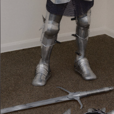
  
  

    <strong>Genre:</strong> Rap
    <strong>Subgenre:</strong> Rap
    <strong>Country:</strong> USA
    <strong>Language:</strong> English
    <strong>Format:</strong> EP
    <strong>Favorite Song:</strong> Infinyte
  

  
  

    <h3>Scores</h3>
    

      

        Nuance
        3
      

      

        Narrative/Lyrics
        4
      

      

        Novelty
        2
      

      

        Listenability
        2
      

      

        Bonus Points
        +2
      

    

    

      Total:
      13/21
      B-
    

  

  
  

    <h3>Review</h3>
    
Paris Texas came out of the woodworks a few years back during the decline of the Brockhampton craze, and with their first single &quot;Force of Habit&quot;, I was for sure they&#x27;d be taking the reigns. Following two albums that were critical and commerical dissapointments, they released two EPs back to back this year: &quot;They Left me with the Sword&quot; and &quot;They Left me with the Gun&quot;. Nothing about these EPs are espcially bad other than some mixing and rap cadence that gets a bit stale by the end compared to their last projects, but in my experience, they go in one ear and out the other. They&#x27;re the type of EP that comes up in shuffle and you think &quot;Oh I remember this! What happened to these guys?&quot; only to realize that that statement basically answers the question. 

  

  
  <a href="https://www.youtube.com/watch?v=C_jANET2Zs4&amp;list=RDC_jANET2Zs4&amp;start_radio=1" class="listen-link" target="_blank">Listen</a>
  
  

    
  

</article>

<article class="album-card">
  

    86
    <h2 class="album-title">Breach - 21 Pilots</h2>
  

  
  <blockquote class="favorite-lyrics">
    
I don&#x27;t sleep much, that&#x27;s crazy, how&#x27;d you know that?

    
I&#x27;ll keep myself up, that&#x27;s maybe how you know that

  </blockquote>
  
  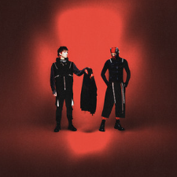
  
  

    <strong>Genre:</strong> Rock
    <strong>Subgenre:</strong> Alt Rock
    <strong>Country:</strong> USA
    <strong>Language:</strong> English
    <strong>Format:</strong> Album
    <strong>Favorite Song:</strong> The Contract
  

  
  

    <h3>Scores</h3>
    

      

        Nuance
        4
      

      

        Narrative/Lyrics
        3
      

      

        Novelty
        2
      

      

        Listenability
        2
      

      

        Bonus Points
        +2
      

    

    

      Total:
      13/21
      B-
    

  

  
  

    <h3>Review</h3>
    
I somehow missed out on 2021&#x27;s *Scaled and Icy* and 2024&#x27;s *Clancy*, and was not a huge fan prior to 2018, but that year&#x27;s *Trench* went triple platnium in my bedroom for me as both an angry college student and a kid learning bass. To this day I haven&#x27;t heard Scaled and Icy nor Clancy so I don&#x27;t know much about their evolution nor whether they&#x27;re overdoing their sound in on a discographical level, but *Breach* brings me right back to the best parts of 2018/2019 pre-pandemic. It&#x27;s just a good, headbanging time while also being digestible, understandble, and most of all, fun.  
I do have to comment on the themes that the duo tends to use on this and in the past. In short, 21p makes music for young men who choose to see mental health treatment as YA novels from the mid-2000s (Maze Runner, Divergent, et cetera). That has never been more apparent than on this album, such as the most popular track &quot;City Walls&quot; - you can fill in the gaps as to what the walls represent. Grow up guys.  Still a catchy track though. 

  

  
  <a href="https://www.youtube.com/watch?v=QZfH7cFp3Ys" class="listen-link" target="_blank">Listen</a>
  
  

    
  

</article>

<article class="album-card">
  

    85
    <h2 class="album-title">Racer - Blusher</h2>
  

  
  <blockquote class="favorite-lyrics">
    
Don&#x27;t make it romantic

    
Don&#x27;t look at me like you&#x27;re in love

  </blockquote>
  
  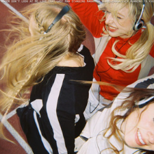
  
  

    <strong>Genre:</strong> Pop
    <strong>Subgenre:</strong> Pop
    <strong>Country:</strong> Australia
    <strong>Language:</strong> English
    <strong>Format:</strong> Album
    <strong>Favorite Song:</strong> Don&#x27;t look at me like that
  

  
  

    <h3>Scores</h3>
    

      

        Nuance
        2
      

      

        Narrative/Lyrics
        2
      

      

        Novelty
        1
      

      

        Listenability
        3
      

      

        Bonus Points
        +2
      

    

    

      Total:
      10/21
      C-
    

  

  
  

    <h3>Review</h3>
    
I gave this EP a shot after seeing this trio&#x27;s stellar live performance of &quot;Don&#x27;t look at me like that&quot; and had my expectations were almost met. I had hoped for an Australian Illit, but what I got was a pretty basic six song pop EP. I kept 4/6 songs in rotation for a while, but I don&#x27;t think it&#x27;s highly worthy of any critical acclaim. Novelty is minimal, lyrics are uninspired, and it didn&#x27;t particularly feel like they spent too long on it compared to other EPs on this list. Regardless, this is a fun and well directed debut project from this girl group, and I may keep an eye on them going forwards. 

  

  
  <a href="https://www.youtube.com/watch?v=2_zqDxcg08w&amp;list=RD2_zqDxcg08w&amp;start_radio=1" class="listen-link" target="_blank">Listen</a>
  
  

    Would love to hear the thoughts of: Lena Sally A must listen to for Tess
  

</article>

<article class="album-card">
  

    84
    <h2 class="album-title">It&#x27;s a Beautiful Place - Water From Your Eyes</h2>
  

  
  <blockquote class="favorite-lyrics">
    
Take my picture back, psychopath, psychopath

    
Flashlight, nitric gas, psychopath

  </blockquote>
  
  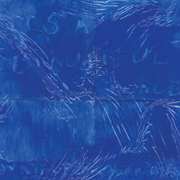
  
  

    <strong>Genre:</strong> Rock
    <strong>Subgenre:</strong> Indie Rock
    <strong>Country:</strong> United Kingdom
    <strong>Language:</strong> English
    <strong>Format:</strong> Album
    <strong>Favorite Song:</strong> Born 2
  

  
  

    <h3>Scores</h3>
    

      

        Nuance
        3
      

      

        Narrative/Lyrics
        3
      

      

        Novelty
        2
      

      

        Listenability
        2
      

      

        Bonus Points
        +2
      

    

    

      Total:
      12/21
      C+
    

  

  
  

    <h3>Review</h3>
    
Around the middle of this list here, I&#x27;ve realized I start to slump in that I have little to say about these albums. They aren&#x27;t bad, and they very well may end up in someone&#x27;s top 20 of the year, but they are simply what they are. *It&#x27;s a Beautiful Place* is the epitome of that concept.  
A good number of year-end lists I saw ranked this as one of the best albums of the year, but I just don&#x27;t get the hype. It&#x27;s a slightly sub par alt rock record, and I can&#x27;t find the words to describe it any further. I like the space motifs though.  
I&#x27;m fully aware these reviews shouldn&#x27;t focus on anything but the music, but then I remember it&#x27;s my website and I can do what I want. 

  

  
  <a href="https://www.youtube.com/watch?v=usrOTCqBpuk" class="listen-link" target="_blank">Listen</a>
  
  

    Would love to hear the thoughts of: Aidan C
  

</article>

<article class="album-card">
  

    83
    <h2 class="album-title">Sinister Grift - Panda Bear</h2>
  

  
  <blockquote class="favorite-lyrics">
    
Defense

    
I&#x27;m in deep, I could use you by my side

  </blockquote>
  
  
  
  

    <strong>Genre:</strong> Indie
    <strong>Subgenre:</strong> Psychadelic
    <strong>Country:</strong> USA
    <strong>Language:</strong> English
    <strong>Format:</strong> Album
    <strong>Favorite Song:</strong> Defense
  

  
  

    <h3>Scores</h3>
    

      

        Nuance
        4
      

      

        Narrative/Lyrics
        3
      

      

        Novelty
        4
      

      

        Listenability
        1
      

      

        Bonus Points
        +2
      

    

    

      Total:
      14/21
      B-
    

  

  
  

    <h3>Review</h3>
    
One of those albums that&#x27;s a real gauntlet to get through.  
I&#x27;ve been familiar with Panda Bear and the Animal Collective going back as early as 2014, so I kinda knew what I was getting into with this record. The most popular track *Defense* went certified platnium for me this Spring, so I had to give the whole thing a shot. What could go wrong? Well, nothing, per se, but it wasn&#x27;t a particular enjoyable experience either. Panda Bear thrives in very specific circumstances- you have to want to hear something interesting, or you have to be tripping. His music is not for casual listening, which is at least unique amongst rock/indie artists that don&#x27;t call themselves &quot;art rock&quot;.  
In short, there&#x27;s a lot of value here, but it&#x27;s an album that will scare away casual listenrs, yet doesn&#x27;t offer much in substance to justify that experience either (save the closing track). 

  

  
  <a href="https://www.youtube.com/watch?v=vXz4lEwglkg&amp;list=RDvXz4lEwglkg&amp;start_radio=1" class="listen-link" target="_blank">Listen</a>
  
  

    
  

</article>

<article class="album-card">
  

    82
    <h2 class="album-title">Good Girls - Josie Edwards</h2>
  

  
  <blockquote class="favorite-lyrics">
    
I begged you not to let go But you heard only echo

    
Now I’m hanging by my high hope

  </blockquote>
  
  
  
  

    <strong>Genre:</strong> Folk
    <strong>Subgenre:</strong> Folk
    <strong>Country:</strong> USA
    <strong>Language:</strong> English
    <strong>Format:</strong> EP
    <strong>Favorite Song:</strong> High Hope
  

  
  

    <h3>Scores</h3>
    

      

        Nuance
        2
      

      

        Narrative/Lyrics
        2
      

      

        Novelty
        2
      

      

        Listenability
        3
      

      

        Bonus Points
        +2
      

    

    

      Total:
      11/21
      C
    

  

  
  

    <h3>Review</h3>
    
This EP is only about 13 minutes, but is a pretty enjoyable experience beginning to end despite it not landing as much as I hoped with me. I rank it low because it was just simply too short. There is so much potential for greatness here, and I think if Josie took the time to turn this into a full album, it would truly hit different. I also feel like you can find 5 variants of this brand of singer songwriter off any college radio station&#x27;s daily playlist, and I say that with love. There&#x27;s some clever lyrics and hooks that will stick with you long after listening, particularly in the closing track &quot;New House&quot;. Def worth a listen if you&#x27;re planning to chill in a hammock at some point today. 

  

  
  <a href="https://www.youtube.com/watch?v=Qrgnr0N8iwU" class="listen-link" target="_blank">Listen</a>
  
  

    Would love to hear the thoughts of: Emily Sally
  

</article>

<article class="album-card">
  

    81
    <h2 class="album-title">USB - Fred Again..</h2>
  

  
  <blockquote class="favorite-lyrics">
    
Me caí en la mitad de la coreo

    
Del stage directo al sanatorio

  </blockquote>
  
  
  
  

    <strong>Genre:</strong> Electronic
    <strong>Subgenre:</strong> 
    <strong>Country:</strong> United Kingdom
    <strong>Language:</strong> English
    <strong>Format:</strong> Mixtape
    <strong>Favorite Song:</strong> Beto&#x27;s Horns
  

  
  

    <h3>Scores</h3>
    

      

        Nuance
        4
      

      

        Narrative/Lyrics
        2
      

      

        Novelty
        3
      

      

        Listenability
        3
      

      

        Bonus Points
        +2
      

    

    

      Total:
      14/21
      B-
    

  

  
  

    <h3>Review</h3>
    
I don&#x27;t think Fred will ever be able to touch the heights he reached when he first came on the scene with the &quot;Actual Life&quot; series, but you know you&#x27;re always in for something interesting with him. This is a mixtape with over 2 hours of throwaways, but there is still some total gold in here if you&#x27;re willing to dig. 

  

  
  <a href="https://www.youtube.com/watch?v=BOtCBy_FSZE&amp;list=RDBOtCBy_FSZE&amp;start_radio=1" class="listen-link" target="_blank">Listen</a>
  
  

    
  

</article>

<article class="album-card">
  

    80
    <h2 class="album-title">Kpop Demon Hunters Soundtrack</h2>
  

  
  <blockquote class="favorite-lyrics">
    
My voice without the lies, this is what it sounds like

    
Fearless and undefined, this is what it sounds like

  </blockquote>
  
  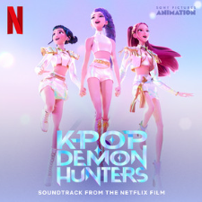
  
  

    <strong>Genre:</strong> Pop
    <strong>Subgenre:</strong> Kpop
    <strong>Country:</strong> USA
    <strong>Language:</strong> English
    <strong>Format:</strong> Album
    <strong>Favorite Song:</strong> What it Sounds Like
  

  
  

    <h3>Scores</h3>
    

      

        Nuance
        3
      

      

        Narrative/Lyrics
        4
      

      

        Novelty
        1
      

      

        Listenability
        3
      

      

        Bonus Points
        +1
      

    

    

      Total:
      12/21
      C+
    

  

  
  

    <h3>Review</h3>
    
It&#x27;s fun, and it succeeds in spades for what it is going for, however there are some very odd and capitalist wording choices scattered around the album, and frankly I did not enjoy any of the non-Huntrix songs. Nothing much more to say about it because the whole story is pretty generic. 

  

  
  <a href="https://www.youtube.com/watch?v=vjaKvvuRW_g&amp;list=RDvjaKvvuRW_g&amp;start_radio=1" class="listen-link" target="_blank">Listen</a>
  
  

    Would love to hear the thoughts of: Andrew Lena Sally
  

</article>

<article class="album-card">
  

    79
    <h2 class="album-title">Eusexua - FKA Twigs</h2>
  

  
  <blockquote class="favorite-lyrics">
    
Where the wild things are I will be

    
Lost in a world of childlike things and tragedies

  </blockquote>
  
  
  
  

    <strong>Genre:</strong> Electronic
    <strong>Subgenre:</strong> Art Pop
    <strong>Country:</strong> United Kingdom
    <strong>Language:</strong> English
    <strong>Format:</strong> Album
    <strong>Favorite Song:</strong> Childlike Things
  

  
  

    <h3>Scores</h3>
    

      

        Nuance
        4
      

      

        Narrative/Lyrics
        3
      

      

        Novelty
        3
      

      

        Listenability
        1
      

      

        Bonus Points
        +1
      

    

    

      Total:
      12/21
      C+
    

  

  
  

    <h3>Review</h3>
    
Eusexua is a mixed bag in terms of enjoyment and listenability. In my opinion, the majority of songs on here suffer from Twigs&#x27; desire to make the album sound as futuristic as possible, such that the final product is incredibly emotionally gripping yet very unpleasant, depressing, and sometimes creepy. I&#x27;m a big fan of artists experimenting and making experimental music, and she succeeds on balancing newish sounds with a vibe that doesn&#x27;t make me feel like I&#x27;m in a haunted house with a couple songs, namely &quot;Drums of Death&quot; and &quot;Sticky&quot;, but I think back on the entire album in the same way I think about Cronenberg&#x27;s &quot;Crimes of the Future&quot;; bleak dystopia with poisonous air and art meant to disgust because all everything else has been done before. Not to say that this album is disgusting, though Twigs has played around with body horror before.  
In summary, I appluad this album for getting a reaction out of me, but I&#x27;m not interested in listening to it again, save my favorite and most outlandish track compared to the rest of the album &quot;Childish Things&quot;. Again, it&#x27;s a mixed bag. 

  

  
  <a href="https://www.youtube.com/watch?v=ax54oYnkjjc&amp;list=RDax54oYnkjjc&amp;start_radio=1" class="listen-link" target="_blank">Listen</a>
  
  

    Would love to hear the thoughts of: Aidan C Sally
  

</article>

<article class="album-card">
  

    78
    <h2 class="album-title">Hot - Le Sserafim</h2>
  

  
  <blockquote class="favorite-lyrics">
    
I want you to stop time

    
The moment the flame burns me, finally, I can breathe

  </blockquote>
  
  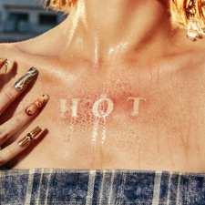
  
  

    <strong>Genre:</strong> Pop
    <strong>Subgenre:</strong> Kpop
    <strong>Country:</strong> South Korea
    <strong>Language:</strong> Korean
    <strong>Format:</strong> EP
    <strong>Favorite Song:</strong> Ash
  

  
  

    <h3>Scores</h3>
    

      

        Nuance
        3
      

      

        Narrative/Lyrics
        1
      

      

        Novelty
        2
      

      

        Listenability
        3
      

      

        Bonus Points
        +2
      

    

    

      Total:
      11/21
      C
    

  

  
  

    <h3>Review</h3>
    
I had to include my girls on here. In case you don&#x27;t listen to any kpop, you should know that groups typically release EPs of 5-6 songs instead of full albums, but with the same overall song distribution rate of western artists. I was introduced to Le Sserafim after they very successfully, although confusingly, collaborated with my most played video game, Overwatch, releasing skins for characters and putting their music on the main menu. It worked on me and made me able to understand the appeal of the genre as corporatist as it has been and will continue to be.  
This EP is consists of 5 songs, 1 of which is an intro, and another, “Come Over” is a flop in my book. That said, as a whole, this EP is the best directed  product the group has put out, and the three remaining songs are some of the best they’ve released, period. I rank it this low because it’s not as impressive or groundbreaking of a release as other albums on here, but it’s still a big thumbs up from me, and a 60% hit project  is cause for celebration no matter what.  
As a side - They did release a full album only on vinyl using songs from their last three EPs called *Easy-Crazy-Hot*. I really wish that got a proper release. 

  

  
  <a href="https://www.youtube.com/watch?v=G6CSdvvrI-k" class="listen-link" target="_blank">Listen</a>
  
  

    
  

</article>

<article class="album-card">
  

    77
    <h2 class="album-title">Golliwag - Billie Woods</h2>
  

  
  <blockquote class="favorite-lyrics">
    
I spent all summer diggin&#x27; myself out a grave

    
Can’t run with the wolves when you&#x27;re a stray, Can&#x27;t let anyone know you gettin’ paid

  </blockquote>
  
  
  
  

    <strong>Genre:</strong> Rap
    <strong>Subgenre:</strong> Abstract Hip Hop
    <strong>Country:</strong> USA
    <strong>Language:</strong> English
    <strong>Format:</strong> Album
    <strong>Favorite Song:</strong> Doll Fulla Pins
  

  
  

    <h3>Scores</h3>
    

      

        Nuance
        4
      

      

        Narrative/Lyrics
        4
      

      

        Novelty
        3
      

      

        Listenability
        1
      

      

        Bonus Points
        +1
      

    

    

      Total:
      13/21
      B-
    

  

  
  

    <h3>Review</h3>
    
I was curious to check out this album because it was one fo the highest rated rap albums of the year on both AOTY and RYM. However, this is not only the least digestible album of the year, but possibly that I&#x27;ve ever heard. It&#x27;s so undigestible, in fact, that I don&#x27;t even know what to rate it. Is there any artistic merit in here? Of course there is, as proven by &quot;Doll Fulla Pins&quot;, &quot;Born Alone&quot;, and plenty others, but the full experience is drawn down by some of the most challenging songs being at the beginning of the tracklist.  
Individually, the tracklist&#x27;s high points offer a feast of profound bars over smooth jazz inspired, Earl Sweatshirt reminiscent New York beats, but as a complete album, it suffers by not reversing the order of songs. 

  

  
  <a href="https://www.youtube.com/watch?v=pm41IrkBrwc&amp;list=RDpm41IrkBrwc&amp;start_radio=1" class="listen-link" target="_blank">Listen</a>
  
  

    Would love to hear the thoughts of: Aidan C A must listen to for Aidan C
  

</article>

<article class="album-card">
  

    76
    <h2 class="album-title">Luminescent Creatures - Ichiko Aoba</h2>
  

  
  <blockquote class="favorite-lyrics">
    
命がちゃんと あることを

    
もっと 言葉の生まれる前からずっと

  </blockquote>
  
  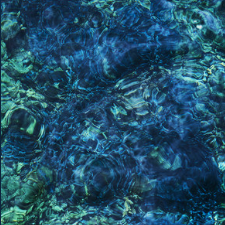
  
  

    <strong>Genre:</strong> Indie
    <strong>Subgenre:</strong> Chamber Folk
    <strong>Country:</strong> Japan
    <strong>Language:</strong> Japanese
    <strong>Format:</strong> Album
    <strong>Favorite Song:</strong> Luciferene
  

  
  

    <h3>Scores</h3>
    

      

        Nuance
        4
      

      

        Narrative/Lyrics
        3
      

      

        Novelty
        2
      

      

        Listenability
        3
      

      

        Bonus Points
        +2
      

    

    

      Total:
      14/21
      B-
    

  

  
  

    <h3>Review</h3>
    
It&#x27;s an Ichiko Aoba record. 
If you aren&#x27;t familiar with Ichiko Aoba, she&#x27;s probably the most popular chamber folk/ambient artist out of Japan right now, and has been since her 2020 album *Windswept Adan*. She&#x27;s great, however *Luminescent Creatures* to me sounded exactly like her previous album, and I mean exactly. Her personal style is unique amongst her peers (or lackthereof), and I welcome new music from her, but I can&#x27;t recommend this record over *Windswept Adan* for first time listeners. The reason for that comes entirely down to the fact that her novelty has mostly worn off to me, both in sound and narrative, so I rank this low out of subjectivity. It&#x27;s still good, close to great - I was just hoping to be surprised even a little bit. 

  

  
  <a href="https://www.youtube.com/watch?v=u2jlWouXz-8&amp;list=RDu2jlWouXz-8&amp;start_radio=1" class="listen-link" target="_blank">Listen</a>
  
  

    
  

</article>

<article class="album-card">
  

    75
    <h2 class="album-title">Taba - Satomimagae</h2>
  

  
  <blockquote class="favorite-lyrics">
    
There are many things I haven’t heard before

    
I might find them in the tune I’m listening to now

  </blockquote>
  
  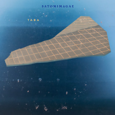
  
  

    <strong>Genre:</strong> Ambient
    <strong>Subgenre:</strong> Post-Ambient
    <strong>Country:</strong> Japan
    <strong>Language:</strong> Japanese
    <strong>Format:</strong> Album
    <strong>Favorite Song:</strong> Ghost
  

  
  

    <h3>Scores</h3>
    

      

        Nuance
        4
      

      

        Narrative/Lyrics
        2
      

      

        Novelty
        4
      

      

        Listenability
        3
      

      

        Bonus Points
        +3
      

    

    

      Total:
      16/21
      B+
    

  

  
  

    <h3>Review</h3>
    
The quietest album on this list? That&#x27;s not a bad thing - it&#x27;s *Taba* is undeniably a unique and beautiful album, I just wish I had more to grasp on to.

  

  
  <a href="https://www.youtube.com/watch?v=0ZQG1uS9hx8&amp;list=RD0ZQG1uS9hx8&amp;start_radio=1" class="listen-link" target="_blank">Listen</a>
  
  

    Would love to hear the thoughts of: Emily Foster
  

</article>

<article class="album-card">
  

    74
    <h2 class="album-title">Assemble25 - TripleS</h2>
  

  
  <blockquote class="favorite-lyrics">
    
Start drawing my name with a heart next to it

  </blockquote>
  
  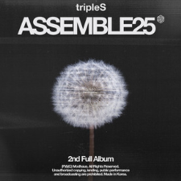
  
  

    <strong>Genre:</strong> Pop
    <strong>Subgenre:</strong> Kpop
    <strong>Country:</strong> South Korea
    <strong>Language:</strong> Korean
    <strong>Format:</strong> Album
    <strong>Favorite Song:</strong> Love Child
  

  
  

    <h3>Scores</h3>
    

      

        Nuance
        3
      

      

        Narrative/Lyrics
        2
      

      

        Novelty
        3
      

      

        Listenability
        3
      

      

        Bonus Points
        +2
      

    

    

      Total:
      13/21
      B-
    

  

  
  

    <h3>Review</h3>
    
As far as I can tell, the gimmick that makes the Kpop group TripleS unique is that they have 25 members - ~4-5 times the size of the average group these days. However, what is lost in indiviualism is gained in harmony, as the vocals on here are nothing short of stellar. That&#x27;s really the only specific comment I have about this album. It&#x27;s a really enjoyable experience, with a surprising number of hits amongst its long tracklist, but at the end of the day it&#x27;s not the least corporate Kpop slop around. Give me something to unique to hold on to, because making good or even great songs is not enough for me to rank it any higher sadly. 

  

  
  <a href="https://www.youtube.com/watch?v=VcZRvMBGS38&amp;list=OLAK5uy_lBlPitKOQ40-ALwHtbA31sanXDOZ3-bz8&amp;index=5" class="listen-link" target="_blank">Listen</a>
  
  

    Would love to hear the thoughts of: Sally
  

</article>

<article class="album-card">
  

    73
    <h2 class="album-title">Fuck You Skrillex You Think You&#x27;re Andy Warhol but You&#x27;re Not!! - Skrillex</h2>
  

  
  <blockquote class="favorite-lyrics">
    
N/A

  </blockquote>
  
  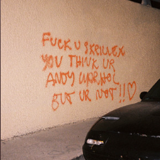
  
  

    <strong>Genre:</strong> Electronic
    <strong>Subgenre:</strong> EDM
    <strong>Country:</strong> USA
    <strong>Language:</strong> Instrumental
    <strong>Format:</strong> Album
    <strong>Favorite Song:</strong> None, in a good way
  

  
  

    <h3>Scores</h3>
    

      

        Nuance
        5
      

      

        Narrative/Lyrics
        2
      

      

        Novelty
        2
      

      

        Listenability
        2
      

      

        Bonus Points
        +2
      

    

    

      Total:
      13/21
      B-
    

  

  
  

    <h3>Review</h3>
    
A pretty interesting experience, and more than worthy of hype in the right contexts, but I find myself more invested in Skrillex&#x27;s progression as an artist than any particular song on this album. A big part of that is due to the length and the fact that this feels more like a mixtape than an album. It&#x27;s density and lack of standout singles makes it difficult to find the personality within it. Apart from that, it&#x27;s cool hearing Skrillex making contemporary dubstep that doesn&#x27;t feel dated, yet still sounds like himself. 

  

  
  <a href="https://www.youtube.com/watch?v=Xwml50CG6LA" class="listen-link" target="_blank">Listen</a>
  
  

    Would love to hear the thoughts of: Phil
  

</article>

<article class="album-card">
  

    72
    <h2 class="album-title">Live Laugh Love - Earl Sweatshirt</h2>
  

  
  <blockquote class="favorite-lyrics">
    
I&#x27;m finna be out

    
I thought I told you geek down, the trouble follow me &#x27;round

  </blockquote>
  
  
  
  

    <strong>Genre:</strong> Rap
    <strong>Subgenre:</strong> Experimental Hip Hop
    <strong>Country:</strong> USA
    <strong>Language:</strong> English
    <strong>Format:</strong> Album
    <strong>Favorite Song:</strong> Tourmaline
  

  
  

    <h3>Scores</h3>
    

      

        Nuance
        3
      

      

        Narrative/Lyrics
        4
      

      

        Novelty
        3
      

      

        Listenability
        1
      

      

        Bonus Points
        +2
      

    

    

      Total:
      13/21
      B-
    

  

  
  

    <h3>Review</h3>
    
When they have open mic night at the krusty krab. 
Ok so you&#x27;re just cruisin the ocean in 1674 and pirates pull up on you blasting this wyd. 
Earl must of bought this beat for some spice and 3 shillings.  
The beat trying to kill itself. 
This sounds like saying goodbye to someone then going in the same direction. 
This beat feels like putting your hand under your desk and accidentally touching gum. 
This song sounds like when you step off a boat and feel the land moving. 
This song sounds like sleeping with jeans on. 
This beat sounds like that one kid who shakes the whole table tryna erase something on his paper. 
This song will keep mosquitoes off you. 
This sounds like practicing a handshake with yourself. 
This song sound like when your long sleeves roll up when you put a coat on. 
This sounds like your sleeves coming down while you’re washing your hands. 
This sounds like the background music to someone deleting their search history in panic. 
This is what rap would’ve sounded like during the great depression. 
This sound like when you eat ice cream with a wooden spoon but you taste the wooden spoon more than the ice cream. 
This sound like washing paper plates. 
This beat is like he was watching ratatouille and Earl was like damn this hard. 
Great album, just a bit too reminiscent of *Some Raps Songs* (2018) for me. 
 

  

  
  <a href="https://www.youtube.com/watch?v=q_nwxIIUVAw&amp;list=RDq_nwxIIUVAw&amp;start_radio=1" class="listen-link" target="_blank">Listen</a>
  
  

    
  

</article>

<article class="album-card">
  

    71
    <h2 class="album-title">Star Line - Chance the Rapper</h2>
  

  
  <blockquote class="favorite-lyrics">
    
I got a 9 millimeter called Thug Life

    
I got a new chain, it say: &quot;FUCK ICE&quot;

  </blockquote>
  
  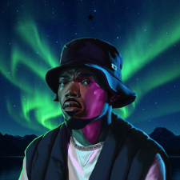
  
  

    <strong>Genre:</strong> Rap
    <strong>Subgenre:</strong> Rap
    <strong>Country:</strong> USA
    <strong>Language:</strong> English
    <strong>Format:</strong> Album
    <strong>Favorite Song:</strong> Drapetomania
  

  
  

    <h3>Scores</h3>
    

      

        Nuance
        4
      

      

        Narrative/Lyrics
        4
      

      

        Novelty
        2
      

      

        Listenability
        2
      

      

        Bonus Points
        +2
      

    

    

      Total:
      14/21
      B-
    

  

  
  

    <h3>Review</h3>
    
Decent return to form but his best singles post the notorious *Big Day* were left off the album despite it being already too long. Anyways, fuck ICE. 

  

  
  <a href="https://www.youtube.com/watch?v=l-2l5XFJNdg&amp;list=RDl-2l5XFJNdg&amp;start_radio=1" class="listen-link" target="_blank">Listen</a>
  
  

    
  

</article>

<article class="album-card">
  

    70
    <h2 class="album-title">Deadbeat - Tame Impala</h2>
  

  
  <blockquote class="favorite-lyrics">
    
I&#x27;m sliding, powerless as I descend

    
Back into my old ways again

  </blockquote>
  
  
  
  

    <strong>Genre:</strong> Electronic
    <strong>Subgenre:</strong> House
    <strong>Country:</strong> Australia
    <strong>Language:</strong> English
    <strong>Format:</strong> Album
    <strong>Favorite Song:</strong> My Old Ways
  

  
  

    <h3>Scores</h3>
    

      

        Nuance
        3
      

      

        Narrative/Lyrics
        2
      

      

        Novelty
        3
      

      

        Listenability
        3
      

      

        Bonus Points
        +2
      

    

    

      Total:
      13/21
      B-
    

  

  
  

    <h3>Review</h3>
    
Not to immediatley compare my reaction to this album to other critics, but I was surprised bu how much I enjoyed this record even after hearing such bad reviews. It&#x27;s by a far stretch the least exciting album he&#x27;s put out, but I get what he&#x27;s going for here. Is house a downgrade from the decade defining psychadelic hits he put out through the 2010s? Slightly - but I&#x27;d rather he switch genres now instead of attempting to repeat the success of &quot;New Person, Same Old Mistakes&quot; and ruining the memory of his best work through his own self pastiche.  
My only problem with the album, however, is that individual tracks don&#x27;t give nearly as positive of an experience was the whole album did - it&#x27;s definitley a listen that you benefit more from hearing in full versus in segments. 

  

  
  <a href="https://www.youtube.com/watch?v=pyUOSaQZmxw&amp;list=RDpyUOSaQZmxw&amp;start_radio=1" class="listen-link" target="_blank">Listen</a>
  
  

    
  

</article>

<article class="album-card">
  

    69
    <h2 class="album-title">Snipe Hunter - Tyler Childers</h2>
  

  
  <blockquote class="favorite-lyrics">
    
It’s fought for like a bitch and it’s a bitch to keep it goin’

    
When they ain’t nobody knowin’, Any prayer you’ve ever sang

  </blockquote>
  
  
  
  

    <strong>Genre:</strong> Country
    <strong>Subgenre:</strong> Bluegrass
    <strong>Country:</strong> USA
    <strong>Language:</strong> English
    <strong>Format:</strong> Album
    <strong>Favorite Song:</strong> Eatin Big Time
  

  
  

    <h3>Scores</h3>
    

      

        Nuance
        4
      

      

        Narrative/Lyrics
        4
      

      

        Novelty
        3
      

      

        Listenability
        3
      

      

        Bonus Points
        +2
      

    

    

      Total:
      16/21
      B+
    

  

  
  

    <h3>Review</h3>
    
This is actually a pretty great bluegrass(?) album - I rank it low, however, because of technical reasons. There is a wildly bizzare discrepency in the mixing song-to-song that makes the album experience feel disjointed and fraying. Song-by-song, there are plenty of highlights with a pretty decent throughline through the whole record. 

  

  
  <a href="https://www.youtube.com/watch?v=l66QEIfCE0Q&amp;list=RDl66QEIfCE0Q&amp;start_radio=1" class="listen-link" target="_blank">Listen</a>
  
  

    Would love to hear the thoughts of: Phil Foster Aidan B
  

</article>

<article class="album-card">
  

    68
    <h2 class="album-title">Lonely People with Power - Deafheaven</h2>
  

  
  <blockquote class="favorite-lyrics">
    
I wanted the Garden of Eden, but fed my misgivings

    
I wrеstled with strength just like you, I atе from the apple of my ruse

  </blockquote>
  
  
  
  

    <strong>Genre:</strong> Metal
    <strong>Subgenre:</strong> Metal
    <strong>Country:</strong> USA
    <strong>Language:</strong> English
    <strong>Format:</strong> Album
    <strong>Favorite Song:</strong> Body Behavior
  

  
  

    <h3>Scores</h3>
    

      

        Nuance
        5
      

      

        Narrative/Lyrics
        3
      

      

        Novelty
        2
      

      

        Listenability
        1
      

      

        Bonus Points
        +1
      

    

    

      Total:
      12/21
      C+
    

  

  
  

    <h3>Review</h3>
    
It&#x27;s a Deafheaven record. 
This is the only band I know of able to make black metal (screamo, as it was once deemed) palatable. The issue is that the black metal genre is inherently, impossibly unlegible due to how dense it is. Hence, I wouldn&#x27;t be able to tell the difference from one song to another, let alone between this album, and the last record of theirs I listened to over a decade ago.  
If you have any interest in this band or genre, I cannot recommend enough their 2013 album *Sunbather*, specifically the song &quot;Dream House&quot;. Easily a top 10 song of all time for me, and one of the few of theirs that stands out as unique from the rest.  
This album is still pretty great though, it&#x27;s just another Deadheaven record. 

  

  
  <a href="https://www.youtube.com/watch?v=Lq5kBkD-F1o&amp;list=RDLq5kBkD-F1o&amp;start_radio=1" class="listen-link" target="_blank">Listen</a>
  
  

    Would love to hear the thoughts of: Aidan B Aidan C
  

</article>

<article class="album-card">
  

    67
    <h2 class="album-title">From the Pyre - The Last Dinner Party</h2>
  

  
  <blockquote class="favorite-lyrics">
    
I&#x27;ll break into your house, do it, I&#x27;ll do it

    
If you twist the knife right I will twist the knife left

  </blockquote>
  
  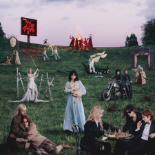
  
  

    <strong>Genre:</strong> Indie
    <strong>Subgenre:</strong> Indie
    <strong>Country:</strong> United Kingdom
    <strong>Language:</strong> English
    <strong>Format:</strong> Album
    <strong>Favorite Song:</strong> Count the Ways
  

  
  

    <h3>Scores</h3>
    

      

        Nuance
        4
      

      

        Narrative/Lyrics
        3
      

      

        Novelty
        2
      

      

        Listenability
        3
      

      

        Bonus Points
        +2
      

    

    

      Total:
      14/21
      B-
    

  

  
  

    <h3>Review</h3>
    
*From the Pyre* is definitley good, but I&#x27;m not sure what the band intended me to get out of it that&#x27;s any different than what got when I walked away from last year&#x27;s *Prelude to Ecstacy*. Does it need to necessarily say something different? No. The songs are certainly distinct enough from one another so I don&#x27;t have problem telling the albums apart or calling either one-note. What I wished for was a distinct theme, motif, story... anything that makes this feel like anything other than B sides from their last album. I liked their last album a lot, so it&#x27;s not unwelcome, but I wish they took an extra year on this one to set them apart more. 

  

  
  <a href="https://www.youtube.com/watch?v=Oa2eBo-qKVw" class="listen-link" target="_blank">Listen</a>
  
  

    Would love to hear the thoughts of: Lena Emily Sally
  

</article>

<article class="album-card">
  

    66
    <h2 class="album-title">Evangelic Girl is a Gun - Yeule</h2>
  

  
  <blockquote class="favorite-lyrics">
    
He eats me like his favourite fruit, he holds me like a gun and shoots me

    
Under crystal chandeliers, he tells me words I want to hear

  </blockquote>
  
  
  
  

    <strong>Genre:</strong> Pop
    <strong>Subgenre:</strong> Indietronica
    <strong>Country:</strong> Singapore
    <strong>Language:</strong> English
    <strong>Format:</strong> Album
    <strong>Favorite Song:</strong> Dudu
  

  
  

    <h3>Scores</h3>
    

      

        Nuance
        4
      

      

        Narrative/Lyrics
        2
      

      

        Novelty
        3
      

      

        Listenability
        3
      

      

        Bonus Points
        +2
      

    

    

      Total:
      14/21
      B-
    

  

  
  

    <h3>Review</h3>
    
I like this album because it is really strongly directed, but it&#x27;s hard to ignore that it doesn&#x27;t have a ton of meat on its bones. This is due to two things: There&#x27;s a very slight disconnected between the softness of Yeule&#x27;s voice and the instrumentation which tends to go a bit harder, or at least wants to, and the lyrics are not very profound. It&#x27;s a very aesthetic album that sounds like it wants to be emo, but coems across as a bit inauthentic. That said, there&#x27;s plenty of bops on it and it is an overally enjoyable time - I just wish the summitive vision was more cohesive or at least communicated better. 

  

  
  <a href="https://www.youtube.com/watch?v=sUdvVt7Ldso&amp;list=RDsUdvVt7Ldso&amp;start_radio=1" class="listen-link" target="_blank">Listen</a>
  
  

    Would love to hear the thoughts of: Sally
  

</article>

<article class="album-card">
  

    65
    <h2 class="album-title">Loner - Barry Can&#x27;t Swim</h2>
  

  
  <blockquote class="favorite-lyrics">
    
N/A

  </blockquote>
  
  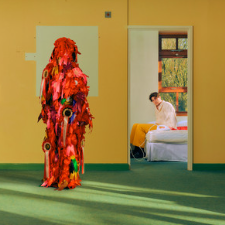
  
  

    <strong>Genre:</strong> Electronic
    <strong>Subgenre:</strong> House
    <strong>Country:</strong> United Kingdom
    <strong>Language:</strong> English
    <strong>Format:</strong> Album
    <strong>Favorite Song:</strong> Wandering Mount Moon
  

  
  

    <h3>Scores</h3>
    

      

        Nuance
        3
      

      

        Narrative/Lyrics
        2
      

      

        Novelty
        3
      

      

        Listenability
        3
      

      

        Bonus Points
        +2
      

    

    

      Total:
      13/21
      B-
    

  

  
  

    <h3>Review</h3>
    
This is a pretty fun house-y debut record from Barry Can&#x27;t Swim, a dj who&#x27;s been gaining deserved popularity over the past coupe years.  
If there was one thing to say about this album, it&#x27;s in praise of how diverse it is. Every track has a distinct sound it, and listening to the album in full sounds like you&#x27;re travelling around the world without feeling like Barry is appropriating anything. He&#x27;s also able to tell a decent narrative despite it being lyrically sparse. It&#x27;s just a good, decent time with a majorly good closing track. Not as impressive, shocking, revolutionary, or heady as the debuts of his peers like Fred Again, but not bad in the slightest. 

  

  
  <a href="https://www.youtube.com/watch?v=mDI49vzM4jw&amp;list=RDmDI49vzM4jw&amp;start_radio=1" class="listen-link" target="_blank">Listen</a>
  
  

    Would love to hear the thoughts of: Phil
  

</article>

<article class="album-card">
  

    64
    <h2 class="album-title">People of Faces - Celeste</h2>
  

  
  <blockquote class="favorite-lyrics">
    
It&#x27;s a very fine line between her world and mine

    
And she ruses a life, but that&#x27;s fine

  </blockquote>
  
  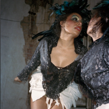
  
  

    <strong>Genre:</strong> R&amp;B
    <strong>Subgenre:</strong> Idk the subgenre
    <strong>Country:</strong> United Kingdom
    <strong>Language:</strong> English
    <strong>Format:</strong> Album
    <strong>Favorite Song:</strong> People Always Change
  

  
  

    <h3>Scores</h3>
    

      

        Nuance
        3
      

      

        Narrative/Lyrics
        5
      

      

        Novelty
        2
      

      

        Listenability
        3
      

      

        Bonus Points
        +2
      

    

    

      Total:
      15/21
      B
    

  

  
  

    <h3>Review</h3>
    
I kinda feel bad for Celeste because her natural voice is so reminiscent of Amy Winehouse - and I know it&#x27;s her natural voice because of the unadulterated passion she imbues in her music. It&#x27;s a voice-heavy/ focused performance throughout the album - she knows she has the X factor, yet I&#x27;m happy to report back that there&#x27;s more than enough surprises, both in genre and in pure unexpected moments, to say that this project hits all the marks I would like to see from a complete album, and it does so in spades. If I felt every note she hit. 

  

  
  <a href="https://www.youtube.com/watch?v=4Wa3RWq_3U4&amp;list=RD4Wa3RWq_3U4&amp;start_radio=1&amp;pp=ygUWd29tYW4gb2YgZmFjZXMgY2VsZXN0ZaAHAQ%3D%3D" class="listen-link" target="_blank">Listen</a>
  
  

    
  

</article>

<article class="album-card">
  

    63
    <h2 class="album-title">Eve: Romance - Bibi</h2>
  

  
  <blockquote class="favorite-lyrics">
    
Would you wet your finger for me? Would you pinch me?

    
Would you turn my page? Would you read me?

  </blockquote>
  
  
  
  

    <strong>Genre:</strong> Pop
    <strong>Subgenre:</strong> Kpop
    <strong>Country:</strong> South Korea
    <strong>Language:</strong> Korean
    <strong>Format:</strong> Album
    <strong>Favorite Song:</strong> Midnight Cruise
  

  
  

    <h3>Scores</h3>
    

      

        Nuance
        2
      

      

        Narrative/Lyrics
        3
      

      

        Novelty
        3
      

      

        Listenability
        3
      

      

        Bonus Points
        +2
      

    

    

      Total:
      13/21
      B-
    

  

  
  

    <h3>Review</h3>
    
I go back and forth on this album and it&#x27;s hard to pinpoint why. The memory of *Eve: Romance* is not super positive, but when I go back and listen to individual songs, they&#x27;re all pretty great. I have the entire thing liked on sp*tify and that isn&#x27;t me being lazy. Bibi does a great job keeping you interested throughout the record, and there&#x27;s plenty of variation in genre, themes, instruments, even languages from song to song. Every song sounds like it could be a single. Perhaps it&#x27;s that diversity that holds the entire album back. There&#x27;s so many good ideas and so many songs competing for your attention, yet after many listens, I don&#x27;t see them fitting together to make a cohesive album.  
Another possibility that is far less flattering to my image as a famous and respected music critic /s is that the album cover neither looks professional or appropriate for the seriousness and maturity of the work within it. The cover gives 14-year-old bedroom pop wannabe on soundcloud. Shoot me.  
One random positive comment I have though is that it&#x27;s nice to have a kpop artist be uncontrollably horny for a change. 

  

  
  <a href="https://www.youtube.com/watch?v=d7glwJ5yd20&amp;list=RDd7glwJ5yd20&amp;start_radio=1" class="listen-link" target="_blank">Listen</a>
  
  

    Would love to hear the thoughts of: Sally
  

</article>

<article class="album-card">
  

    62
    <h2 class="album-title">Virgin - Lorde</h2>
  

  
  <blockquote class="favorite-lyrics">
    
Who&#x27;s gon&#x27; love me like this?

    
Oh, who could give me lightness?

  </blockquote>
  
  
  
  

    <strong>Genre:</strong> Pop
    <strong>Subgenre:</strong> Alt Pop
    <strong>Country:</strong> New Zealand
    <strong>Language:</strong> English
    <strong>Format:</strong> Album
    <strong>Favorite Song:</strong> Man of the Year
  

  
  

    <h3>Scores</h3>
    

      

        Nuance
        3
      

      

        Narrative/Lyrics
        4
      

      

        Novelty
        3
      

      

        Listenability
        2
      

      

        Bonus Points
        +2
      

    

    

      Total:
      14/21
      B-
    

  

  
  

    <h3>Review</h3>
    
I almost didn&#x27;t listen to this record, but I&#x27;m very glad I did.  
Lorde is one of the few A list artists that I&#x27;ve been following since the very start of their career. I remember being hyped for the Love Club EP, and downloading &quot;400 Lux&quot; when it was Itunes&#x27; free track of the week in 2013. But *Melodrama* never really hit for me, and 2021&#x27;s *Solar Power* was universally panned as a hit and a miss, so my opinion of Lorde has been muddied by that and the one video of her shushing her audience for singing along with her.  *Virgin* is pretty aight. It got a reaction out of me, and it didn't feel like Lorde would shush me for getting <em>really</em> into *Man of the Year* for the reasons she really subtely intended. Good stuff. 

  

  
  <a href="https://www.youtube.com/watch?v=ynrSkSYirB0&amp;list=RDynrSkSYirB0&amp;start_radio=1&amp;pp=ygUVbWFuIG9mIHRoZSB5ZWFyIGxvcmRloAcB" class="listen-link" target="_blank">Listen</a>
  
  

    
  

</article>

<article class="album-card">
  

    61
    <h2 class="album-title">Yuki - Betcover!!</h2>
  

  
  <blockquote class="favorite-lyrics">
    
N/A

  </blockquote>
  
  
  
  

    <strong>Genre:</strong> Jazz
    <strong>Subgenre:</strong> Jazz
    <strong>Country:</strong> Japan
    <strong>Language:</strong> Japanese
    <strong>Format:</strong> Album
    <strong>Favorite Song:</strong> ゴーゴースチーム (Go Go Stream)
  

  
  

    <h3>Scores</h3>
    

      

        Nuance
        5
      

      

        Narrative/Lyrics
        4
      

      

        Novelty
        4
      

      

        Listenability
        3
      

      

        Bonus Points
        +1
      

    

    

      Total:
      17/21
      A-
    

  

  
  

    <h3>Review</h3>
    
A great jazz album with a strong story throughout. Not the most fun or uplifting listen, but consistently interesting and tells a compelling story. Unfortunatley, it&#x27;s also just jazz. Shoot me now for saying that but that&#x27;s my truth. 

  

  
  <a href="https://www.youtube.com/watch?v=R7I2jRC8JXk&amp;list=RDR7I2jRC8JXk&amp;start_radio=1&amp;t=158s" class="listen-link" target="_blank">Listen</a>
  
  

    Would love to hear the thoughts of: Foster Aidan B Aidan C
  

</article>

<article class="album-card">
  

    60
    <h2 class="album-title">Zookeeper - Victor Jones</h2>
  

  
  <blockquote class="favorite-lyrics">
    
Mahatma Gandhi and Mother Teresa

    
Are getting kinda freaky on a beach in Ibiza

  </blockquote>
  
  
  
  

    <strong>Genre:</strong> Rock
    <strong>Subgenre:</strong> Dance Punk
    <strong>Country:</strong> USA
    <strong>Language:</strong> English
    <strong>Format:</strong> Album
    <strong>Favorite Song:</strong> White Fang Safari
  

  
  

    <h3>Scores</h3>
    

      

        Nuance
        3
      

      

        Narrative/Lyrics
        4
      

      

        Novelty
        5
      

      

        Listenability
        1
      

      

        Bonus Points
        +2
      

    

    

      Total:
      15/21
      B
    

  

  
  

    <h3>Review</h3>
    
This is not an album I would, frankly, ever put on casually, but I&#x27;m so glad it exists. I gave it a listen after hearing Victor&#x27;s single &quot;I get hurt&quot; and it never leaving my mind since discovering it. I get hurt isn&#x27;t on the album as it came out much later in 2025, but there&#x27;s still a ton to love about Zookeeper. I&#x27;m not in a position to diagnose new generes, but I have found the comparison to bedroom pop too inticing. I&#x27;d call this album &quot;kitchen punk&quot;. It&#x27;s amateurish, it&#x27;s guerilla, it doesn&#x27;t care about what people think of it, and despite all that, it&#x27;s also incredibly smart, funny, and well written. The kitchen punk designation also speaks to it&#x27;s only flaw, which is that he recorded it without any sound proofing whatsover. It makes it all the more unique, but makes it hard to listen to casually. Still, an incredibly fun and inventive project. 

  

  
  <a href="https://www.youtube.com/watch?v=cZirSkxX3QA&amp;list=RDcZirSkxX3QA&amp;start_radio=1" class="listen-link" target="_blank">Listen</a>
  
  

    Would love to hear the thoughts of: Foster Aidan B Aidan C
  

</article>

<article class="album-card">
  

    59
    <h2 class="album-title">In Limerence - Jacob Alon</h2>
  

  
  <blockquote class="favorite-lyrics">
    
Matthew woke beneath the pool, His laughter rising through the deepest blue

    
He saw his body torn in two, Placed a hand but it sank straight through

  </blockquote>
  
  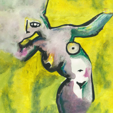
  
  

    <strong>Genre:</strong> Folk
    <strong>Subgenre:</strong> Folk
    <strong>Country:</strong> United Kingdom
    <strong>Language:</strong> English
    <strong>Format:</strong> Album
    <strong>Favorite Song:</strong> Don&#x27;t Fall Asleep
  

  
  

    <h3>Scores</h3>
    

      

        Nuance
        5
      

      

        Narrative/Lyrics
        4
      

      

        Novelty
        2
      

      

        Listenability
        2
      

      

        Bonus Points
        +2
      

    

    

      Total:
      15/21
      B
    

  

  
  

    <h3>Review</h3>
    
Good god please watch the linked video - &quot;Don&#x27;t Fall Asleep&quot; is representative of the album but miles ahead in terms of the individual representation of Jacob&#x27;s songwriting and musical talent. As for the initial review... 
This album feels like Jacob entered the studio with the sole intention of creating the most devastating album he can come up with, and I say that in a slightly bad way. It&#x27;s not a one note project in the slightest, but it also doesn&#x27;t feel like it was meant for anything other than to make the listener sad. Obviously that wasn&#x27;t the actual or sole intention, but that&#x27;s all I left this album with after the first listen. There are hints of lyricism which dare to step off the beaten path, but they don&#x27;t stray far before returning to the comfort of very on-the-nose &quot;you were my best friend wah wah&quot; lines. That may very well hit with you, but it was simply too sad for me. FFS, my favorite song is about his cousin who drowned after doing whipits. It&#x27;s an amazing song, as are most on here, but god is it a brutal, brutal listen.  
What I I do need to commend on this album on it&#x27;s instrumentation. If I was ranking guitar playing, this would be in the top 10. Downright masterful stuff and Jacob&#x27;s skill alone gives this project a ton of bonus points in my book. 

  

  
  <a href="https://www.youtube.com/watch?v=0cQwz7PHsCw&amp;list=RD0cQwz7PHsCw&amp;start_radio=1" class="listen-link" target="_blank">Listen</a>
  
  

    Would love to hear the thoughts of: Emily A must listen to for Emily
  

</article>

<article class="album-card">
  

    58
    <h2 class="album-title">I&#x27;m Only Fucking Myself - Lola Young</h2>
  

  
  <blockquote class="favorite-lyrics">
    
I got shut down in therapy, he said there&#x27;s people who need real help 

    
What a waste of my fucking money, I&#x27;ll just do it myself

  </blockquote>
  
  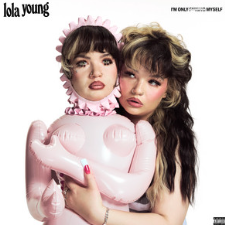
  
  

    <strong>Genre:</strong> Pop
    <strong>Subgenre:</strong> Pop
    <strong>Country:</strong> United Kingdom
    <strong>Language:</strong> English
    <strong>Format:</strong> Album
    <strong>Favorite Song:</strong> Can We Ignore It? 
  

  
  

    <h3>Scores</h3>
    

      

        Nuance
        4
      

      

        Narrative/Lyrics
        3
      

      

        Novelty
        3
      

      

        Listenability
        3
      

      

        Bonus Points
        +2
      

    

    

      Total:
      15/21
      B
    

  

  
  

    <h3>Review</h3>
    
Plenty of talent is on display with everything and anything Lola releases, however like with Sombr, Jacob Alon, and other sad breakup-fresh artists I listened to this year, the narrative gets really tiring after a while. What separates IOFM from lower albums on the list, though, are the high points. &quot;Can we Ignore it?&quot; is a top 5 song of the year for me. 

  

  
  <a href="https://www.youtube.com/watch?v=XlD7jaLE_68&amp;list=RDXlD7jaLE_68&amp;start_radio=1" class="listen-link" target="_blank">Listen</a>
  
  

    Would love to hear the thoughts of: Sally
  

</article>

<article class="album-card">
  

    57
    <h2 class="album-title">Moisturizer - Wet Leg</h2>
  

  
  <blockquote class="favorite-lyrics">
    
Maybe we could start a band as some kinda joke

    
&quot;Well, that didn&#x27;t quite go to plan,&quot; I say on the radio

  </blockquote>
  
  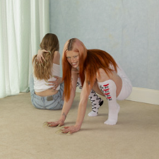
  
  

    <strong>Genre:</strong> Rock
    <strong>Subgenre:</strong> Indie Pop
    <strong>Country:</strong> United Kingdom
    <strong>Language:</strong> English
    <strong>Format:</strong> Album
    <strong>Favorite Song:</strong> u and me at home
  

  
  

    <h3>Scores</h3>
    

      

        Nuance
        3
      

      

        Narrative/Lyrics
        3
      

      

        Novelty
        3
      

      

        Listenability
        3
      

      

        Bonus Points
        +2
      

    

    

      Total:
      14/21
      B-
    

  

  
  

    <h3>Review</h3>
    
This is one of those albums that is saved by it&#x27;s high points. Most of the tracks on *Moisturizer* are some medicore pop rock tracks with some basic themes and lyrics. They&#x27;re fine, some are blander than others like &quot;Pond Song&quot;. Then the next track will be a SOTY contender. &quot;Mangetout&quot;, &quot;Pokemon&quot;, and &quot;U and Me at Home&quot; are far and beyond the standouts amongst the tracklist for me, and the latter being the album closer will have you leaving this album with a nothing short of a smile. Weird how that works out. 

  

  
  <a href="https://www.youtube.com/watch?v=IFSgIHXvckk&amp;list=RDIFSgIHXvckk&amp;start_radio=1" class="listen-link" target="_blank">Listen</a>
  
  

    Would love to hear the thoughts of: Lena Emily Foster Sally
  

</article>

<article class="album-card">
  

    56
    <h2 class="album-title">More - Pulp</h2>
  

  
  <blockquote class="favorite-lyrics">
    
&quot;It&#x27;s just a sunset&quot;, someone said. Something that&#x27;s coming to an end.

    
&quot;Yes, it&#x27;s a sunset&quot;, someone said. And just exactly how much did you spend?

  </blockquote>
  
  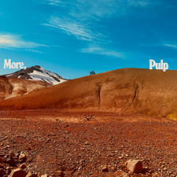
  
  

    <strong>Genre:</strong> Rock
    <strong>Subgenre:</strong> Britpop
    <strong>Country:</strong> United Kingdom
    <strong>Language:</strong> English
    <strong>Format:</strong> Album
    <strong>Favorite Song:</strong> A Sunset
  

  
  

    <h3>Scores</h3>
    

      

        Nuance
        4
      

      

        Narrative/Lyrics
        5
      

      

        Novelty
        4
      

      

        Listenability
        1
      

      

        Bonus Points
        +3
      

    

    

      Total:
      17/21
      A-
    

  

  
  

    <h3>Review</h3>
    
I am so glad I listened to this album. I&#x27;ve heard of Pulp growing up but couldn&#x27;t name a song by them, and their most popular single was a complete mystery to me. I guess this is one of those Robbie Williams phenomenons that never made it to the US much.  
Anyways, this album is my Blackstar of the year. It&#x27;s more upbeat and lighthearted than Blackstar, but at the end of the day it&#x27;s still old people singing about death. Still worth a listen, but probably won&#x27;t make it into anyone&#x27;s regular rotation. This was a one and done for me. 

  

  
  <a href="https://www.youtube.com/watch?v=zTcrz0NIlrc&amp;list=RDzTcrz0NIlrc&amp;start_radio=1" class="listen-link" target="_blank">Listen</a>
  
  

    Would love to hear the thoughts of: Foster
  

</article>

<article class="album-card">
  

    55
    <h2 class="album-title">Forever is a Feeling - Lucy Dacus</h2>
  

  
  <blockquote class="favorite-lyrics">
    
My best guess at the future, you are my best guess.

    
If I were a gambling man, and I am, you’d be my best bet.

  </blockquote>
  
  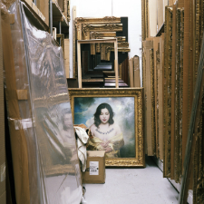
  
  

    <strong>Genre:</strong> Indie
    <strong>Subgenre:</strong> Singer-Songwriter
    <strong>Country:</strong> USA
    <strong>Language:</strong> English
    <strong>Format:</strong> Album
    <strong>Favorite Song:</strong> Best Guess
  

  
  

    <h3>Scores</h3>
    

      

        Nuance
        4
      

      

        Narrative/Lyrics
        4
      

      

        Novelty
        2
      

      

        Listenability
        3
      

      

        Bonus Points
        +3
      

    

    

      Total:
      16/21
      B+
    

  

  
  

    <h3>Review</h3>
    
It&#x27;s a Lucy Dacus Album. As with plenty of artists on here, Lucy is one of those who has set the bar for herself incredibly high. *Forever is a Feeling* doesn&#x27;t necessarily surpass the best work she&#x27;s put out previously, but her baseline is going to be better than the average indie rock album, in my opinion and as proven here. 

  

  
  <a href="https://www.youtube.com/watch?v=a90_cjTF770&amp;list=RDa90_cjTF770&amp;start_radio=1" class="listen-link" target="_blank">Listen</a>
  
  

    Would love to hear the thoughts of: Lena Emily
  

</article>

<article class="album-card">
  

    54
    <h2 class="album-title">&lt;3 - Jane Remover</h2>
  

  
  <blockquote class="favorite-lyrics">
    
I got sixty-eight inches of the music in me waitin&#x27;

  </blockquote>
  
  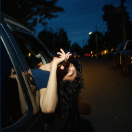
  
  

    <strong>Genre:</strong> Electronic
    <strong>Subgenre:</strong> 
    <strong>Country:</strong> USA
    <strong>Language:</strong> English
    <strong>Format:</strong> EP
    <strong>Favorite Song:</strong> So What? 
  

  
  

    <h3>Scores</h3>
    

      

        Nuance
        4
      

      

        Narrative/Lyrics
        4
      

      

        Novelty
        4
      

      

        Listenability
        3
      

      

        Bonus Points
        +3
      

    

    

      Total:
      18/21
      A
    

  

  
  

    <h3>Review</h3>
    
With &quot;&lt;3&quot; Jane more than proves that they&#x27;re the GOAT of loud, layered, unobstructed, newly bombastic electronic music. I rank it on the lower side, however, because this EP is the least impressive of the THREE projects she put out this year on the basis that it&#x27;s just an EP. Still, wildly impressive amongst her peers. 

  

  
  <a href="https://www.youtube.com/watch?v=jI8FcPWekBs&amp;list=RDjI8FcPWekBs&amp;start_radio=1" class="listen-link" target="_blank">Listen</a>
  
  

    
  

</article>

<article class="album-card">
  

    53
    <h2 class="album-title">Edits - Chuquimamani-Condori</h2>
  

  
  <blockquote class="favorite-lyrics">
    
N/A

  </blockquote>
  
  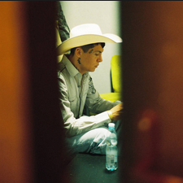
  
  

    <strong>Genre:</strong> Collage
    <strong>Subgenre:</strong> Epic Collage
    <strong>Country:</strong> USA
    <strong>Language:</strong> Spanish
    <strong>Format:</strong> Album
    <strong>Favorite Song:</strong> Way it is
  

  
  

    <h3>Scores</h3>
    

      

        Nuance
        3
      

      

        Narrative/Lyrics
        3
      

      

        Novelty
        5
      

      

        Listenability
        2
      

      

        Bonus Points
        +3
      

    

    

      Total:
      16/21
      B+
    

  

  
  

    <h3>Review</h3>
    
Edits is a unique but rewarding gauntlet that not only makes you think about what&#x27;s sampled (using loosely), but about what makes &quot;songs&quot;, &quot;albums&quot;, and &quot;music&quot; itself.  
The &quot;songs&quot; on this album, are definitley music, it&#x27;s wild that I have to say that, but what makes this album unique is that it&#x27;s entirely DJ edits, so as far as I know, it&#x27;s sampling on top of sampling, at best. That does not sound like something worthy of praise, nor am I praising it, but the final product is something I have genuinely never heard before. Most of the time, it sounds fucking insane, like nothing more than two completely unrelated tracks played over one another.  
This is really hard to talk about for me both because of its complexity and because it kinda fried my brain for the day, so I&#x27;m just going to refer you to Sam Goldner&#x27;s pitchf*rk review from here on out: <a href="https://pitchfork.com/reviews/albums/chuquimamani-condori-edits/" target="_blank">Link</a>

  

  
  <a href="https://www.youtube.com/watch?v=9WSEaokjJYQ&amp;list=RD9WSEaokjJYQ&amp;start_radio=1" class="listen-link" target="_blank">Listen</a>
  
  

    Would love to hear the thoughts of: Aidan B Aidan C A must listen to for Aidan B
  

</article>

<article class="album-card">
  

    52
    <h2 class="album-title">Sweet Tang  - Ifeye</h2>
  

  
  <blockquote class="favorite-lyrics">
    
Like a hurricane, Okay, okay, okay, okay

    
더위 먹은 듯 panic, 또다시 spinning, 돌고 돌아

  </blockquote>
  
  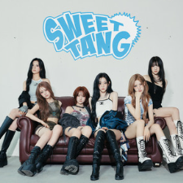
  
  

    <strong>Genre:</strong> Pop
    <strong>Subgenre:</strong> Kpop
    <strong>Country:</strong> South Korea
    <strong>Language:</strong> Korean
    <strong>Format:</strong> EP
    <strong>Favorite Song:</strong> r u ok?
  

  
  

    <h3>Scores</h3>
    

      

        Nuance
        4
      

      

        Narrative/Lyrics
        1
      

      

        Novelty
        4
      

      

        Listenability
        3
      

      

        Bonus Points
        +2
      

    

    

      Total:
      14/21
      B-
    

  

  
  

    <h3>Review</h3>
    
For a brand new group, the first group to debut under a new entertainment corporation, this EP is insanely impressive. Yes, it&#x27;s short, but every song is single worthy. That said the lead &quot;r u ok&quot; is the clear standout and is worthy of it&#x27;s popularity. Kpop is notoriously corporatized, and the whole company could go under tomorrow, but I sure hope it doesn&#x27;t because these girls could be huge. I really don&#x27;t have anything bad to say about this EP, but it loses some points by inherently being kpop slop. Sometimes I like slop, shoot me. 

  

  
  <a href="https://www.youtube.com/watch?v=tGMy0z1akLs&amp;list=RDtGMy0z1akLs&amp;start_radio=1" class="listen-link" target="_blank">Listen</a>
  
  

    Would love to hear the thoughts of: Lena Sally A must listen to for Sally
  

</article>

<article class="album-card">
  

    51
    <h2 class="album-title">Viagr Aboys - Viagra Boys</h2>
  

  
  <blockquote class="favorite-lyrics">
    
And years ago on the plains of North America, there weren&#x27;t no rules &#x27;bout nothing

    
And you could pay a guy to get his horse to stomp you on the head, 

    
Life is hard, and it&#x27;s harder when you like it hard

  </blockquote>
  
  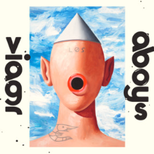
  
  

    <strong>Genre:</strong> Indie
    <strong>Subgenre:</strong> Dance Punk
    <strong>Country:</strong> Sweden
    <strong>Language:</strong> English
    <strong>Format:</strong> Album
    <strong>Favorite Song:</strong> Medicine for Horses
  

  
  

    <h3>Scores</h3>
    

      

        Nuance
        3
      

      

        Narrative/Lyrics
        5
      

      

        Novelty
        5
      

      

        Listenability
        2
      

      

        Bonus Points
        +2
      

    

    

      Total:
      17/21
      A-
    

  

  
  

    <h3>Review</h3>
    
*Viagr Aboys* really threw me for a loop when I first tried listening to it, to the point where I had it on my &quot;I&#x27;m not reviewing this&quot; list for most of 2025. After rediscovering and getting hooked on the song &quot;Uno II&quot;, I had to give it another try, and I&#x27;m glad I did. This album has it all. Introspection, innovation, wittiness, and more. Not every song is as easy on the ears as others, but if you&#x27;re willing to get over the fact that you&#x27;re listening to a band called Viagra Boys, you&#x27;ll surely find something to enjoy in here. 

  

  
  <a href="https://www.youtube.com/watch?v=9kWgvEKIo4c" class="listen-link" target="_blank">Listen</a>
  
  

    Would love to hear the thoughts of: Foster A must listen to for Aidan B
  

</article>

<article class="album-card">
  

    50
    <h2 class="album-title">Papota - Ca7triel &amp; Paco Amoroso</h2>
  

  
  <blockquote class="favorite-lyrics">
    
We&#x27;ve been fucking the girl same girl

    
You at night, me by day, who would say it? (Fuck)

  </blockquote>
  
  
  
  

    <strong>Genre:</strong> Pop
    <strong>Subgenre:</strong> Latin Funk
    <strong>Country:</strong> Argentina
    <strong>Language:</strong> Spanish
    <strong>Format:</strong> EP
    <strong>Favorite Song:</strong> Dumbai
  

  
  

    <h3>Scores</h3>
    

      

        Nuance
        4
      

      

        Narrative/Lyrics
        3
      

      

        Novelty
        4
      

      

        Listenability
        3
      

      

        Bonus Points
        +3
      

    

    

      Total:
      17/21
      A-
    

  

  
  

    <h3>Review</h3>
    
There&#x27;s only two exceptions to the rule I&#x27;m usually strict on being that everything must be a new 2025 release: an album that came out in December of 2024, and this EP which is simply a few new songs mixed with a live version of this duo&#x27;s explosive 2024 breakout album Bano Maria. Both exceptions the rule of 2025-only are made because the music was relatively recent and just too good to leave to the &quot;other music I listened to this year&quot; list that people are just going to scroll over.  
These guys are inventive, addicting, and hilarious. It can be a bit crass sometimes, but never crosses a line. If you&#x27;re able to get over that, what awaits is one of the most fun projects of the year, let alone that I&#x27;ve ever heard out of Argentina. Nice to have something good make it to the US from Argentina. 

  

  
  <a href="https://www.youtube.com/watch?v=zYc1qMe_kpc" class="listen-link" target="_blank">Listen</a>
  
  

    Would love to hear the thoughts of: Phil Andrew Aidan B Aidan C Sally A must listen to for Sally
  

</article>

<article class="album-card">
  

    49
    <h2 class="album-title">Kyle Gordon is Wonderful - Kyle Gordon</h2>
  

  
  <blockquote class="favorite-lyrics">
    
Stool Sample, handle this!

    
And you can suck the dick and then drink the piss!

  </blockquote>
  
  
  
  

    <strong>Genre:</strong> Comedy
    <strong>Subgenre:</strong> Comedy
    <strong>Country:</strong> USA
    <strong>Language:</strong> English
    <strong>Format:</strong> Album
    <strong>Favorite Song:</strong> Crawl to Me ft. Stool Sample
  

  
  

    <h3>Scores</h3>
    

      

        Nuance
        4
      

      

        Narrative/Lyrics
        4
      

      

        Novelty
        3
      

      

        Listenability
        2
      

      

        Bonus Points
        +2
      

    

    

      Total:
      15/21
      B
    

  

  
  

    <h3>Review</h3>
    
A comedy album in the top 50 AOTY for me. Lol.  
Kyle Gordon is a musical comedian who somehow made musical comedy not the worst thing ever (excluding Bo Burnham&#x27;s *Inside*), and I think he owes that to the effort, talent, and direction he puts into his work. It&#x27;s not as simple as singing jokes, or inversely, joking about music, this particular album I would closer describe as surgery of genre, and the Frankenstein&#x27;s monster that comes out of it somehow ends up sounding great while also making you crack up. Good stuff. 

  

  
  <a href="https://www.youtube.com/watch?v=6vRZRZVDlqU&amp;list=RD6vRZRZVDlqU&amp;start_radio=1" class="listen-link" target="_blank">Listen</a>
  
  

    Would love to hear the thoughts of: Andrew A must listen to for Andrew
  

</article>

<article class="album-card">
  

    48
    <h2 class="album-title">Caroline - Caroline 2</h2>
  

  
  <blockquote class="favorite-lyrics">
    
At the right time, I don&#x27;t wanna be anyone

    
At the right time, I don&#x27;t wanna be somebody else

  </blockquote>
  
  
  
  

    <strong>Genre:</strong> Indie
    <strong>Subgenre:</strong> Alternative
    <strong>Country:</strong> United Kingdom
    <strong>Language:</strong> English
    <strong>Format:</strong> Album
    <strong>Favorite Song:</strong> Tell me I never knew that
  

  
  

    <h3>Scores</h3>
    

      

        Nuance
        4
      

      

        Narrative/Lyrics
        3
      

      

        Novelty
        4
      

      

        Listenability
        3
      

      

        Bonus Points
        +3
      

    

    

      Total:
      17/21
      A-
    

  

  
  

    <h3>Review</h3>
    
Another very quiet album, yet this ended up being one of my most listened to albums of the year. Despite the long song lengths, it&#x27;s just an easy to listen to, good time. It also throws more than a few surprises in the mix to keep you interested through its tracklist. High recommend. 

  

  
  <a href="https://www.youtube.com/watch?v=rAg3YuHkMHQ&amp;list=RDrAg3YuHkMHQ&amp;start_radio=1" class="listen-link" target="_blank">Listen</a>
  
  

    Would love to hear the thoughts of: Lena Foster Sally A must listen to for Emily
  

</article>

<article class="album-card">
  

    47
    <h2 class="album-title">Double Infinity - Big Thief</h2>
  

  
  <blockquote class="favorite-lyrics">
    
Los Angeles, 3:33, nothing on the stereo

    
Dirty tea, you&#x27;re like the Mona Lisa

  </blockquote>
  
  
  
  

    <strong>Genre:</strong> Indie
    <strong>Subgenre:</strong> Folk Rock
    <strong>Country:</strong> USA
    <strong>Language:</strong> English
    <strong>Format:</strong> Album
    <strong>Favorite Song:</strong> Los Angeles
  

  
  

    <h3>Scores</h3>
    

      

        Nuance
        4
      

      

        Narrative/Lyrics
        3
      

      

        Novelty
        3
      

      

        Listenability
        3
      

      

        Bonus Points
        +2
      

    

    

      Total:
      15/21
      B
    

  

  
  

    <h3>Review</h3>
    
Pretty sweet album albeit not very novel or exciting as a complete package despite it&#x27;s high points. It&#x27;s a good example of artists not needing to remake the wheel upon every release. 

  

  
  <a href="https://www.youtube.com/watch?v=GOeELtc6fqg" class="listen-link" target="_blank">Listen</a>
  
  

    Would love to hear the thoughts of: Lena Emily Foster Aidan C Sally A must listen to for Emily
  

</article>

<article class="album-card">
  

    46
    <h2 class="album-title">Krok - СОЮЗ </h2>
  

  
  <blockquote class="favorite-lyrics">
    
N/A

  </blockquote>
  
  
  
  

    <strong>Genre:</strong> Jazz
    <strong>Subgenre:</strong> Tropicalia
    <strong>Country:</strong> Belarus
    <strong>Language:</strong> Belarusian
    <strong>Format:</strong> Album
    <strong>Favorite Song:</strong> Krok
  

  
  

    <h3>Scores</h3>
    

      

        Nuance
        4
      

      

        Narrative/Lyrics
        3
      

      

        Novelty
        4
      

      

        Listenability
        3
      

      

        Bonus Points
        +3
      

    

    

      Total:
      17/21
      A-
    

  

  
  

    <h3>Review</h3>
    
A Belarusian goes to Brazil to relive the 1980s bossa nova dream he was born too late to experience, and he does so anyways. Beautifully played and masterfully produced, my only negative comment is that it&#x27;s a bit one note. Speakers of similar languages will probably be able to get more out of it than I did on that front. 

  

  
  <a href="https://gruppasoyuz.bandcamp.com/album/krok" class="listen-link" target="_blank">Listen</a>
  
  

    Would love to hear the thoughts of: Andrew Lena Emily Foster Aidan B Aidan C A must listen to for Foster
  

</article>

<article class="album-card">
  

    45
    <h2 class="album-title">Sequence 01 - F5ve</h2>
  

  
  <blockquote class="favorite-lyrics">
    
I can see your friends they don&#x27;t like me 

    
And I don’t understand, do you got a plan?

  </blockquote>
  
  
  
  

    <strong>Genre:</strong> Pop
    <strong>Subgenre:</strong> Jpop
    <strong>Country:</strong> Japan
    <strong>Language:</strong> Japanese
    <strong>Format:</strong> Album
    <strong>Favorite Song:</strong> Lettuce
  

  
  

    <h3>Scores</h3>
    

      

        Nuance
        3
      

      

        Narrative/Lyrics
        2
      

      

        Novelty
        4
      

      

        Listenability
        3
      

      

        Bonus Points
        +2
      

    

    

      Total:
      14/21
      B-
    

  

  
  

    <h3>Review</h3>
    
*Sequence 01* is a really fun, experimental, and inventive jpop project with some genuine hits and catchy melodies throughout, however it suffers slightly from a confused aesthetic that bounces between states of maturity. If you can get over that, it&#x27;s very worth listening to, and surprisingly coherent as a debut album despite it&#x27;s many many risks. 

  

  
  <a href="https://www.youtube.com/watch?v=uWDprhRTXMQ&amp;list=RDuWDprhRTXMQ&amp;start_radio=1" class="listen-link" target="_blank">Listen</a>
  
  

    Would love to hear the thoughts of: Sally A must listen to for Sally
  

</article>

<article class="album-card">
  

    44
    <h2 class="album-title">Jonatan - Yung Lean</h2>
  

  
  <blockquote class="favorite-lyrics">
    
Cause I wonder where you at-at-at, wonder where you go

    
Girl, inside that mask of yours-yours, just take it off and let it show

  </blockquote>
  
  
  
  

    <strong>Genre:</strong> Rap
    <strong>Subgenre:</strong> Cloud Rap
    <strong>Country:</strong> Sweden
    <strong>Language:</strong> English
    <strong>Format:</strong> Album
    <strong>Favorite Song:</strong> Forever Yung
  

  
  

    <h3>Scores</h3>
    

      

        Nuance
        3
      

      

        Narrative/Lyrics
        3
      

      

        Novelty
        4
      

      

        Listenability
        2
      

      

        Bonus Points
        +3
      

    

    

      Total:
      15/21
      B
    

  

  
  

    <h3>Review</h3>
    
Yung Lean once again proves that he&#x27;s one of the greats on *Jonatan*. This being his sixth studio album, he&#x27;s able to hold on to his distinctive style while also showing a lot more maturity and personability than on any of his previous work. Not as groundbreaking as his earlier mixtapes, or any of the breakout miserable singles from *Stranger*, but more than satisfying for me as a longtime fan who hasn&#x27;t sensed an ounce of fatigue yet. 

  

  
  <a href="https://www.youtube.com/watch?v=qjYkr78anZs&amp;list=RDqjYkr78anZs&amp;start_radio=1" class="listen-link" target="_blank">Listen</a>
  
  

    
  

</article>

<article class="album-card">
  

    43
    <h2 class="album-title">Alter Ego - Lisa</h2>
  

  
  <blockquote class="favorite-lyrics">
    
Whenever I close my eyes, it&#x27;s taking me back in time

    
Been drowning in dreams lately, like it&#x27;s 2019, baby

  </blockquote>
  
  
  
  

    <strong>Genre:</strong> Pop
    <strong>Subgenre:</strong> Pop
    <strong>Country:</strong> Thailand
    <strong>Language:</strong> English
    <strong>Format:</strong> Album
    <strong>Favorite Song:</strong> Dream (though New Woman was my SOTY in 2024)
  

  
  

    <h3>Scores</h3>
    

      

        Nuance
        4
      

      

        Narrative/Lyrics
        4
      

      

        Novelty
        4
      

      

        Listenability
        3
      

      

        Bonus Points
        +3
      

    

    

      Total:
      18/21
      A
    

  

  
  

    <h3>Review</h3>
    
I&#x27;m ranking this album so low despite my high scores because, while the highs really knock it up quite a few points, it&#x27;s tracklist is still very polarized. This is a good album to talk about track by track. Firstly, the &quot;alter ego&quot; concept was a loose, seemingly abandoned idea in which each song is produced by a certain persona. However, that is not demonstrated on the album whatsover outside of a mention of some of those names in the bonus remixes at the end.  
Let&#x27;s start with the highs. The album opens with the smash hit &quot;Born Again&quot;. I listened to this constantly in the gym at the beginning of the year and it&#x27;s one of those songs that will inject energy in your veins. It&#x27;s hype, even if the Doja feature is a bit too much. &quot;Thunder&quot; is a well produced, hard hitting track that&#x27;s still a fun listen despite some typical kpop lyrical cringe. That&#x27;s followed up immediatley by &quot;New Woman&quot;, my song of the year of 2025. Just an incredible, unexpected, inventive, unique experimental pop track that might leave you awestruck, even though I hated it on first listen. &quot;Rapunzel&quot; is a fun, upbeat capitalist jerkfest. It&#x27;s fine, though I prefer the version without the Megan feature. &quot;Moonlit Floor&quot; is a wildly unnecessary and out-of-place cover int he middle of the album, but I can&#x27;t deny that Lisa and the band do a great rendition. Lastly, &quot;Dream&quot; may be my favorite track behind &quot;New Woman&quot; and really shows off Lisa&#x27;s skills as a singer and songwriter, which was typically surpressed by the kpop corporate overlords. That leaves 7/13 track remaining as duds, at best. To avoid getting too negative, these are the Blackpink songs - bombastic, overproduced, intimidating in a cringe way, celebrating capitalism, playing the raunchier songs off too safe to evoke much feeling... you get the point. They&#x27;re there to appease that audience and satisfy investors - I&#x27;m not too mad, though I would just kill to see an album 100% under her artistic control.  
In summary, this is a solid, solid solo debut, and easily the best work to come out of the Blackpink 4, even if the money and artistry budget available could have gone further. 

  

  
  <a href="https://www.youtube.com/watch?v=FMX98ROVRCE&amp;list=RDFMX98ROVRCE&amp;start_radio=1" class="listen-link" target="_blank">Listen</a>
  
  

    Would love to hear the thoughts of: Phil Tess
  

</article>

<article class="album-card">
  

    42
    <h2 class="album-title">Deftones - Private Music</h2>
  

  
  <blockquote class="favorite-lyrics">
    
Feel the waves crash against the concrete from below

    
A new wine intoxicates you slowly out of time

  </blockquote>
  
  
  
  

    <strong>Genre:</strong> Metal
    <strong>Subgenre:</strong> Nu Metal
    <strong>Country:</strong> USA
    <strong>Language:</strong> English
    <strong>Format:</strong> Album
    <strong>Favorite Song:</strong> Milk of the madonna
  

  
  

    <h3>Scores</h3>
    

      

        Nuance
        5
      

      

        Narrative/Lyrics
        4
      

      

        Novelty
        3
      

      

        Listenability
        2
      

      

        Bonus Points
        +3
      

    

    

      Total:
      17/21
      A-
    

  

  
  

    <h3>Review</h3>
    
It&#x27;s a Deftones record, and I say that with love. If you have any familiarity with Deftones, you already have an idea of what you&#x27;re getting into. *Private Music* doesn&#x27;t depart from the sound the band has had since the 90s, and that&#x27;s alright. Like what I said about this year&#x27;s Big Thief album, you don&#x27;t need to completely reinvent the wheel to make a good release, it just has to be a distinct, impactful addition to your discography. 

  

  
  <a href="https://www.youtube.com/watch?v=D1zErtM1r2c" class="listen-link" target="_blank">Listen</a>
  
  

    Would love to hear the thoughts of: Phil Foster Aidan B Aidan C A must listen to for Aidan B
  

</article>

<article class="album-card">
  

    41
    <h2 class="album-title">Vanisher, Horizon Scraper - Quadeca</h2>
  

  
  <blockquote class="favorite-lyrics">
    
Darling, don&#x27;t you give up on a Monday

    
I wanna tell you I want you, you&#x27;d probably take it the wrong way

  </blockquote>
  
  
  
  

    <strong>Genre:</strong> Rap
    <strong>Subgenre:</strong> Baroque Pop/Experimental Hip Hop
    <strong>Country:</strong> USA
    <strong>Language:</strong> English
    <strong>Format:</strong> Album
    <strong>Favorite Song:</strong> Monday
  

  
  

    <h3>Scores</h3>
    

      

        Nuance
        5
      

      

        Narrative/Lyrics
        3
      

      

        Novelty
        5
      

      

        Listenability
        1
      

      

        Bonus Points
        +2
      

    

    

      Total:
      16/21
      B+
    

  

  
  

    <h3>Review</h3>
    
The fact that this album is as low as it is really just speaks to the quality of music put out this year, because I still love this album despite it&#x27;s placement and the silly little scores I gave it. I went in to this album partially expecting it to be an album of the year contender. Quadeca is an expert marketer of his music, and nails the visual component as well as the music itself, to craft a vivid, moving, unique, and modern nautical aesthetic. Each song has a ton of effort thrown into it, and you&#x27;re unlikely to hear much similar outside of his features on another album in this list. One reason for it being placed so low despite that praise is because it is not an easy, digestible listen. There are some hit worthy singles, but most of the album leans more into soundscape than something you can throw on casually. Another reason is that I think Quadeca had his sights set too high. I feel like this album was trying to convey the same weight as some of the grander art rock albums of this year, namely by Bruit, Racing Mount Pleasant, and Maruja, but that is difficult to do as a solo artist, and the songs feel a bit hollow in comparison to the gradiosity they aim for. 

  

  
  <a href="https://www.youtube.com/watch?v=RDp61U9zTj0&amp;list=RDRDp61U9zTj0&amp;start_radio=1" class="listen-link" target="_blank">Listen</a>
  
  

    Would love to hear the thoughts of: Aidan B Aidan C A must listen to for Aidan C
  

</article>

<article class="album-card">
  

    40
    <h2 class="album-title">Je T&#x27;aime &amp; Scrap and Love Songs Revisited - Porches</h2>
  

  
  <blockquote class="favorite-lyrics">
    
You look so pretty and I look so mean

    
On the night we filled our bodies with amphetamines

  </blockquote>
  
  
  
  

    <strong>Genre:</strong> Rock
    <strong>Subgenre:</strong> Alt Rock
    <strong>Country:</strong> USA
    <strong>Language:</strong> English
    <strong>Format:</strong> EP
    <strong>Favorite Song:</strong> Daddies
  

  
  

    <h3>Scores</h3>
    

      

        Nuance
        4
      

      

        Narrative/Lyrics
        4
      

      

        Novelty
        4
      

      

        Listenability
        3
      

      

        Bonus Points
        +2
      

    

    

      Total:
      17/21
      A-
    

  

  
  

    <h3>Review</h3>
    
This placement is actually two EPs I&#x27;m grouping together. I originally had them separated, but placed them next to each other because I found it hard to differentiate between the two. That is in no way a dig at them, though. They simply sound alike.  
I don&#x27;t know much about Porches but I have to say that these two EPs really gripped me. His voice and lyricism are seriously entrancing and unique, and *Scrap and Love Songs Revisited* is especially impressive for being a throwaway. 

  

  
  <a href="https://www.youtube.com/watch?v=c7khrDCCiHo&amp;list=RDc7khrDCCiHo&amp;start_radio=1" class="listen-link" target="_blank">Listen</a>
  
  

    Would love to hear the thoughts of: Emily
  

</article>

<article class="album-card">
  

    39
    <h2 class="album-title">Ghostholding - Venturing/Jane Remover</h2>
  

  
  <blockquote class="favorite-lyrics">
    
Did you see God when you say you felt lucky lately?

    
And it&#x27;s not much faith that you have &#x27;cause it’s suffocating

  </blockquote>
  
  
  
  

    <strong>Genre:</strong> Rock
    <strong>Subgenre:</strong> Indie Rock
    <strong>Country:</strong> USA
    <strong>Language:</strong> English
    <strong>Format:</strong> Album
    <strong>Favorite Song:</strong> Believe
  

  
  

    <h3>Scores</h3>
    

      

        Nuance
        3
      

      

        Narrative/Lyrics
        4
      

      

        Novelty
        3
      

      

        Listenability
        3
      

      

        Bonus Points
        +3
      

    

    

      Total:
      16/21
      B+
    

  

  
  

    <h3>Review</h3>
    
This is about the point in the list where it gets really good, so much so that it pains me to rank this so low.  
On *Ghostholding*, Jane Remover, under the name Venturing, embodies the spirit of Mk. Gee and creates one of the most addictive and surprising rock records of the year. This is one of three releases Jane put out this year, and the only one that leans into rock versus electronic, hence the name change. Excellent stuff. 

  

  
  <a href="https://www.youtube.com/watch?v=109ySMbakh4&amp;list=PLrDqpvWmwFNNy57vMeeUI2ldjrMZgs3h1&amp;index=3" class="listen-link" target="_blank">Listen</a>
  
  

    Would love to hear the thoughts of: Phil Andrew Aidan B Aidan C A must listen to for Aidan B
  

</article>

<article class="album-card">
  

    38
    <h2 class="album-title">Getting Killed - Geese</h2>
  

  
  <blockquote class="favorite-lyrics">
    
There&#x27;s a bomb in my car

  </blockquote>
  
  
  
  

    <strong>Genre:</strong> Rock
    <strong>Subgenre:</strong> Post Punk Revival
    <strong>Country:</strong> USA
    <strong>Language:</strong> English
    <strong>Format:</strong> Album
    <strong>Favorite Song:</strong> Husbands
  

  
  

    <h3>Scores</h3>
    

      

        Nuance
        4
      

      

        Narrative/Lyrics
        3
      

      

        Novelty
        4
      

      

        Listenability
        2
      

      

        Bonus Points
        +2
      

    

    

      Total:
      15/21
      B
    

  

  
  

    <h3>Review</h3>
    
If you somehow went through 2025 without hearing about Geese, you&#x27;ve been living under a rock.  
I don&#x27;t have much to say or critique about this album because Geese have somehow, in my view, made themselves immune to criticism. I could tell you I was slightly let down by the lack of listenability of this album, but the artistry, pasison, meaning, lyricism, instrumentation, et cetera, consistently demand that I rethink my own system and expectations. *Getting Killed* refuses to not be taken seriously, yet Geese gives the impression that they&#x27;re just playing around and having fun on every track. I feel like I&#x27;m getting trolled in the best way possible.  
Good album, great singles, legendary band. Crazy and personally concerning that they&#x27;re this respected despite being in their early 20s. 

  

  
  <a href="https://www.youtube.com/watch?v=nT43dsYhw0k&amp;list=RDnT43dsYhw0k&amp;start_radio=1" class="listen-link" target="_blank">Listen</a>
  
  

    Would love to hear the thoughts of: Foster Aidan B Aidan C A must listen to for Aidan C
  

</article>

<article class="album-card">
  

    37
    <h2 class="album-title">Lotus - Little Simz</h2>
  

  
  <blockquote class="favorite-lyrics">
    
Can&#x27;t hold me down &#x27;cause I&#x27;ve always been free

    
Why they always wanna hate when the love is free

  </blockquote>
  
  
  
  

    <strong>Genre:</strong> Rap
    <strong>Subgenre:</strong> Rap
    <strong>Country:</strong> United Kingdom
    <strong>Language:</strong> English
    <strong>Format:</strong> Album
    <strong>Favorite Song:</strong> Free
  

  
  

    <h3>Scores</h3>
    

      

        Nuance
        5
      

      

        Narrative/Lyrics
        5
      

      

        Novelty
        4
      

      

        Listenability
        3
      

      

        Bonus Points
        +2
      

    

    

      Total:
      19/21
      A+
    

  

  
  

    <h3>Review</h3>
    
Little Simz has set the bar incredibly high for herself, yet she consistently is able to meet expectations. This is one of those times where I rank it low despite the high rating consciously on the basis that *Lotus* is not her favorite work of mine, as *SIMBI* is hard to top. If this is your first time listening to her, however, lock in for one of the most underrated artists in hip hop. &quot;Free&quot; is an all timer. 

  

  
  <a href="https://www.youtube.com/watch?v=goChcI7lH0o&amp;list=RDgoChcI7lH0o&amp;start_radio=1" class="listen-link" target="_blank">Listen</a>
  
  

    Would love to hear the thoughts of: Aidan B A must listen to for Aidan C
  

</article>

<article class="album-card">
  

    36
    <h2 class="album-title">Star - 2Hollis</h2>
  

  
  <blockquote class="favorite-lyrics">
    
You gotta learn, I got some nerve

    
Scream I&#x27;m the worst, sitting shotgun at the church

  </blockquote>
  
  
  
  

    <strong>Genre:</strong> Electronic
    <strong>Subgenre:</strong> Hyperpop
    <strong>Country:</strong> USA
    <strong>Language:</strong> English
    <strong>Format:</strong> Album
    <strong>Favorite Song:</strong> Nerve
  

  
  

    <h3>Scores</h3>
    

      

        Nuance
        5
      

      

        Narrative/Lyrics
        3
      

      

        Novelty
        4
      

      

        Listenability
        2
      

      

        Bonus Points
        +3
      

    

    

      Total:
      17/21
      A-
    

  

  
  

    <h3>Review</h3>
    
I feel like this album is the culmination of all underground bedroom trap from the 2020s, and would serve as a great closer to the era of Swedish/Swedish looking Sadboys. 2Hollis is a nepo baby who doesn&#x27;t deserve as much cred as the likes of Yung Lean and Bladee, but this is still an undeniable banger of an album. 

  

  
  <a href="https://www.youtube.com/watch?v=7DgSHDI4yh8&amp;list=RD7DgSHDI4yh8&amp;start_radio=1" class="listen-link" target="_blank">Listen</a>
  
  

    Would love to hear the thoughts of: Aidan B A must listen to for Aidan B
  

</article>

<article class="album-card">
  

    35
    <h2 class="album-title">Racing Mount Pleasant - Racing Mount Pleasant</h2>
  

  
  <blockquote class="favorite-lyrics">
    
I don&#x27;t know the reason why, I can&#x27;t meet your eyes

    
It&#x27;s all coming down on me, Can we stay inside

  </blockquote>
  
  
  
  

    <strong>Genre:</strong> Rock
    <strong>Subgenre:</strong> Baroque Pop
    <strong>Country:</strong> USA
    <strong>Language:</strong> English
    <strong>Format:</strong> Album
    <strong>Favorite Song:</strong> Racing Mount Pleasant
  

  
  

    <h3>Scores</h3>
    

      

        Nuance
        5
      

      

        Narrative/Lyrics
        4
      

      

        Novelty
        3
      

      

        Listenability
        2
      

      

        Bonus Points
        +3
      

    

    

      Total:
      17/21
      A-
    

  

  
  

    <h3>Review</h3>
    
I didn&#x27;t know anything about this band going into it, and was worried after the first five or so tracks that I was wasting my time. The tracklist starts of pretty slow and melancholy to the point where I found the sound and lyrics overdramatic even.It takes a dramatic turn at around &quot;You&quot; and &quot;You Pt. 2&quot;, with those two tracks, the title track, and the 7 minute guantlet &quot;Call it Easy&quot; demanding the listener&#x27;s attention more than most other music I&#x27;ve heard this year. 

  

  
  <a href="https://www.youtube.com/watch?v=cYrjyZvKNAw&amp;list=RDcYrjyZvKNAw&amp;start_radio=1" class="listen-link" target="_blank">Listen</a>
  
  

    Would love to hear the thoughts of: Andrew Emily Foster Aidan B Aidan C Sally A must listen to for Aidan C
  

</article>

<article class="album-card">
  

    34
    <h2 class="album-title">Headlights - Alex G</h2>
  

  
  <blockquote class="favorite-lyrics">
    
Let me write down, every word. Once I was a mockingbird. 

    
Not an angel, but I'm your man. I can bring you back again

  </blockquote>
  
  
  
  

    <strong>Genre:</strong> Indie
    <strong>Subgenre:</strong> Indie
    <strong>Country:</strong> USA
    <strong>Language:</strong> English
    <strong>Format:</strong> Album
    <strong>Favorite Song:</strong> Afterlife
  

  
  

    <h3>Scores</h3>
    

      

        Nuance
        3
      

      

        Narrative/Lyrics
        3
      

      

        Novelty
        4
      

      

        Listenability
        3
      

      

        Bonus Points
        +3
      

    

    

      Total:
      16/21
      B+
    

  

  
  

    <h3>Review</h3>
    
*Headlights* may hold the title for me as the easiest to listen to and universally liked album of the year. It&#x27;s not going to blow most people away, but there&#x27;s more than a few songs on here that can and will be your daily drivers for quite a while. 

  

  
  <a href="https://www.youtube.com/watch?v=kt0Z9RZkg-4" class="listen-link" target="_blank">Listen</a>
  
  

    Would love to hear the thoughts of: Lena Emily Foster Aidan B Aidan C Sally A must listen to for Aidan C
  

</article>

<article class="album-card">
  

    33
    <h2 class="album-title">Color outside the Lines - Cortis</h2>
  

  
  <blockquote class="favorite-lyrics">
    
Money, style, fame, love and what?

    
Take what you want!

  </blockquote>
  
  
  
  

    <strong>Genre:</strong> Pop
    <strong>Subgenre:</strong> Kpop
    <strong>Country:</strong> South Korea
    <strong>Language:</strong> Korean
    <strong>Format:</strong> EP
    <strong>Favorite Song:</strong> Go!
  

  
  

    <h3>Scores</h3>
    

      

        Nuance
        4
      

      

        Narrative/Lyrics
        3
      

      

        Novelty
        5
      

      

        Listenability
        3
      

      

        Bonus Points
        +2
      

    

    

      Total:
      17/21
      A-
    

  

  
  

    <h3>Review</h3>
    
God damn these 17 year olds are so fucking cool. 

  

  
  <a href="https://www.youtube.com/watch?v=42wfEs7oIP8&amp;list=RD0CWZMg4cHKo&amp;index=2" class="listen-link" target="_blank">Listen</a>
  
  

    Would love to hear the thoughts of: Phil Andrew Sally A must listen to for Phil
  

</article>

<article class="album-card">
  

    32
    <h2 class="album-title">Fall Back - Florence Road</h2>
  

  
  <blockquote class="favorite-lyrics">
    
Tell me, tell me it&#x27;s not that heavy

  </blockquote>
  
  
  
  

    <strong>Genre:</strong> Rock
    <strong>Subgenre:</strong> Indie Rock
    <strong>Country:</strong> USA
    <strong>Language:</strong> English
    <strong>Format:</strong> EP
    <strong>Favorite Song:</strong> Heavy
  

  
  

    <h3>Scores</h3>
    

      

        Nuance
        4
      

      

        Narrative/Lyrics
        5
      

      

        Novelty
        2
      

      

        Listenability
        3
      

      

        Bonus Points
        +3
      

    

    

      Total:
      17/21
      A-
    

  

  
  

    <h3>Review</h3>
    
This EP is shockingly good. Like, really really good. Like, this would be where Sombr landed if he stuck to an EP instead of being forced to make a full album good. Obviously the two performers have nothing in common in sound, but I make the comparison because every song on *Fall Back* has that same potential for generational hit... at least withint he indie rock scene. 

  

  
  <a href="https://www.youtube.com/watch?v=z_oaGG6a5QQ&amp;list=RDEMo_5D6tt2WkkPsm6yRVvGQA&amp;start_radio=1" class="listen-link" target="_blank">Listen</a>
  
  

    Would love to hear the thoughts of: Emily A must listen to for Emily
  

</article>

<article class="album-card">
  

    31
    <h2 class="album-title">The Art of Loving - Olivia Dean</h2>
  

  
  <blockquote class="favorite-lyrics">
    
I don&#x27;t know where the switches are or where you keep the cutlery

    
And I&#x27;ll probably crash your stupid car and make your life a misery

  </blockquote>
  
  
  
  

    <strong>Genre:</strong> Pop
    <strong>Subgenre:</strong> Pop Soul
    <strong>Country:</strong> United Kingdom
    <strong>Language:</strong> English
    <strong>Format:</strong> Album
    <strong>Favorite Song:</strong> Close Up
  

  
  

    <h3>Scores</h3>
    

      

        Nuance
        4
      

      

        Narrative/Lyrics
        4
      

      

        Novelty
        3
      

      

        Listenability
        3
      

      

        Bonus Points
        +3
      

    

    

      Total:
      17/21
      A-
    

  

  
  

    <h3>Review</h3>
    
This is Olivia Dean&#x27;s second full album, but you could hear this and assume she&#x27;s ten years into her career. Is it particularly thought provoking or culturally relevant? No, in fact it&#x27;s the opposite. It&#x27;s sweet, catchy, and fun, and that&#x27;s all it needs to be, and that&#x27;s all that needs to be said. Great stuff. 

  

  
  <a href="https://www.youtube.com/watch?v=6kLEQi0u5rA&amp;list=RD6kLEQi0u5rA&amp;start_radio=1" class="listen-link" target="_blank">Listen</a>
  
  

    Would love to hear the thoughts of: Andrew Lena Emily Foster Tess Sally A must listen to for Tess
  

</article>

<article class="album-card">
  

    30
    <h2 class="album-title">I Quit - Haim</h2>
  

  
  <blockquote class="favorite-lyrics">
    
Baby how can I explain , When an innocent mistake, Turns into seventeen days

    
Fucking relationships

  </blockquote>
  
  
  
  

    <strong>Genre:</strong> Indie
    <strong>Subgenre:</strong> Indie
    <strong>Country:</strong> USA
    <strong>Language:</strong> English
    <strong>Format:</strong> Album
    <strong>Favorite Song:</strong> Take me back
  

  
  

    <h3>Scores</h3>
    

      

        Nuance
        4
      

      

        Narrative/Lyrics
        5
      

      

        Novelty
        4
      

      

        Listenability
        3
      

      

        Bonus Points
        +2
      

    

    

      Total:
      18/21
      A
    

  

  
  

    <h3>Review</h3>
    
I’m going to, for once in my life, ignore that the Haim sisters are probably zionists and say that this is not only their best work, but one of the most enjoyable listens of the year. 

  

  
  <a href="https://www.youtube.com/watch?v=dOI_QTmK8Ks&amp;list=RDdOI_QTmK8Ks&amp;start_radio=1" class="listen-link" target="_blank">Listen</a>
  
  

    Would love to hear the thoughts of: Lena Emily Tess Sally A must listen to for Lena
  

</article>

<article class="album-card">
  

    29
    <h2 class="album-title">The Clearing - Wolf Alice</h2>
  

  
  <blockquote class="favorite-lyrics">
    
That doesn&#x27;t hurt my pride. I like the thrill of my performing when I abuse the courage of white wine

    
And you&#x27;re leaning against the wall

  </blockquote>
  
  
  
  

    <strong>Genre:</strong> Indie
    <strong>Subgenre:</strong> Indie
    <strong>Country:</strong> United Kingdom
    <strong>Language:</strong> English
    <strong>Format:</strong> Album
    <strong>Favorite Song:</strong> Bloom Baby Bloom
  

  
  

    <h3>Scores</h3>
    

      

        Nuance
        5
      

      

        Narrative/Lyrics
        4
      

      

        Novelty
        4
      

      

        Listenability
        3
      

      

        Bonus Points
        +3
      

    

    

      Total:
      19/21
      A+
    

  

  
  

    <h3>Review</h3>
    
Someone commeneted on the bloom music video &quot;she&#x27;s like having 3 singers in one&quot; and I couldn&#x27;t agree more. Singer Ellie Rowsell absolutely steals the show on this record, but is supported by some clever songwriting and addictive melodies from front to back. Pretty much zero reason to be angry about this one. 

  

  
  <a href="https://www.youtube.com/watch?v=UXOgzXmd5Zo&amp;list=RDUXOgzXmd5Zo&amp;start_radio=1" class="listen-link" target="_blank">Listen</a>
  
  

    Would love to hear the thoughts of: Lena Emily Tess Sally A must listen to for Emily
  

</article>

<article class="album-card">
  

    28
    <h2 class="album-title">Nourished by Time - The Passionate Ones</h2>
  

  
  <blockquote class="favorite-lyrics">
    
My whole life changed faster than a minute

    
I dreamed this life, now I&#x27;m scared to live it

  </blockquote>
  
  
  
  

    <strong>Genre:</strong> R&amp;B
    <strong>Subgenre:</strong> Alternative R&amp;B
    <strong>Country:</strong> USA
    <strong>Language:</strong> English
    <strong>Format:</strong> Album
    <strong>Favorite Song:</strong> Max Potential
  

  
  

    <h3>Scores</h3>
    

      

        Nuance
        4
      

      

        Narrative/Lyrics
        4
      

      

        Novelty
        5
      

      

        Listenability
        2
      

      

        Bonus Points
        +3
      

    

    

      Total:
      18/21
      A
    

  

  
  

    <h3>Review</h3>
    
If there was ever an album that demanded more than one listen to fully understand, it&#x27;s *The Passionate Ones*. As with many of my favorite songs and albums, I hated it on first listen, but a strong reaction of any kind is a good sign in most cases. This album is crazy introspective, and universally relatable.  
I would write more about it here, but I don&#x27;t think I could say anything other than rephrasing what Marcus said about it already in an interview with TheFace.com back in June: 
&quot;Everyone lives their life in such an interesting way, whether you’re a doctor or a sex worker, but one thing that connects everyone is that we all want to have passion in our lives – have something we care about and protect that thing. That’s what the basis of the album was for me. I’m finally able to live out my dreams, and when that happens, you have two ways to go: you can do your own thing, or you can help someone else. I’ve figured out a way to talk about love and leftism and existentialism in a pop format. I’m really grateful for that, to be able to stand up for something. I care about workers’ rights, I care about people, and I care about the human condition. Basically, this album is really just all about me – but we’re all mirrors for each other. So if it’s about me, it’s about you, too.&quot;

  

  
  <a href="https://www.youtube.com/watch?v=zIIx09j6-Ek&amp;list=RDzIIx09j6-Ek&amp;start_radio=1" class="listen-link" target="_blank">Listen</a>
  
  

    Would love to hear the thoughts of: Aidan C A must listen to for Aidan C
  

</article>

<article class="album-card">
  

    27
    <h2 class="album-title">Choke Enough - Oklou</h2>
  

  
  <blockquote class="favorite-lyrics">
    
Is the endless still unbound? 

    
Or am I just different now?

  </blockquote>
  
  
  
  

    <strong>Genre:</strong> Pop
    <strong>Subgenre:</strong> Psychadelic Pop
    <strong>Country:</strong> France
    <strong>Language:</strong> English
    <strong>Format:</strong> Album
    <strong>Favorite Song:</strong> Blade Bird
  

  
  

    <h3>Scores</h3>
    

      

        Nuance
        4
      

      

        Narrative/Lyrics
        4
      

      

        Novelty
        4
      

      

        Listenability
        3
      

      

        Bonus Points
        +3
      

    

    

      Total:
      18/21
      A
    

  

  
  

    <h3>Review</h3>
    
A youtuber I like described this album very accuratley as &quot;It&#x27;s like when you&#x27;re walking through a forest and a deer comes up to you and hands you a cigarette&quot;. 
&quot;Choke Enough&quot; made the rounds when it released earlier in 2025 despite Oklou not being a household name, but had a pretty major resurgance in December after Spotify called it &quot;your favorite artist&#x27;s favorite artist&quot;. It&#x27;s not hard to see why. Technically, this album is mixed in a really unique way. The processing the instrumentation and Oklou&#x27;s amazing voice goes through provides the sonic equivalent of laying in sunlight. It&#x27;s beyond meditative, but stills throws enough surprises and interesting lyrics to keep you invested. 
I listened to this album too late in the year, but I could definitley see it rise in the rankings as I get more familiar with it after many more listens. 

  

  
  <a href="https://www.youtube.com/watch?v=haEH7C1lpNI&amp;list=RDhaEH7C1lpNI&amp;start_radio=1" class="listen-link" target="_blank">Listen</a>
  
  

    Would love to hear the thoughts of: Lena Emily Tess Sally A must listen to for Lena
  

</article>

<article class="album-card">
  

    26
    <h2 class="album-title">Bomb - Illit</h2>
  

  
  <blockquote class="favorite-lyrics">
    
Hey, hey, hey, 손까지만 잡는 거

    
I can&#x27;t help but feeling so much jellyous

  </blockquote>
  
  
  
  

    <strong>Genre:</strong> Pop
    <strong>Subgenre:</strong> Kpop
    <strong>Country:</strong> South Korea
    <strong>Language:</strong> Korean
    <strong>Format:</strong> EP
    <strong>Favorite Song:</strong> Jellyous
  

  
  

    <h3>Scores</h3>
    

      

        Nuance
        4
      

      

        Narrative/Lyrics
        3
      

      

        Novelty
        5
      

      

        Listenability
        3
      

      

        Bonus Points
        +3
      

    

    

      Total:
      18/21
      A
    

  

  
  

    <h3>Review</h3>
    
They do not miss. 

  

  
  <a href="https://www.youtube.com/watch?v=GkG60kISnfc&amp;list=RDGkG60kISnfc&amp;start_radio=1" class="listen-link" target="_blank">Listen</a>
  
  

    Would love to hear the thoughts of: Sally A must listen to for Sally
  

</article>

<article class="album-card">
  

    25
    <h2 class="album-title">Ego Death at the Bachelorette Party - Haley Williams</h2>
  

  
  <blockquote class="favorite-lyrics">
    
And I just want to be in California, heaven laughs &#x27;cause they all tried to warn us.

    
They sent me right back from where I came, my tail between my legs on Broadway.

  </blockquote>
  
  
  
  

    <strong>Genre:</strong> Rock
    <strong>Subgenre:</strong> Bubblegrunge
    <strong>Country:</strong> USA
    <strong>Language:</strong> English
    <strong>Format:</strong> Album
    <strong>Favorite Song:</strong> Ego Death at the Bachelorette Party
  

  
  

    <h3>Scores</h3>
    

      

        Nuance
        4
      

      

        Narrative/Lyrics
        5
      

      

        Novelty
        4
      

      

        Listenability
        2
      

      

        Bonus Points
        +3
      

    

    

      Total:
      18/21
      A
    

  

  
  

    <h3>Review</h3>
    
Worthy of its reviews despite the bizzare rollout. My first listen produced the line &quot;some high points but is a bit too long to get overarching meaning or theme from. Overall a good album but I don&#x27;t see myself revisiting it apart from six or seven great songs.&quot; Turns out, those six or seven great songs are definitive of the album itself, and the other inclusions are welcome accompaniment to it&#x27;s heavy hitters.  
This album was released song-by-song before being compiled into one project, and its mixtape-y construction works for its length and diversity. There are some dud songs here and there, but as a complete album, I see the connective thread. 

  

  
  <a href="https://www.youtube.com/watch?v=Bw72CQYfHvY&amp;list=RDBw72CQYfHvY&amp;start_radio=1" class="listen-link" target="_blank">Listen</a>
  
  

    Would love to hear the thoughts of: Andrew Lena Emily Tess Sally A must listen to for Tess
  

</article>

<article class="album-card">
  

    24
    <h2 class="album-title">Vendrán Suaves Lluvias - Silvana Estrada </h2>
  

  
  <blockquote class="favorite-lyrics">
    
Con qué dura moneda, pagaste mi cariño

    
Ni adiós ni buenas noches, good luck, good night

  </blockquote>
  
  
  
  

    <strong>Genre:</strong> Folk
    <strong>Subgenre:</strong> Latin Folk
    <strong>Country:</strong> Mexico
    <strong>Language:</strong> Spanish
    <strong>Format:</strong> Album
    <strong>Favorite Song:</strong> Flores
  

  
  

    <h3>Scores</h3>
    

      

        Nuance
        5
      

      

        Narrative/Lyrics
        5
      

      

        Novelty
        4
      

      

        Listenability
        3
      

      

        Bonus Points
        +3
      

    

    

      Total:
      20/21
      A+
    

  

  
  

    <h3>Review</h3>
    
*Soft Rains Will Come* emotionally curbstomped me. 

  

  
  <a href="https://www.youtube.com/watch?v=CM7TBl0zzvM" class="listen-link" target="_blank">Listen</a>
  
  

    Would love to hear the thoughts of: Phil Lena Emily Aidan C
  

</article>

<article class="album-card">
  

    23
    <h2 class="album-title">Hyperyouth - Joey Valence &amp; Brae</h2>
  

  
  <blockquote class="favorite-lyrics">
    
Seven twenty-five an hour, I thought I was balling

    
I never thought this rhyming shit would be my life&#x27;s calling

  </blockquote>
  
  
  
  

    <strong>Genre:</strong> Rap
    <strong>Subgenre:</strong> Hip Hop
    <strong>Country:</strong> USA
    <strong>Language:</strong> English
    <strong>Format:</strong> Album
    <strong>Favorite Song:</strong> BUST DOWN
  

  
  

    <h3>Scores</h3>
    

      

        Nuance
        5
      

      

        Narrative/Lyrics
        4
      

      

        Novelty
        4
      

      

        Listenability
        3
      

      

        Bonus Points
        +2
      

    

    

      Total:
      18/21
      A
    

  

  
  

    <h3>Review</h3>
    
Satisfied 3 Ns in spades. Some utterly shocking moments of lyricism and production. An incredible and surprisingly emotional, narrative driven ride that proves that this duo is more than a Beastie Boys pastiche. Plus, I&#x27;m a sucker for songs about being grateful.

  

  
  <a href="https://www.youtube.com/watch?v=mkQ1AOLnxho&amp;list=RDmkQ1AOLnxho&amp;start_radio=1" class="listen-link" target="_blank">Listen</a>
  
  

    Would love to hear the thoughts of: Phil Andrew Foster Aidan B Aidan C Sally A must listen to for Andrew
  

</article>

<article class="album-card">
  

    22
    <h2 class="album-title">Design Ah! Neo 1, 2, 3, &amp; 4 - Shuta Hasunuma, Ichiko Aoba, &amp; Tamaki Roy</h2>
  

  
  <blockquote class="favorite-lyrics">
    
Cross section, cross section, axis, rotating body

    
Cross section, cross section, axis, rotating body

  </blockquote>
  
  
  
  

    <strong>Genre:</strong> Ambient
    <strong>Subgenre:</strong> Experimental Ambient
    <strong>Country:</strong> Japan
    <strong>Language:</strong> Japanese
    <strong>Format:</strong> EP
    <strong>Favorite Song:</strong> Solid of Revolution
  

  
  

    <h3>Scores</h3>
    

      

        Nuance
        5
      

      

        Narrative/Lyrics
        3
      

      

        Novelty
        5
      

      

        Listenability
        1
      

      

        Bonus Points
        +3
      

    

    

      Total:
      17/21
      A-
    

  

  
  

    <h3>Review</h3>
    
I adore these EPs. Admittedly, Neo 4 was a bit of a letdown with Ichiko Aoba and Tamaki Roy dropping out of the project, but until then, this is a collection of some unadadulterated, unbridled creativity.  
The story behind these EPs are kind of interesting, and they may be more familiar to you than you think. They were comissioned for the &quot;Design Ah&quot; convention in Tokyo, and meant to soundtrack the whole convention as well as the interactive exhibits in them. If you&#x27;ve been seeing any tiktoks or whatever that prompt you to make a thumb-swiping motion to a metronome, I believe that trend started here.  
That may sound boring to listen to outside of those stupid videos, but each song is far from as simple as that sounds. And with that, everything else I can say cannot be said because of the diversity and indescribabily of what&#x27;s on offer. Whether you&#x27;re working, or on a walk and just want to make the world around you feel more interesting, give these EPs a shot. 

  

  
  <a href="https://open.spotify.com/track/6gWNlVuIp6AJHdqRwNwqhj?si=777feefa08b04aed" class="listen-link" target="_blank">Listen</a>
  
  

    Would love to hear the thoughts of: Foster Aidan B Aidan C Sally A must listen to for Sally
  

</article>

<article class="album-card">
  

    21
    <h2 class="album-title">Animaru - Mei Semones</h2>
  

  
  <blockquote class="favorite-lyrics">
    
僕はアニマル、生きて食べて

    
僕はアニマル、考えが単純

  </blockquote>
  
  
  
  

    <strong>Genre:</strong> Indie
    <strong>Subgenre:</strong> Bossa Pop
    <strong>Country:</strong> USA
    <strong>Language:</strong> Japanese
    <strong>Format:</strong> Album
    <strong>Favorite Song:</strong> Rat with Wings
  

  
  

    <h3>Scores</h3>
    

      

        Nuance
        5
      

      

        Narrative/Lyrics
        3
      

      

        Novelty
        5
      

      

        Listenability
        3
      

      

        Bonus Points
        +2
      

    

    

      Total:
      18/21
      A
    

  

  
  

    <h3>Review</h3>
    
*Animaru* is an album that you understand the praise for within 30 seconds, and if I could give it any award this year, it&#x27;s that Mei is the best guitar player of the year, maybe ever? Beyond the technicals, the story that&#x27;s told through a lot of this album is also quite intriguing and cohesive, discussing themes of seeing onself as nothing more than an animal in a world built for otherwise. Just an all around awesome record, and I&#x27;m glad she&#x27;s getting the attention she deserves. 

  

  
  <a href="https://www.youtube.com/watch?v=ftsmkLJHIc8&amp;list=RDftsmkLJHIc8&amp;start_radio=1" class="listen-link" target="_blank">Listen</a>
  
  

    Would love to hear the thoughts of: Lena Emily Foster Aidan B A must listen to for Aidan B 
  

</article>

<article class="album-card">
  

    20
    <h2 class="album-title">Bleeds - Wednesday</h2>
  

  
  <blockquote class="favorite-lyrics">
    
But everybody gets along just fine

    
Cause the champagne tastes like elderberry wine

  </blockquote>
  
  
  
  

    <strong>Genre:</strong> Country
    <strong>Subgenre:</strong> Bubblegrunge
    <strong>Country:</strong> USA
    <strong>Language:</strong> English
    <strong>Format:</strong> Album
    <strong>Favorite Song:</strong> Wound Up Here By Holding On
  

  
  

    <h3>Scores</h3>
    

      

        Nuance
        4
      

      

        Narrative/Lyrics
        5
      

      

        Novelty
        4
      

      

        Listenability
        3
      

      

        Bonus Points
        +3
      

    

    

      Total:
      19/21
      A+
    

  

  
  

    <h3>Review</h3>
    
For some reason, every time a song from Bleeds comes up in shuffle, I find myself wanting to scream &quot;hell yeah&quot; as long as I can. Not because I&#x27;m necessarily psyched to listen, but because Wednesdays&#x27; music is able to transport me to another place like nothing else. That place might be ratfuck North Carolina, but it physically catapults me across Appalachia nonetheless. Downright amazing and addictive country record that has no right to be as good and universally enjoyable as it is.  

  

  
  <a href="https://www.youtube.com/watch?v=B24si8B9C-g" class="listen-link" target="_blank">Listen</a>
  
  

    Would love to hear the thoughts of: Emily Aidan B Aidan C Sally A must listen to for Emily
  

</article>

<article class="album-card">
  

    19
    <h2 class="album-title">Lux - Rosalia</h2>
  

  
  <blockquote class="favorite-lyrics">
    
Я не шукаю помсти, помста шукає мене

    
Я не шукаю помсти

  </blockquote>
  
  
  
  

    <strong>Genre:</strong> Pop
    <strong>Subgenre:</strong> Art Pop
    <strong>Country:</strong> Spain
    <strong>Language:</strong> Spanish
    <strong>Format:</strong> Album
    <strong>Favorite Song:</strong> Porcelena
  

  
  

    <h3>Scores</h3>
    

      

        Nuance
        5
      

      

        Narrative/Lyrics
        5
      

      

        Novelty
        5
      

      

        Listenability
        1
      

      

        Bonus Points
        +3
      

    

    

      Total:
      19/21
      A+
    

  

  
  

    <h3>Review</h3>
    
Someone on twitter said &quot;She remembered she was European and not Latino on this one&quot;.  
*Lux* is wildly ambitious, and as one of the biggest musicians on Earth, it&#x27;s beyond welcome and refreshing to see someone use their resources to the fullest extent and expose the masses to real art. The pursuit of real art occiasionally hurts this album&#x27;s listenability, though, as Rosalia really aims to imbue every song with shock and awe over making a necessarily enjoyable experience. That said, when it hits, it hits hard, and unlike anything you&#x27;ve heard this century. 

  

  
  <a href="https://www.youtube.com/watch?v=htQBS2Ikz6c&amp;list=RDhtQBS2Ikz6c&amp;start_radio=1" class="listen-link" target="_blank">Listen</a>
  
  

    Would love to hear the thoughts of: Phil Emily Foster Aidan B Aidan C Tess Sally A must listen to for Foster
  

</article>

<article class="album-card">
  

    18
    <h2 class="album-title">Addison - Addison Rae</h2>
  

  
  <blockquote class="favorite-lyrics">
    
Guess I gotta accept the pain. Need a cigarette to make me feel better.

    
Every good thing comes my way, so I put my headphones on

  </blockquote>
  
  
  
  

    <strong>Genre:</strong> Pop
    <strong>Subgenre:</strong> Pop
    <strong>Country:</strong> USA
    <strong>Language:</strong> English
    <strong>Format:</strong> Album
    <strong>Favorite Song:</strong> New York
  

  
  

    <h3>Scores</h3>
    

      

        Nuance
        4
      

      

        Narrative/Lyrics
        4
      

      

        Novelty
        5
      

      

        Listenability
        3
      

      

        Bonus Points
        +3
      

    

    

      Total:
      19/21
      A+
    

  

  
  

    <h3>Review</h3>
    
What the hell, sure. 
A higher power decided to let Addison Rae of all people make the 2nd best pure pop album of the year, and we just have to live with that. Props to her two producers, but credit where credit is due for Addison as well. &quot;Headphones On&quot; is probably my most listened to song of the year. 

  

  
  <a href="https://www.youtube.com/watch?v=XdFpzaM07i0&amp;list=RDXdFpzaM07i0&amp;start_radio=1" class="listen-link" target="_blank">Listen</a>
  
  

    Would love to hear the thoughts of: Lena Emily Tess Sally A must listen to for Lena
  

</article>

<article class="album-card">
  

    17
    <h2 class="album-title">The Cosmic Selector - Lord Huron</h2>
  

  
  <blockquote class="favorite-lyrics">
    
So loud, I never even heard the sirens. I gripped the wheel and stomped the pedal.

    
I said a meaningless prayer through my gritted teeth. I kept my eyes on the long white lines.

  </blockquote>
  
  
  
  

    <strong>Genre:</strong> Indie
    <strong>Subgenre:</strong> Folk Rock
    <strong>Country:</strong> USA
    <strong>Language:</strong> English
    <strong>Format:</strong> Album
    <strong>Favorite Song:</strong> Who Laughs Last
  

  
  

    <h3>Scores</h3>
    

      

        Nuance
        5
      

      

        Narrative/Lyrics
        4
      

      

        Novelty
        4
      

      

        Listenability
        3
      

      

        Bonus Points
        +3
      

    

    

      Total:
      19/21
      A+
    

  

  
  

    <h3>Review</h3>
    
The fact that this band has songs with hundreds of millions of streams, yet isn&#x27;t a household name outside of the rockies is wild to me. I have a fondness for Lord Huron, but this record subverted all my expectations. Front to back, almost ever song on here has an intoxicating melody to it, as well as lyrics that&#x27;ll make you think about everyone you&#x27;ve ever loved. Beyond that, it&#x27;s also one of the most cinematic experiences of the year, with the lead single &quot;Who Laughs Last&quot; narrating a high budget crime drama. 

  

  
  <a href="https://www.youtube.com/watch?v=1828lQRbK5o&amp;list=RD1828lQRbK5o&amp;start_radio=1" class="listen-link" target="_blank">Listen</a>
  
  

    Would love to hear the thoughts of: Phil Andrew Aidan C Tess Sally A must listen to for Andrew
  

</article>

<article class="album-card">
  

    16
    <h2 class="album-title">Age of Ephemerality - BRUIT&lt;</h2>
  

  
  <blockquote class="favorite-lyrics">
    
  </blockquote>
  
  
  
  

    <strong>Genre:</strong> Rock
    <strong>Subgenre:</strong> Post Rock
    <strong>Country:</strong> France
    <strong>Language:</strong> Instrumental
    <strong>Format:</strong> Album
    <strong>Favorite Song:</strong> Progress/ Regress
  

  
  

    <h3>Scores</h3>
    

      

        Nuance
        5
      

      

        Narrative/Lyrics
        5
      

      

        Novelty
        5
      

      

        Listenability
        1
      

      

        Bonus Points
        +3
      

    

    

      Total:
      19/21
      A+
    

  

  
  

    <h3>Review</h3>
    
A perfect example of how instrumental albums can convey messages without words, and a soundtrack to a late stage capitalist dystopia, today. 

  

  
  <a href="https://www.youtube.com/watch?v=8bFlXzPDF7M&amp;list=RD8bFlXzPDF7M&amp;start_radio=1&amp;t=2310s" class="listen-link" target="_blank">Listen</a>
  
  

    Would love to hear the thoughts of: Aidan B Aidan C A must listen to for Aidan C
  

</article>

<article class="album-card">
  

    15
    <h2 class="album-title">Debi Tirar Mas Fotos - Bad Bunny</h2>
  

  
  <blockquote class="favorite-lyrics">
    
For reggaeton, salsa, bomba, and plena,

    
Check out how mine sounds.

  </blockquote>
  
  
  
  

    <strong>Genre:</strong> Rap
    <strong>Subgenre:</strong> Reggaeton
    <strong>Country:</strong> USA
    <strong>Language:</strong> Spanish
    <strong>Format:</strong> Album
    <strong>Favorite Song:</strong> Velda
  

  
  

    <h3>Scores</h3>
    

      

        Nuance
        4
      

      

        Narrative/Lyrics
        5
      

      

        Novelty
        4
      

      

        Listenability
        3
      

      

        Bonus Points
        +3
      

    

    

      Total:
      19/21
      A+
    

  

  
  

    <h3>Review</h3>
    
Yeah, I get it now. 
Bad Bunny is one of those uber-popular artists that you&#x27;ve heard a few songs by but never understood the hype. Little did I know that this guy is not only comparably extremely conservative with his official releases, but also willing to experiment as well despite the size of his audience.  
Debi Tirar Mas Fotos (I should have taken more photos) is, dare I say, a benchmark, for both reggaeton and latin music. I say that as someone who has zero knowledge, expertise, or familiarity with Latin or Reggaeton, but I make the claim anyways because I know it made me and millions of other people not only interested, but invested. Truly phenomenal stuff.

  

  
  <a href="https://www.youtube.com/watch?v=vmbyVU9w47Y" class="listen-link" target="_blank">Listen</a>
  
  

    Would love to hear the thoughts of: Phil Andrew Foster Aidan C Tess Sally A must listen to for Aidan C
  

</article>

<article class="album-card">
  

    14
    <h2 class="album-title">Let God Sort em Out - Clipse</h2>
  

  
  <blockquote class="favorite-lyrics">
    
See, mine made sure he had every base covered

    
So imagine his pain findin&#x27; base in the cupboard

  </blockquote>
  
  
  
  

    <strong>Genre:</strong> Rap
    <strong>Subgenre:</strong> Hip Hop
    <strong>Country:</strong> USA
    <strong>Language:</strong> English
    <strong>Format:</strong> Album
    <strong>Favorite Song:</strong> Birds Don&#x27;t Sing
  

  
  

    <h3>Scores</h3>
    

      

        Nuance
        5
      

      

        Narrative/Lyrics
        5
      

      

        Novelty
        4
      

      

        Listenability
        2
      

      

        Bonus Points
        +2
      

    

    

      Total:
      18/21
      A
    

  

  
  

    <h3>Review</h3>
    
*Let God Sort Em Out* is a mixed bag in terms of songs you might actually *want* to listen to, but it&#x27;s high points are good enough to get you invited to perform at the damn vatican despite being an autobiography about selling crack. That&#x27;s a huge oversimplification just to get you interested, but it&#x27;s true, and if I were the pope I&#x27;d invite them too.  
There&#x27;s other albums on this list which are more enjoyable to listen to, both for personal enjoyment and due to the subject matter, but few have the same level of emotional depth and storytelling ability that this album does. It cannot be ignored. 

  

  
  <a href="https://www.youtube.com/watch?v=kt64MDdjtR8&amp;list=RDkt64MDdjtR8&amp;start_radio=1" class="listen-link" target="_blank">Listen</a>
  
  

    Would love to hear the thoughts of: Andrew Aidan B Aidan C A must listen to for Aidan C
  

</article>

<article class="album-card">
  

    13
    <h2 class="album-title">Blush - Kevin Abstract</h2>
  

  
  <blockquote class="favorite-lyrics">
    
You hate my favorite song

    
But you love the way I look when I sing along

  </blockquote>
  
  
  
  

    <strong>Genre:</strong> Rap
    <strong>Subgenre:</strong> Hip Hop
    <strong>Country:</strong> USA
    <strong>Language:</strong> English
    <strong>Format:</strong> Album
    <strong>Favorite Song:</strong> Red Light
  

  
  

    <h3>Scores</h3>
    

      

        Nuance
        5
      

      

        Narrative/Lyrics
        4
      

      

        Novelty
        4
      

      

        Listenability
        3
      

      

        Bonus Points
        +3
      

    

    

      Total:
      19/21
      A+
    

  

  
  

    <h3>Review</h3>
    
If you were to think about albums as meals, a lot of them would make you physically sick by the end. Maybe not because each plate/song is unpleasant, but moreso because it&#x27;s a lot of the same. Nobody wants 15 ribeyes in a row. Blush is a diverse tasting menu from one of the top restaurants in the world. There is not a song on this album I&#x27;d rank below a 9/10 and every one is unique. 
If you&#x27;re reading this, you probably know me and might have expected me to put a Brockhampton member in this list somewhere. That said, I didn&#x27;t expect so personally because Kevin Abstract&#x27;s last solo album Blanket had some high points but was mostly forgettable. The difference in quality obviously comes from the collaboration that took place on this album. The success of Brockhampton was not that each member individually could create what they did, it came from them bouncing each others ideas off the wall and seeing what stuck. No one person had the final say on what something sounded like. Despite this being listed as a solo project, Kevin has made it clear that &quot;Blush&quot; is a loose collective. It just so happens that that collective involves some of the greatest working talents in the industry right now, namely JPEGMafia, Quadeca, and Romil Hemnani, as well as introducing tons of no-name artists which will deservedly blow up after this album gains traction (Love Spells, Derby).  
My only major issue with this album that I have to note is the inclusion of Ameer Vann. Ameer was famously kicked out of Brockhampton in 2018 due to allegations of sexual misconduct by multiple women. Moreover, in 2024, fellow Brockhampton member Dom McKlennon claimed that Ameer also set him up to be robbed following his dismissal from the group. Ameer is talented and Kevin and him have been good friends since high school, yet I take serious issue with Kevin including him on the album as it associates the other talents on this album, and the listener, with Kevin&#x27;s forgiveness of the man. Ameer appears on 4/18 songs.

  

  
  <a href="https://www.youtube.com/watch?v=OgVXdeKbF_E&amp;list=RDOgVXdeKbF_E&amp;start_radio=1" class="listen-link" target="_blank">Listen</a>
  
  

    Would love to hear the thoughts of: Emily Aidan C Sally A must listen to for Aidan C
  

</article>

<article class="album-card">
  

    12
    <h2 class="album-title">Stardust - Danny Brown</h2>
  

  
  <blockquote class="favorite-lyrics">
    
Everything I went through had me drowning on the surface

    
Discovered who I am, now I know my life purpose

  </blockquote>
  
  
  
  

    <strong>Genre:</strong> Rap
    <strong>Subgenre:</strong> Experimental Hip Hop
    <strong>Country:</strong> USA
    <strong>Language:</strong> English
    <strong>Format:</strong> Album
    <strong>Favorite Song:</strong> The Book of Daniel
  

  
  

    <h3>Scores</h3>
    

      

        Nuance
        5
      

      

        Narrative/Lyrics
        5
      

      

        Novelty
        4
      

      

        Listenability
        2
      

      

        Bonus Points
        +3
      

    

    

      Total:
      19/21
      A+
    

  

  
  

    <h3>Review</h3>
    
A wild twist in subject matter from Danny Brown on this one, and a twist that not only refreshes his music, but my entire image of him as an artist. On *Stardust*, Danny seamlessly bounces between a memoir of his career and substance abuse, to his own artistry and gratitude for his fans and collaborators, as well as other themes and motifs that I can&#x27;t even list because of how lyrically dense the album is. The features on this thing are also really impressive. I especially enjoyed Ta Ukrainka&#x27;s verses on &quot;The End&quot; which discusses her move to Poland from Ukraine and the social isolation that came with not knowing the language, paired with the fact that she sings in both Ukranian and Polish on the song.  
My only notable complaint with the album is that it tries to hard to be dramatic at times, with some songs, including &quot;The End&quot; having long, spoken word sections at the end of the song. If those sections were made into their own, seperate, interludes, I&#x27;d push this up a few more placements. Other than that, A+ record, and my personal favorite of Danny&#x27;s. 

  

  
  <a href="https://www.youtube.com/watch?v=FweQc5g2030&amp;list=RDFweQc5g2030&amp;start_radio=1" class="listen-link" target="_blank">Listen</a>
  
  

    Would love to hear the thoughts of: Foster Aidan B Aidan C A must listen to for Aidan C
  

</article>

<article class="album-card">
  

    11
    <h2 class="album-title">Revengeseekrz - Jane Remover</h2>
  

  
  <blockquote class="favorite-lyrics">
    
You would do it too, I saw you, I heard you call it love

    
So should I change my name again? JR, JR, JR

  </blockquote>
  
  
  
  

    <strong>Genre:</strong> Electronic
    <strong>Subgenre:</strong> Glitchcore
    <strong>Country:</strong> USA
    <strong>Language:</strong> English
    <strong>Format:</strong> Album
    <strong>Favorite Song:</strong> JRJRJR
  

  
  

    <h3>Scores</h3>
    

      

        Nuance
        5
      

      

        Narrative/Lyrics
        3
      

      

        Novelty
        5
      

      

        Listenability
        2
      

      

        Bonus Points
        +3
      

    

    

      Total:
      18/21
      A
    

  

  
  

    <h3>Review</h3>
    
This album has been shuffled around my ranking a ton this year. It&#x27;s main problem is also it&#x27;s greatest and most unique advantage: it&#x27;s denser than a motherfucker. There will not be a single second when you&#x27;re listening to this album where you are not being bombarded with noise. Every track is extremely deep and layered, yet Jane&#x27;s voice and life story is communicated spectacularly. If you&#x27;re open to hearing something fantastically *new*, check this out. This is the first and strongest project of the three released by Jane this year, and clearly the one she put the most thought and energy into, despite the greatness of *Heart Emoji* and *Ghostholding*. 

  

  
  <a href="https://www.youtube.com/watch?v=RiwEzF3DsGk" class="listen-link" target="_blank">Listen</a>
  
  

    Would love to hear the thoughts of: Phil Aidan B A must listen to for Aidan B
  

</article>

<article class="album-card">
  

    10
    <h2 class="album-title">Never Enough - Turnstile</h2>
  

  
  <blockquote class="favorite-lyrics">
    
FINALLY I CAN SEE IT 

    
THESE BIRDS NOT MEANT TO FLY ALONE

  </blockquote>
  
  
  
  

    <strong>Genre:</strong> Rock
    <strong>Subgenre:</strong> Post Hardcore
    <strong>Country:</strong> USA
    <strong>Language:</strong> English
    <strong>Format:</strong> Album
    <strong>Favorite Song:</strong> DULL
  

  
  

    <h3>Scores</h3>
    

      

        Nuance
        5
      

      

        Narrative/Lyrics
        4
      

      

        Novelty
        4
      

      

        Listenability
        3
      

      

        Bonus Points
        +3
      

    

    

      Total:
      19/21
      A+
    

  

  
  

    <h3>Review</h3>
    
From start to finish, this album feels like a neverending soundscape of a psyche. The memory of *Never Enough* feels like a dream.  
I&#x27;m realizing I don&#x27;t know how to talk about this album very much, and that I don&#x27;t know what to say. It&#x27;s fairly one-note, but that note is consistently catchy and exhilerating, yet still manages to throw in plenty of surprises while still staying within the same sound. 

  

  
  <a href="https://www.youtube.com/watch?v=a95G2GzB3t0&amp;list=RDa95G2GzB3t0&amp;start_radio=1" class="listen-link" target="_blank">Listen</a>
  
  

    Would love to hear the thoughts of: Phil Andrew Foster Aidan B Aidan C Sally A must listen to for Aidan C
  

</article>

<article class="album-card">
  

    9
    <h2 class="album-title">Something Beautiful - Miley Cyrus</h2>
  

  
  <blockquote class="favorite-lyrics">
    
Show me how you&#x27;d hold me if tomorrow was comin&#x27; for sure

  </blockquote>
  
  
  
  

    <strong>Genre:</strong> Pop
    <strong>Subgenre:</strong> Pop
    <strong>Country:</strong> USA
    <strong>Language:</strong> English
    <strong>Format:</strong> Album
    <strong>Favorite Song:</strong> Something Beautiful
  

  
  

    <h3>Scores</h3>
    

      

        Nuance
        5
      

      

        Narrative/Lyrics
        5
      

      

        Novelty
        5
      

      

        Listenability
        2
      

      

        Bonus Points
        +2
      

    

    

      Total:
      19/21
      A+
    

  

  
  

    <h3>Review</h3>
    
The veneers are insane, the buccal fat gone, her vocal chords are fucked, and yet somehow, Miley Cyrus created an album with a stronger vision and execution than not only anything in her discography, but in all of American pop music this year. It takes risks, it&#x27;s pallatable and digestible, it&#x27;s soul crushingly emotional and visceral at times, while also being extremely enjoyable as well from beginning to end. 

  

  
  <a href="https://www.youtube.com/watch?v=y2nu8zpVBmY" class="listen-link" target="_blank">Listen</a>
  
  

Would love to hear the thoughts of: Sally A must listen to for Sally
  

</article>

<article class="album-card">
  

    8
    <h2 class="album-title">Pain to Power - Maruja</h2>
  

  
  <blockquote class="favorite-lyrics">
    
It&#x27;s our differences that make us beautiful.

  </blockquote>
  
  
  
  

    <strong>Genre:</strong> Rock
    <strong>Subgenre:</strong> Art Rock
    <strong>Country:</strong> United Kingdom
    <strong>Language:</strong> English
    <strong>Format:</strong> Album
    <strong>Favorite Song:</strong> Sairose
  

  
  

    <h3>Scores</h3>
    

      

        Nuance
        5
      

      

        Narrative/Lyrics
        5
      

      

        Novelty
        5
      

      

        Listenability
        2
      

      

        Bonus Points
        +3
      

    

    

      Total:
      20/21
      A+
    

  

  
  

    <h3>Review</h3>
    
There&#x27;s something to be said about artists who are able to convey a strong and passionate message without writing lyrics that are overcomplicated and/or borderline cryptic to the listener. The band Maruja tells it like it is, and despite the simplicity of how they do it, it&#x27;ll still make you want to cry. Without question the most politically relevant album of the year, and done so with talent, passion, and bravery very few are capable of. Just spectacular. 

  

  
  <a href="https://www.youtube.com/watch?v=jw6X2U2t0vI&amp;list=RDjw6X2U2t0vI&amp;start_radio=1" class="listen-link" target="_blank">Listen</a>
  
  

    Would love to hear the thoughts of: Phil Emily Foster Aidan B Aidan C A must listen to for Foster
  

</article>

<article class="album-card">
  

    7
    <h2 class="album-title">I Love my Computer - Ninajirachi</h2>
  

  
  <blockquote class="favorite-lyrics">
    
It sounds like iPod Touch, yellow Pikachu case

    
FL Studio free download in my search history

  </blockquote>
  
  
  
  

    <strong>Genre:</strong> Electronic
    <strong>Subgenre:</strong> EDM
    <strong>Country:</strong> Australia
    <strong>Language:</strong> English
    <strong>Format:</strong> Album
    <strong>Favorite Song:</strong> All at Once
  

  
  

    <h3>Scores</h3>
    

      

        Nuance
        5
      

      

        Narrative/Lyrics
        5
      

      

        Novelty
        4
      

      

        Listenability
        3
      

      

        Bonus Points
        +3
      

    

    

      Total:
      20/21
      A+
    

  

  
  

    <h3>Review</h3>
    
I took a break from listening to EDM between 2015 and ~2023 when Fred Again&#x27;s Boiler Room set dragged me back to the genre against my will. Given that I&#x27;m still getting a fair view of the contemporary mainstream landscape, it&#x27;s only fair that I compare Ninajirachi to her peers. And with that said, nobody is doing it like Nina.  
On other Electronic albums I&#x27;ve reviewed this year, my main complaint on most of them was that the producer doesn&#x27;t sing, which leads to a disconnect between the lyrics and backing track, amongst other, more specific mismatches. I&#x27;ve been following Nina since her 2019 EP *Lapland*, which she released when she was 19, and one thing you can always say about her is music is that it is incredibly focused and she plays has a hand in every aspect of her work. What sets *I Love my Computer Apart* from her prior discography is that it&#x27;s significantly more personal and heartfelt. It feels like more like a memoir at times than an EDM album. &quot;Ipod Touch&quot;, for example, brings up moments from her childhood that made her fall in love with Electronic Music. &quot;Sing Good&quot; is another obvious example of this kind of writing, with her telling the story of how she was able to open up and be brave enough to sing on her songs rather than just producing them. I really don&#x27;t think you&#x27;re going to get than kind of personal touch on anything else in the EDM genre today. Please correct me if I&#x27;m wrong. 

  

  
  <a href="https://www.youtube.com/watch?v=MxekyGtqcNE&amp;list=RDMxekyGtqcNE&amp;start_radio=1" class="listen-link" target="_blank">Listen</a>
  
  

    Would love to hear the thoughts of: Phil Andrew Aidan B Sally A must listen to for Phil
  

</article>

<article class="album-card">
  

    6
    <h2 class="album-title">Heavy Metal - Cameron Winter</h2>
  

  
  <blockquote class="favorite-lyrics">
    
You&#x27;re making me feel like I&#x27;m a zero dollar man

    
You&#x27;re making me feel like a dollar in your hand

  </blockquote>
  
  
  
  

    <strong>Genre:</strong> Indie
    <strong>Subgenre:</strong> Singer-Songwriter
    <strong>Country:</strong> USA
    <strong>Language:</strong> English
    <strong>Format:</strong> Album
    <strong>Favorite Song:</strong> $0
  

  
  

    <h3>Scores</h3>
    

      

        Nuance
        4
      

      

        Narrative/Lyrics
        5
      

      

        Novelty
        5
      

      

        Listenability
        2
      

      

        Bonus Points
        +3
      

    

    

      Total:
      19/21
      A+
    

  

  
  

    <h3>Review</h3>
    
Yes, this came out at the end of 2024, emdash, fuck you. This year was a pretty emotional one for me, and while sad songs have never been in my rotation, songs about love and relationships have been and have been exacerbated as of recent. None of the songs on Heavy Metal are particularly or outright sad, though his voice and piano riffs may initially make you think they are. In fact, this album gave me more hope than any other music this decade.  
I may not be in as much need of hope as most people in the world, but jesus christ this album spoke to me in unexpected ways. I gave it a listen after weeks/months of seeing the unique album cover pop up on a mix of folks “best of 2024” list or “albums to listen to Jan 2025” yadayadayada. The reason for that praise is clearly due to Cameron&#x27;s care and passion behind his music. I don&#x27;t think there&#x27;s a single other artist I&#x27;ve listened to this year that sang from the heart at a level that he did. I was absolutely destroyed after learning he was born in 2002, because the maturity shown in each song, both lyrically and sonically, are that of someone in the mid-30s, minimum, reminiscent of Bob Dylan or even the Beatles on the songwriting front.  
Side note: it&#x27;s pretty wild the differences between Cameron&#x27;s solo work and as the frontman of the band Geese. I liked and appreciated Geese&#x27;s album this year, but didn&#x27;t love it, whereas *Heavy Metal* is impossible not to love after a few listens. 
You better start walking because love takes miles. 

  

  
  <a href="https://www.youtube.com/watch?v=ETZKZzz7MWo&amp;list=RDETZKZzz7MWo&amp;start_radio=1" class="listen-link" target="_blank">Listen</a>
  
  

    Would love to hear the thoughts of: Andrew Foster Aidan B Aidan C A must listen to for Aidan C
  

</article>

<article class="album-card">
  

    5
    <h2 class="album-title">Pressure - Julia Wolf</h2>
  

  
  <blockquote class="favorite-lyrics">
    
I want your things in my room, I miss you all of the time

    
I stalk myself on the internet just to see what you&#x27;ll find

  </blockquote>
  
  
  
  

    <strong>Genre:</strong> Rock
    <strong>Subgenre:</strong> Emo
    <strong>Country:</strong> USA
    <strong>Language:</strong> English
    <strong>Format:</strong> Album
    <strong>Favorite Song:</strong> FYP
  

  
  

    <h3>Scores</h3>
    

      

        Nuance
        5
      

      

        Narrative/Lyrics
        5
      

      

        Novelty
        5
      

      

        Listenability
        3
      

      

        Bonus Points
        +3
      

    

    

      Total:
      21/21
      A+
    

  

  
  

    <h3>Review</h3>
    
For the record, I listened to this well before she got a disrespectful but prominent feature on a dr*ke song which shall not be named.  
I gotta say this is pretty much a flawless album, while also balancing an impressive use of early 2000s nostalgia with modern sounds and themes. Julia&#x27;s voice is so unique, and the softness of it and her words mesh shockingly well with the more metal instrumentation in the background. Speaking of the instrumentation, I forget the guy&#x27;s name but she worked closely with one producer/guitarist on *Pressure* that deserves as much praise as Julia. It&#x27;s downright masterful stuff.  
Anyways, would recommend. This is another album that I don&#x27;t have a ton to say about because it doesn&#x27;t need defending. 

  

  
  <a href="https://www.youtube.com/watch?v=0CWZMg4cHKo&amp;list=RD0CWZMg4cHKo&amp;start_radio=1" class="listen-link" target="_blank">Listen</a>
  
  

    Would love to hear the thoughts of: Phil Andrew Lena Tess Sally A must listen to for Tess
  

</article>

<article class="album-card">
  

    4
    <h2 class="album-title">Forever Howlong - BC,NR</h2>
  

  
  <blockquote class="favorite-lyrics">
    
I shall boil some beans

    
I should get my vitamin B

  </blockquote>
  
  
  
  

    <strong>Genre:</strong> Indie
    <strong>Subgenre:</strong> Baroque Pop
    <strong>Country:</strong> United Kingdom
    <strong>Language:</strong> English
    <strong>Format:</strong> Album
    <strong>Favorite Song:</strong> Forever Howlong
  

  
  

    <h3>Scores</h3>
    

      

        Nuance
        5
      

      

        Narrative/Lyrics
        5
      

      

        Novelty
        5
      

      

        Listenability
        2
      

      

        Bonus Points
        +3
      

    

    

      Total:
      20/21
      A+
    

  

  
  

    <h3>Review</h3>
    
I have to admit that this is a case of me deciding this would be an album of the year contender before it even came out.  
After BC,NR&#x27;s previous frontman dropped out, I was curious how the band would choose to move forwards. Their previous album, Live at Bush Hall, gave a preview of that path, but went over my and many other&#x27;s heads due to the confusing marketting of it being a full fledged BC,NR album but sold, in my view, as just a collection of concert recordings. 
To say I love the direction this band took is putting it lightly. It&#x27;s impossible to fill the shoes left by the previous singer Isaac Wood, but he was replaced by the three female members of the group all stepping up the plate as singers, and the new form BC,NR takes is, in my opinion, even stronger than before. 99% of fans would say otherwise despite enjoying Forever Howlong, but I&#x27;ll stand by that claim because the diversity and uniqueness that&#x27;s spawned from their band makeup is really unlike anything else I&#x27;ve heard before. 
There really is no one word to describe this album. 

  

  
  <a href="https://youtu.be/MkypqnDwsUI?si=liFZ-2tElzsrsV3s&amp;t=955" class="listen-link" target="_blank">Listen</a>
  
  

    Would love to hear the thoughts of: Andrew Lena Emily Aidan C A must listen to for Emily
  

</article>

<article class="album-card">
  

    3
    <h2 class="album-title">Euro-Country - CMAT</h2>
  

  
  <blockquote class="favorite-lyrics">
    
I don&#x27;t miss you like I should

    
But l&#x27;d kill myself to find out if you think this song is good

  </blockquote>
  
  
  
  

    <strong>Genre:</strong> Pop
    <strong>Subgenre:</strong> Pop Country
    <strong>Country:</strong> Ireland
    <strong>Language:</strong> English
    <strong>Format:</strong> Album
    <strong>Favorite Song:</strong> Lord let that Tesla Crash
  

  
  

    <h3>Scores</h3>
    

      

        Nuance
        5
      

      

        Narrative/Lyrics
        5
      

      

        Novelty
        5
      

      

        Listenability
        3
      

      

        Bonus Points
        +3
      

    

    

      Total:
      21/21
      A+
    

  

  
  

    <h3>Review</h3>
    
After my first listen to *Euro Country* I thought &quot;Some great melodies and instrumentation, and an interesting premise, though the vibe that comes with supplanting american style white trash on europe is tough to both chew and swallow&quot;. I acknowledged it was still worth listening to as that premise is also what makes it so unique, but as a completed package, it&#x27;s something I struggle to love despite the utter greatness of its components. Admittedly, this is also a good example of how my judgements of music unfortunatley are not 100% based on the music in itself, because the album cover is confusing to someone who is unaware of the themes of the work within it. This album is well worth all the praise it receives, but the seriousness of the music is directly denied by the comedic album art.  
Pause. I listen to the album a two or three more times. 
Incredibly emotional and evocative of a profound, universal western rural experience - I left this album with a sense of yearning for empty roads and cold sunsets, while also getting a history lesson on the unique difficulties faced by 21st century Ireland. This album is absolutely devastating in the best way possible. A visceral recollection of the Celtic Tiger, a girl my age thrown into a world surrounded by suicide, poverty, the disolution of families, communities, homes, and the feeling of powerlessness which comes with that and seeing its perpetrators celebrated. Love gained and love lost, yet every song is filled with eclectic energy, great melodies, and phenomenal singing that makes it incredibly enjoyable nonetheless. And that only describes the title track. Good god this is one for the ages on lyrics alone. Please listen to this album intentionally. 

  

  
  <a href="https://www.youtube.com/watch?v=z5B5ZGuZz2I&amp;list=RDz5B5ZGuZz2I&amp;start_radio=1" class="listen-link" target="_blank">Listen</a>
  
  

    Would love to hear the thoughts of: Andrew Lena Emily Foster Tess Sally
  

</article>

<article class="album-card">
  

    2
    <h2 class="album-title">People Watching - Sam Fender</h2>
  

  
  <blockquote class="favorite-lyrics">
    
She caught me by the arm, kissed me through the song,

    
Disarmed the anger I held like a rock my whole life

  </blockquote>
  
  
  
  

    <strong>Genre:</strong> Rock
    <strong>Subgenre:</strong> Heartland Rock
    <strong>Country:</strong> United Kingdom
    <strong>Language:</strong> English
    <strong>Format:</strong> Album
    <strong>Favorite Song:</strong> None
  

  
  

    <h3>Scores</h3>
    

      

        Nuance
        5
      

      

        Narrative/Lyrics
        5
      

      

        Novelty
        5
      

      

        Listenability
        3
      

      

        Bonus Points
        +3
      

    

    

      Total:
      21/21
      A+
    

  

  
  

    <h3>Review</h3>
    
It was extremely difficult choosing between this album and my #1 as my AOTY.  
4 out of 5 albums on this list are those that don&#x27;t stop me in my tracks. The top 60 of this 100 are at the very least &quot;good&quot;, but not many of them are those that make me say &quot;wow this is really something special&quot; on first listen. &quot;People Watching&quot; is an album that you will understand why it receives it&#x27;s praise on first listen. On the first listen, I had to ask myself if I was hearing things correctly.  
I am not being hyperbolic when I say every song on this album is not only lead single-worthy, but also individually career defining for any other artist. I mentioned earlier under Kevin Abstract&#x27;s Blush that nobody wants an album that&#x27;s equivalent to a meal with 15 subsequent steaks, but this is an exception. Each song is a heavy hitter with a strong story to it that, and while simple, are all very legible even when listening casually. Melodies across the board are infectous and the instrumentation across the album is nothing short if spectacular. The basslines on &quot;Rein Me In&quot; is a highlight for me, along with the guitar loop on &quot;Nostalgia&#x27;s Lie&quot;.  
My only somewhat negative comment about *People Watching* is that it doesn&#x27;t push the needle forward in genre. It&#x27;s a collection of hitworthy songs, yet still plays it relatively safe in it&#x27;s universal accessibility. That&#x27;s fine because there are definitley moments on here that will still catch you off-guard amongst their other already incredible components, but it doesn&#x27;t experiment much, approaching Alex Warren &quot;ordinary&quot; vibes. It&#x27;s music video comments are filled with boomers telling you their age and how the song reminds them of buddy whothefuck that they listened to when they got home from Vietnam. Forget it.  
Universal Accessibility is not a bad thing by any means so I don&#x27;t know why I bothered writing so much about that. Anyways, I enjoyed the hell out of this album and would recommend to anyone and everyone. It&#x27;s honestly as close to perfect as anything on here. 

  

  
  <a href="https://www.youtube.com/watch?v=3triLkS0nq4&amp;list=RD3triLkS0nq4&amp;start_radio=1" class="listen-link" target="_blank">Listen</a>
  
  

    Would love to hear the thoughts of: Phil Andrew Lena Emily Foster Aidan C Tess Sally A must listen to for Andrew
  

</article>

<article class="album-card">
  

    1
    <h2 class="album-title">Soft Spot - Honningbarna</h2>
  

  
  <blockquote class="favorite-lyrics">
    
I watch a video of Kristian Valen pulling two MP5&#x27;s out of a Ferrari in Marbella

    
Whoa, it&#x27;s wild being alive

  </blockquote>
  
  
  
  

    <strong>Genre:</strong> Rock
    <strong>Subgenre:</strong> Noise Rock
    <strong>Country:</strong> Norway
    <strong>Language:</strong> Norwegian
    <strong>Format:</strong> Album
    <strong>Favorite Song:</strong> God Gutt
  

  
  

    <h3>Scores</h3>
    

      

        Nuance
        5
      

      

        Narrative/Lyrics
        5
      

      

        Novelty
        5
      

      

        Listenability
        3
      

      

        Bonus Points
        +3
      

    

    

      Total:
      21/21
      A+
    

  

  
  

    <h3>Review</h3>
    
I&#x27;m a nobody but I still treat this as the highest praise I can possibly give, period. Chills, start to finish. A portrait of the modern man crumbling under the weight of the 21st century, grappling with remnant of late 90s corporate rejection with the real and violent threat of the contemporary borgeois. It took a long long time to decide my album of the year between the early in the year release of the inventive *Forever Howlong*, the lyrically perfected *Euro Country*, and the emotional, expertly crafted and executed *People Watching* and  *Pressure*, but at the end of it all, no music this year stood up to the feeling I have when listening to *Soft Spot*. In fact, it&#x27;s not even close. This album honestly slowed down my ability to listen to other music because I was re-listening to it in full too many times.  
Perfectly mixed, infectious energy, lyrics that will make you rage and cry - it has it all and is incredibly digestible at that for something in the hardcore genre. Best of all, there is not a song on the tracklist, save, debatably, the intro and interlude, that would make you feel otherwise. Downright incredible levels of energy with something powerful, contemporary, and relevant to boot. No soft spots for fascist hot shots.

  

  
  <a href="https://www.youtube.com/watch?v=swDEpLDsp0Q" class="listen-link" target="_blank">Listen</a>
  
  

    Would love to hear the thoughts of: Foster Aidan B Aidan C A must listen to for Foster
  

</article>

 
<h2>Post List Clarity (Adjustments after the fact)</h2>
<ul>
<li>I would push Miley Cyrus's *Something Beautiful* down a few spaces to around number 15. It's an amazing experience when listened in full, but lacks single power and it's hard pull out individual lyrics that I would call clever or poetic. </li>
<li>I would push *Yuki* by Betcover! up at least 10 spaces. I was horribly mistaken when I called it "just jazz". </li>
<li>I would move Taylor Swift down to number 119. It gets worse every time ecounter "Fate of Ophelia" or frankly even think about the tracklist. My god, "Cancelled" is truly unbelievable.</li>
<li>Pusha T of Clipse said some truly baffling things about his parenting style that I look down on. I wouldn't change the placement yet but I would acknowledge it in the review because it does recontextualize things.  </li>
<li>I would move Nourished by Time's *The Passionate Ones* waaaaaaay up to the 5-15 range. That mf makes me want to live.</li>
</ul>
 
  <a href="https://www.dylanrhymaun.com/writing/fun/albumsof2024.html" target="_blank">Check out my top 20 albums of 2024!</a>
